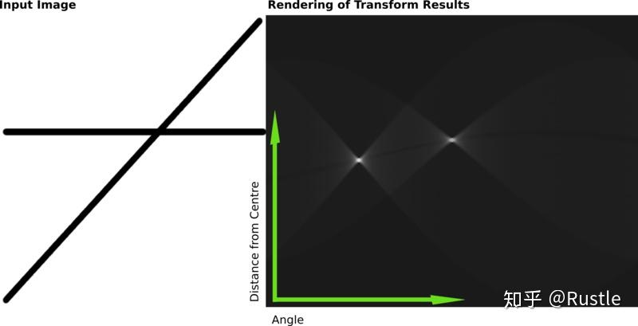
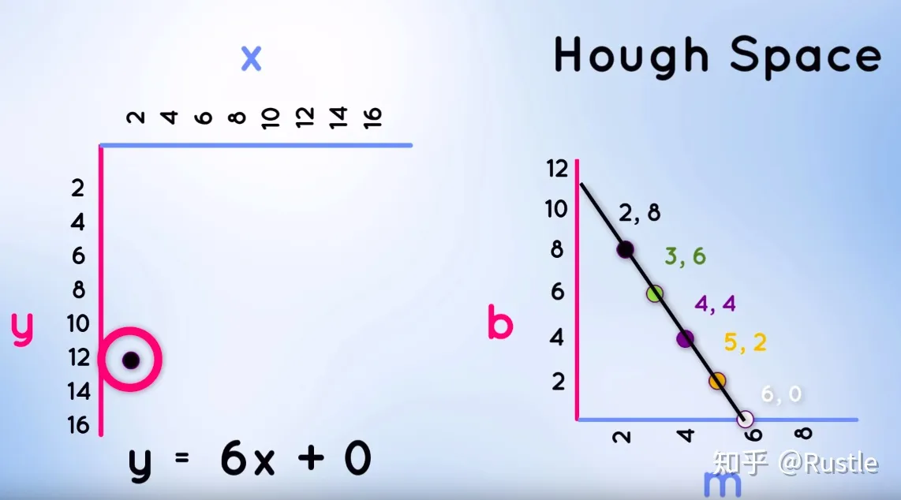
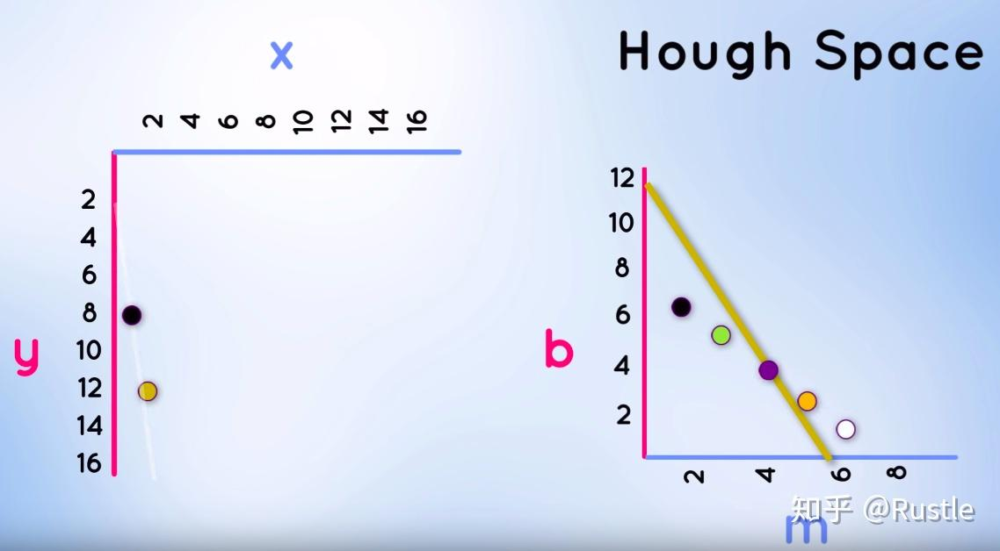
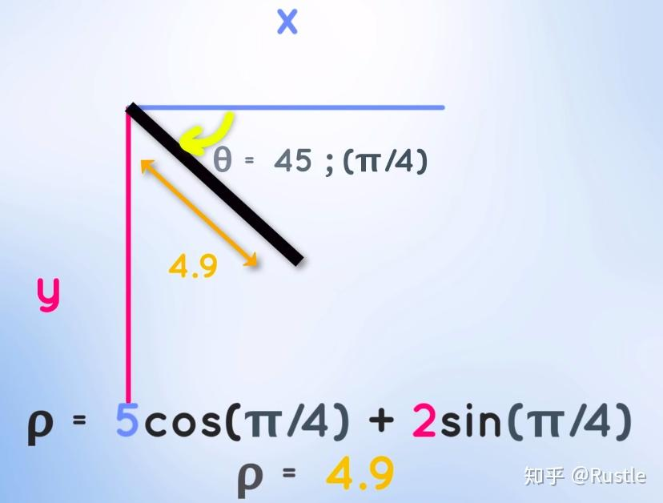
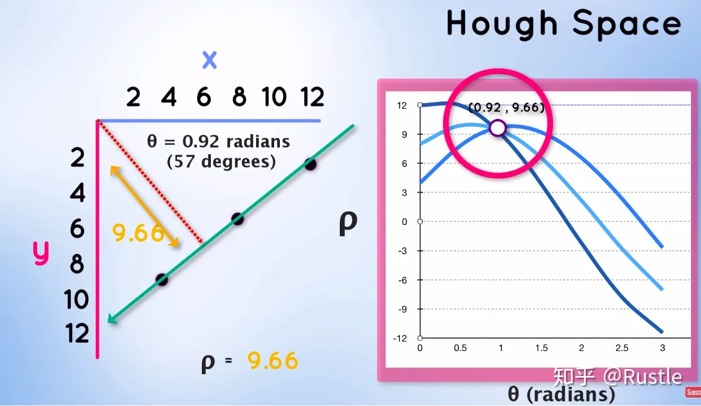

# 霍夫变换

## 什么是霍夫变换？

是一种 **特征检测**，广泛应用于图像分析、计算机视觉、以及数位影像处理。

基本思想是：

**将传统的图像从(x, y)坐标轴体系，变换为参数空间(m, b)或者霍夫空间(Hough space)中, 通过在参数空间(parameter space)或可称为累加空间(accumulator space)中计算局部最大值从而确定原始图像直线或圆所在位置**

## 分类：

* 基于笛卡尔坐标空间的霍夫变换

* 基于极坐标空间的霍夫变换

### 1. 基于笛卡尔坐标空间的霍夫变换

在我们从初中就开始使用的**平面直角坐标**中，一条直线的表示通常用 $y=m_{0}x + b_{0}$ 表示，其中 $m_{0}$ 表示的是直线的**斜率**， $b_{0}$ 表示的是直线的**截距**，一条直线上的点所使用的是同一个 $(m_{0}, b_{0})$，因此我们可以设想一下，如果有一个坐标轴体系是以 $m_{0}$ 为横轴，$b_{0}$为竖轴，形成以$(m_{0}, b_{0})$为参数的**参数空间**，是不是在平面坐标中同一条直线上的点在参数空间表示为一个点呢，**霍夫变换**即是基于这种思想而诞生的，如图 2-1所示

让我们换一种思维来更深层次理解一下**霍夫变换**，在xy笛卡尔坐标轴上的任意一点(x,y)随着x斜率$m_{0}$ 和截距$b_{0}$ 的改变，在参数空间各种  $(m_{0}, b_{0})$的组合将会呈现为一条**直线**，如图 2-2所示，为点A(2, 12)在**参数空间**的投影

现在我们在xy笛卡尔坐标轴做另一点B(1, 8)的**参数空间投影**，如图 2-3所示

可以发现，在参数空间中两直线交于紫色点位(4, 4)，这里所体现的信息为：点A、B两点连接的直线斜率为 $m_{0}=4$ ，截距为 $b_{0}=4$，因此，现在我们可以理解霍夫变换其实就是**计算参数空间累加点的值大小**，值越大越说明这个点的参数$(m_{0}, b_{0})$ 所代表的直线**置信度**越高，可是我们还要讨论一个问题，当直线为垂直x轴时，斜率$m_{0}$将会变为**无穷大**，在计算机数值运算时会造成无法进行，如图 2-4所示

因此**Duda**和**Hart**提出使用**极坐标空间**进行霍夫变换，以此来解决这一问题，即我们接下来要介绍的真正意义上的基于**极坐标空间(二维直线霍夫空间)的霍夫变换**

### 2.基于极坐标空间(二维直线霍夫空间)的霍夫变换

首先我们先回顾一下**什么是极坐标**，极坐标是指在平面内由**极点**、**极轴**和**极径**组成的坐标系，其中假设有一点$P(\rho, \theta)$ ，其中参数$\rho$ **表示极径**，即极点O到P点的距离，参数 $\theta$ **表示极角**，即OX到OP的角度，极坐标方程举个例子，如图 2-4所示，假设有一极坐标方程: $\rho=5cos(\theta)+2sin(\theta)$ ,当 $\theta$ 取 $\frac{\pi}{4}$ 时， $\rho$计算得4.9

相信到现在大家对**极坐标**有个大致的了解，我们回过头看霍夫变换，以直线检测为例，假设有一条直线，原点到该直线的垂直距离为 $\rho$ ，垂线与x轴的夹角为 $\theta$ ，那么这条直线是**唯一**的，且直线方程为:

$\rho=xcos(\theta)+ysin(\theta)$

如图 2-5绿线所示，其中直线上的每个点，在参数空间都可表示为一条**正弦曲线(sinusoidal curve)**，如图右三条蓝线所对应的便是xy坐标系中直线上三点p1p2p3，在**参数空间**中这三条正弦曲线会交于一点，即图中点(0.92, 9.66)，其反映的信息为三点所在直线与原点距离 $\rho$ 为9.66，垂线与x轴夹角 $\theta$ 为0.92

至此，我们可以发现其实极坐标参数空间与笛卡尔坐标参数空间类似，都可看成在**累加空间(accumulator space)**计算**局部最大值**，进行直线的预测，可是大家忽略了一个问题，在现实的应用场景中，许多直线并不是非常精细，或多或少**存在偏差**，导致参数空间各曲线不能交于精确的一点，因此我们需要将参数空间**分块**，分块的步长则为单位长度的 $\rho$ 和 $\theta$ ，如图 2-6所示，其次计算单位区域内**累加**的交点数量，将大于**阈值(threshold)**的区域值认定为直线存在，**存储其参数 $(\rho, \theta)$**

但是还存在一个问题，分块的步长对检测的**精准度**也有影响，分的太细，**计算代价**就会上升，分的太大，计算的准确率就会下降，因此现在通用的常用做法是： $\rho$ 步长设为单像素单位， $\theta$ 步长设为 $\frac{\pi}{180}$ ，并且现实场景中的应用也会使用一种**Mask掩模**的做法，提取我们感兴趣的图像区域，以此来大大减少计算量.
