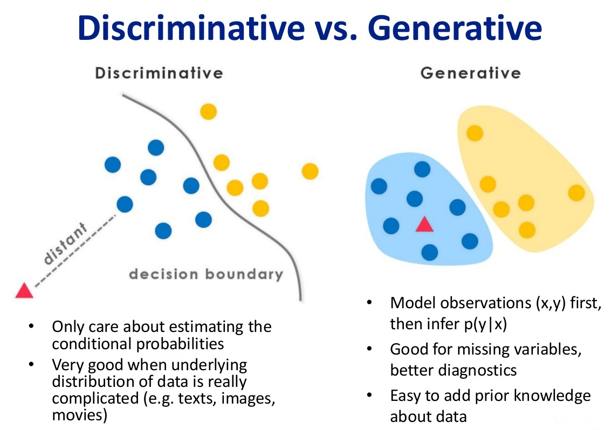

### 2. 什么是生成模型，什么是判别模型？

> 监督学习方法又分生成方法（Generative approach）和判别方法（Discriminative approach），所学到的模型分别称为生成模型（Generative Model）和判别模型（Discriminative Model)。

* 生成模型

    > 由数据学习联合概率密度分布P(X,Y)，然后求出条件概率分布P(Y|X)作为预测的模型，即生成模型：P(Y|X)= P(X,Y)/ P(X)。基本思想是首先建立样本的联合概率概率密度模型P(X,Y)，然后再得到后验概率P(Y|X)，再利用它进行分类。常见的有NB HMM模型。
    >
    > 而生成式模型求得P(Y,X)，对于未见示例X，你要求出X与不同标记之间的[联合概率分布](https://www.zhihu.com/search?q=联合概率分布&search_source=Entity&hybrid_search_source=Entity&hybrid_search_extra={"sourceType"%3A"answer"%2C"sourceId"%3A256466823})，然后大的获胜，如上图右边所示，并没有什么边界存在，对于未见示例（红三角），求两个联合概率分布（有两个类），比较一下，取那个大的。机器学习中[朴素贝叶斯模型](https://www.zhihu.com/search?q=朴素贝叶斯模型&search_source=Entity&hybrid_search_source=Entity&hybrid_search_extra={"sourceType"%3A"answer"%2C"sourceId"%3A256466823})、[隐马尔可夫模型](https://www.zhihu.com/search?q=隐马尔可夫模型&search_source=Entity&hybrid_search_source=Entity&hybrid_search_extra={"sourceType"%3A"answer"%2C"sourceId"%3A256466823})HMM等都是生成式模型，熟悉Naive Bayes的都知道，对于输入X，需要求出好几个联合概率，然后较大的那个就是预测结果~（根本原因个人认为是对于某示例X_1，对正例和反例的标记的联合概率不等于1，即P(Y_1,X_1)+P(Y_2,X_1)<1，要遍历所有的X和Y的联合概率求和，即sum(P(X,Y))=1，具体可参见楼上woodyhui提到的[维基百科](https://www.zhihu.com/search?q=维基百科&search_source=Entity&hybrid_search_source=Entity&hybrid_search_extra={"sourceType"%3A"answer"%2C"sourceId"%3A256466823})[Generative model](https://link.zhihu.com/?target=https%3A//en.wikipedia.org/wiki/Generative_model)里的例子）

* 判别模型

    > 由数据直接学习决策函数Y=f(X)或者条件概率分布P(Y|X)作为预测的模型，即判别模型。基本思想是有限样本条件下建立判别函数，不考虑样本的产生模型，直接研究预测模型。典型的判别模型包括k近邻，感知级，决策树，支持向量机等。
    >
    > 对于判别式模型来说求得P(Y|X)，对未见示例X，根据P(Y|X)可以求得标记Y，即可以直接判别出来，如上图的左边所示，实际是就是直接得到了判别边界，所以传统的、耳熟能详的机器学习算法如[线性回归模型](https://www.zhihu.com/search?q=线性回归模型&search_source=Entity&hybrid_search_source=Entity&hybrid_search_extra={"sourceType"%3A"answer"%2C"sourceId"%3A256466823})、[支持向量机](https://www.zhihu.com/search?q=支持向量机&search_source=Entity&hybrid_search_source=Entity&hybrid_search_extra={"sourceType"%3A"answer"%2C"sourceId"%3A256466823})SVM等都是判别式模型，这些模型的特点都是输入属性X可以直接得到Y（对于二分类任务来说，实际得到一个score，当score大于[threshold](https://www.zhihu.com/search?q=threshold&search_source=Entity&hybrid_search_source=Entity&hybrid_search_extra={"sourceType"%3A"answer"%2C"sourceId"%3A256466823})时则为正类，否则为反类）~（根本原因个人认为是对于某示例X_1，对正例和反例的标记的条件概率之和等于1，即P(Y_1|X_1)+P(Y_2|X_1)=1）