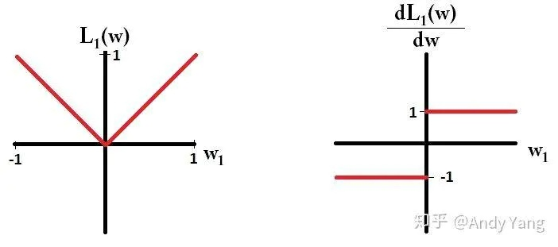

## 1. 范数（Norm）

具体定义

> * a function that assigns a strictly positive length or size to each vector in a vector space， except for the zero vector. ——Wikipedia
>
> 一个向量的范数就是**将向量投影到[0,1)范围的值**，其中0只有零向量的范数可以取到

### L1 和 L2 范数

> 可以用距离的概念来看

* 具体应用：

    * 作为损失函数使用

        > 主要用L2原因是：L2求导计算方便，一定存在一条最优的线;L1则可能存在多个最优解
        >
        > L1优点：鲁棒性更强，对异常值不敏感

    * 作为正则项来使用

        > L2 计算起来非常方便，L1则在非稀疏向量的计算上效率非常低
        >
        > L1输出稀疏，会把不重要的特征置为0，L2不会
        >
        > L2存在唯一解，L1则存在多个解

* L1和L2正则分别有什么特点？

* 为何L1稀疏？

> 在梯度更新时，不管 L1 的大小是多少（只要不是0）梯度都是1或者-1，所以每次更新时，它都是稳步向0前进。从而导致L1输出稀疏。

>参考： https://www.zhihu.com/question/26485586/answer/616029832

### 5. dropout为何能防止过拟合？

> https://zhuanlan.zhihu.com/p/23178423

> 防止参数过分依赖训练数据，增加参数对数据集的泛化能力
>
> > 假设要训练这样一个网络：
> >
> > 
> >
> > 正常的流程是：首先把x通过网络前向传播；然后把误差反向传播以决定 如何更新参数 让网络进行学习。
> >
> > 使用dropout之后过程变成：
> >
> > 
> >
> > 1. 首先随机（临时）删掉网络中一半的隐藏神经元，输入输出神经元保持不变（下图中虚线为部分临时被删除的神经元）
> > 2. 然后把输入x通过修改后的网络前向传播，然后把得到的损失结果通过修改的网络反向传播。一小批训练样本执行完这个过程后就按照随机梯度下降法更新（没有被删除的神经元）对应的参数（w，b）。
> > 3. 然后继续重复这一过程：
> >     - 恢复被删掉的神经元（此时 被删除的神经元 保持原样，而没有被删除的神经元已经有所更新）
> >     - 从隐藏神经元中随机选择一个一半大小的子集 临时删除掉（备份被删除神经元的参数）。
> >     - 对一小批训练样本，先前向传播然后反向传播损失并根据随机梯度下降法更新参数（w，b） （没有被删除的那一部分参数得到更新，删除的神经元参数保持被删除前的结果）
> > 4. 重复这一过程
>
> 为什么能防止过拟合呢？
>
> * **取平均的作用**： 先回到正常的模型（没有dropout），我们用相同的训练数据去训练5个不同的神经网络，一般会得到5个不同的结果，此时我们可以采用 “5个结果取均值”或者“多数取胜的投票策略”去决定最终结果。（例如 3个网络判断结果为数字9,那么很有可能真正的结果就是数字9，其它两个网络给出了错误结果）。这种“综合起来取平均”的策略通常可以有效防止过拟合问题。**因为不同的网络可能产生不同的过拟合，取平均则有可能让一些“相反的”拟合互相抵消**。dropout掉不同的隐藏神经元就类似在训练不同的网络（随机删掉一半隐藏神经元导致网络结构已经不同)，**整个dropout过程就相当于 对很多个不同的神经网络取平均**。而不同的网络产生不同的过拟合，一些互为“反向”的拟合相互抵消就可以达到整体上减少过拟合。
> * **减少神经元之间复杂的共适应关系**： 因为dropout程序导致两个神经元不一定每次都在一个dropout网络中出现。（这样权值的更新不再依赖于有固定关系的隐含节点的共同作用，阻止了某些特征仅仅在其它特定特征下才有效果的情况）。 迫使网络去学习更加鲁棒的特征 （这些特征在其它的神经元的随机子集中也存在）。换句话说假如我们的神经网络是在做出某种预测，它不应该对一些特定的线索片段太过敏感，即使丢失特定的线索，它也应该可以从众多其它线索中学习一些共同的模式（鲁棒性）。（这个角度看 dropout就有点像L1，L2正则，减少权重使得网络对丢失特定神经元连接的鲁棒性提高）

**l1正则如何优化？l2正则为什么可以防止过拟合？**

L1正则是指对模型的参数向量中所有非零元素的绝对值之和进行惩罚。L1正则可以实现特征的稀疏化，即将一些不重要的特征的系数变为零，减少了模型的复杂度，从而防止过拟合。

常见的优化方法包括坐标下降法（Coordinate Descent）、L-BFGS（Limited-memory Broyden–Fletcher–Goldfarb–Shanno）等。其中，坐标下降法是L1正则化线性回归（Lasso）中常用的优化方法。

L2正则是指对模型的参数向量中所有元素的平方和进行惩罚。L2正则可以通过减小大幅的参数更新、增加模型的泛化性能来防止过拟合。此外，L2正则对噪声具有一定的鲁棒性，可以在一定程度上避免异常值对模型的影响。

L2正则的优化可以使用标准的梯度下降方法、牛顿法等。相比于L1正则，L2正则比较容易优化，计算速度较快并且能够处理线性问题和非线性问题。

需要注意的是，选择合适的正则化方法需要综合考虑具体的数据特征和应用场景，有时同时使用L1和L2正则化也可以取得很好的效果。

https://zhuanlan.zhihu.com/p/85630046

**训练和推理时dropout是如何做的**

Dropout是一种有效的正则化方法，通常在训练神经网络时使用，以减少过拟合的风险。在推理时，通常不需要使用dropout，因为我们需要最终的确定性输出或预测。

在训练时，dropout的工作原理如下：

对于每个神经元，按照指定的概率p（通常为0.5）进行“开关”决策。也就是说，以概率p将该神经元的输出设置为0（关闭），以概率1-p保留该神经元的输出（启动）。

在正向传播过程中，将经过dropout处理的神经元输出乘以其保留概率，在反向传播过程中，通过与正向传播时的保留概率相乘，将传播梯度与启动的神经元相连接。

由于每次训练时dropout的随机性不同，因此相当于在每次训练时，多个不同的神经网络组合起来进行训练，增加了模型的多样性和鲁棒性，防止过拟合的发生。

在推理时，不再使用dropout，因为我们需要模型输出最终的确定性结果或预测，当然我们也可以基于推广的思想在推理时考虑统计dropout后的输出结果，来得到某些概率分布的输出结果。

因此，在推理时需要重新缩放每个启动神经元的输出，以保持平均输出值的一致性，但不再使用dropout，因为我们需要最终确定的输出结果。