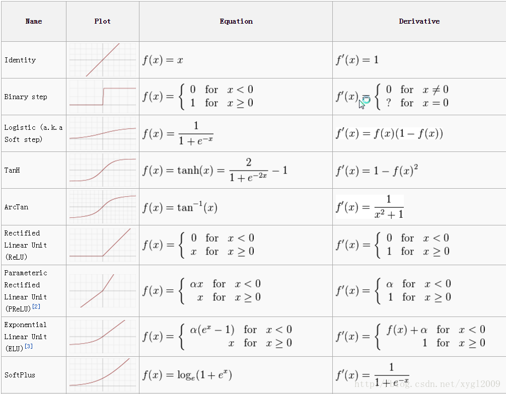
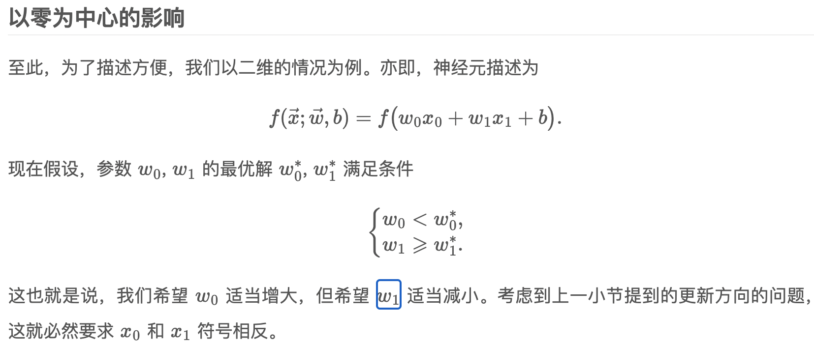

```
损失函数和激活函数决定的是模型会不会收敛，也影响训练速度；

优化器决定的是模型能不能跳出局部极小值、跳出鞍点、能不能快速下降这些问题的。

https://www.cnblogs.com/eilearn/p/9028394.html
```



### **a. 为什么使用激活函数**

主要原因：**引入非线性元素**。

> 如果不用激励函数，每一层输出都是上层输入的线性函数，无论神经网络有多少层，输出都是输入的线性组合。
> 如果使用的话，激活函数给神经元引入了非线性因素，使得神经网络可以任意逼近任何非线性函数，这样神经网络就可以应用到众多的非线性模型中。

### **b. 为什么分类问题不能使用mse损失函数？**

> 1. 在线性回归中用到的最多的是MSE(最小二乘损失函数)，这个比较好理解，就是预测值和目标值的欧式距离。而交叉熵是一个信息论的概念，交叉熵能够衡量同一个随机变量中的两个不同概率分布的差异程度，在机器学习中就表示为真实概率分布与预测概率分布之间的差异。交叉熵的值越小，模型预测效果就越好。
>     所以交叉熵本质上是概率问题，表征真实概率分布与预测概率分布差异，和几何上的欧氏距离无关，在线性回归中才有欧氏距离的说法，在分类问题中label的值大小在欧氏空间中是没有意义的。所以分类问题不能用mse作为损失函数。
> 2. 分类问题是逻辑回归，必须有激活函数这个非线性单元在，比如sigmoid（也可以是其他非线性激活函数），mse已经是非凸函数了，有多个极值点，所以不适用做损失函数了。
> 3. mse作为损失函数，求导的时候都会有对激活函数的求导连乘运算，对于sigmoid、tanh，有很大区域导数为0的。该激活函数的输入很可能直接就在平坦区域，那么导数就几乎是0，梯度就几乎不会被反向传递，梯度直接消失了。所以mse做损失函数的时候最后一层不能用sigmoid做激活函数，其他层可以用sigmoid做激活函数。当然，用其他损失函数只能保证在第一步不会直接死掉，反向传播如果激活函数和归一化做得不好，同样会梯度消失。所以从梯度这个原因说mse不好不是很正确。

* 梯度消失问题存在两个地方
    1. 损失函数对权值w求导，这是误差反向传播的第一步，mse的损失函数会在损失函数求导这一个层面上就导致梯度消失；所以使用交叉熵损失函数
    2. 误差反向传播时，链式求导也会使得梯度消失。
* 使用交叉熵损失函数也不能避免反向传播带来的梯度消失，此时规避梯度消失的方法：
    * ReLU等激活函数；
    * 输入归一化、每层归一化；
    * 网络结构上调整，比如LSTM、GRU等。

### c. 常用激活函数

#### 1. softmax函数

* 定义

    > 是一种概率函数，将原始的输出映射到(0, 1)中，并且最最终结果的总和为1.

* 公式

$$
f(x) = \frac{1}{1 + e^{-x}}
$$


* 用处

    > 可用于多分类问题

* 特点：

    * 保证较小的值有较小的概率，而不是直接丢弃
    * 获得所有概率彼此相关，因为分母结合了原始输出值的所有因子
    * 在0处不可微
    * 负输入的梯度为零，这意味着对于该区域的激活，权重不会在反向传播期间更新，因此会产生永不激活的死亡神经元

* 转换成概率的步骤

    * 分子：利用指数函数转为非负数的值
    * 分母：将所有结果相加，进行归一化

#### 2. tanh函数

> 双曲正切函数

* 优点

    * 在特征相差明显时的效果会很好，在循环过程中会不断扩大特征效果
    * 是 0-mean的，实际应用中比sigmoids函数要好
* 公式

$$
{\rm tanh}\ x = \frac{{\rm sinh}\ x}{{\rm cosh}\ x} = \frac{e^{x} - e^{-x}}{e^{x} + e^{-x}}
$$


#### 3. Relu函数的定义、优缺点

* 优点

    * 反向求导时，计算量较少；
    * 反向传播时，不会出现较小的梯度，不会出现饱和现象
    * 会使一部分网络激活输出值为0，这样就造成了网络的稀疏性，并且减少了参数的相互依存关系，缓解了过拟合问题的发生

* 缺点

    * 不是0-centered
    * 很容易导致神经元坏死
    * 不会对数据进行幅度压制

* **ReLu是如何表现出高阶的非线性组合的？**

    > ReLU在正负半轴都是线性的，确实没错。但是，**它实现网络非线性映射的魔法在于对不同样本的不同状态**。
    >
    > 考虑对于一个激活函数只包含ReLU和线性单元的简单网络：
    >
    > 首先，我们考虑有一个输入样本  $x_{1}$ ，网络中所有的ReLU对它都有一个确定的状态，整个网络最终对$x_{1}$的映射等效于一个线性映射: $y_{1} = \omega_{1}x_{1} + b_{1}$  
    >
    > 考虑另一个输入样本 $x_{2}$ ，它的特征与$x_{1}$不同。因此，网络中某些ReLU的激活状态因为输入变化可能发生变化，比如一些以前在右侧接通区域的变到左侧切断区域（或反之）；这样整个网络对于样本$x_{2}$有一个新的等效线性映射：$y_{2} = \omega_{2}x_{2} + b_{2}$   这两个函数都是线性的，但是他们的参数是不同的。
    >
    > 进一步，可以这样设想，在 $x_{1}$ 的周围，有一小块区域 ![[公式]](https://www.zhihu.com/equation?tex=%5B%7Bx_%7B1%7D%5E%7B1%7D%7D%5Cpm%5Cvarepsilon_%7B1%7D%2C%7Bx_%7B1%7D%5E%7B2%7D%7D%5Cpm%5Cvarepsilon_%7B2%7D%2C...%2C%7Bx_%7B1%7D%5E%7Bn%7D%7D%5Cpm%5Cvarepsilon_%7Bn%7D%5D)（为了表达简单，假定了两侧 ![[公式]](https://www.zhihu.com/equation?tex=%5Cpm%5Cvarepsilon_%7Bi%7D) 都是对称的，实际通常不是）。所有特征位于这一小块区域内的样本，在网络中激活的ReLU状态都和 ![[公式]](https://www.zhihu.com/equation?tex=x_%7B1%7D) 激活的完全一样。（因为这些点离![[公式]](https://www.zhihu.com/equation?tex=x_%7B1%7D)非常接近，在这个变化范围，网络中所有的ReLU都没有翻转）。那么这一小块区域内，网络拟合的出的线性映射都是一样的，去掉x,y的角标，表示为![[公式]](https://www.zhihu.com/equation?tex=y%3Dw_%7B1%7Dx%2Bb_%7B1%7D)您一定发现了，这就是由 ![[公式]](https://www.zhihu.com/equation?tex=%5Bw_%7B1%7D%EF%BC%8Cb_%7B1%7D%5D) 定义的一个超平面，但是这个超平面可能只在![[公式]](https://www.zhihu.com/equation?tex=x_%7B1%7D)的附近才成立。一旦稍微远离，导致至少一个ReLU翻转，那么网络将有可能拟合出另一个不同参数的超平面。
    >
    > 　　所以，这具有不同参数的超平面拼接在一起，不就拟合出了各种各样的非线性特性了吗？所以，虽然ReLU的每个部分都是线性的，但是通过对ReLU各种状态的组合进行改变，导致了网络等效映射的变化，也就构造了各种非线性映射。表现在多维空间，就是很多不同的小块超平面拼接成的奇形怪状的近似超曲面。

#### 4. sigmoid函数定义、优缺点

* 优点

    >  用于二分类问题

* 缺点

    * 激活函数计算量大，反向传播求误差梯度时，求导涉及除法
    * 反向传播时，很容易就会出现梯度消失的情况，从而无法完成深层网络的训练
    * Sigmoids函数饱和且kill掉梯度
    * Sigmoids函数收敛缓慢。
    * 输出不是以0为中心的

* **导致梯度消失的原因**

    * 当神经元的激活在接近0或1处时会饱和，在这些区域，梯度几乎为0。
    * 可以作为概率，但导数值小于1，最大为0.25，如果损失函数 mse，则梯度计算与 sigmoid 导数相关，导致梯度消失。

* **输出不是以0为中心问题**



>   在 Sigmoid 函数中，输出值恒为正。这也就是说，如果上一级神经元采用 Sigmoid 函数作为激活函数，那么我们无法做到 x0 和 x1 符号相反。此时，模型为了收敛，不得不向逆风前行的风助力帆船一样，走 Z 字形逼近最优解。
>
>   


### d. 激活函数的比较

#### **1) Sigmoid 和 ReLU 比较：**

> 1. 对于深层网络，sigmoid函数反向传播时，很容易就会出现梯度消失的情况（在sigmoid接近饱和区时，变换太缓慢，导数趋于0，这种情况会造成信息丢失）。而relu函数在大于0的部分梯度为常数，所以不会产生梯度弥散现象。
> 2. relu函数在负半区的导数为0 ，所以一旦神经元激活值进入负半区，那么梯度就会为0，造成了网络的稀疏性，缓解过拟合。
> 3. relu计算简单，采用sigmoid等函数，反向传播求误差梯度时，计算量大，而采用Relu激活函数，整个过程的计算量节省很多。

#### 2) **Sigmoid 和 Softmax 区别：**

> 1. sigmoid将一个real value映射到（0,1）的区间（当然也可以是（-1,1）），这样可以用来做二分类。 
> 2. 而softmax把一个k维的real value向量（a1,a2,a3,a4….）映射成一个（b1,b2,b3,b4….）其中 bi 是一个 0～1 的常数，输出神经元之和为 1.0，所以相当于概率值，然后可以根据 bi 的概率大小来进行多分类的任务。
> 3. 二分类问题时 sigmoid 和 softmax 是一样的，求的都是 cross entropy loss，而 softmax 可以用于多分类问题。
> 4. 多个logistic回归通过叠加也同样可以实现多分类的效果，但是 softmax回归进行的多分类，类与类之间是**互斥**的，即一个输入只能被归为一类；多个logistic回归进行多分类，输出的类别并不是互斥的，即"苹果"这个词语既属于"水果"类也属于"3C"类别。


