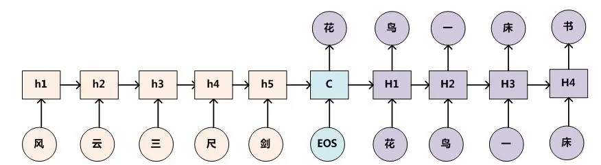

### 6. 简述seq2seq模型？

* 前言

    > RNN Encoder-Decoder结构，简单的来说就是算法包含两部分，一个负责对输入的信息进行Encoding，将输入转换为向量形式。
    >
    > 然后由Decoder对这个向量进行解码，还原为输出序列。
    >
    > 而RNN Encoder-Decoder结构就是编码器与解码器都是使用RNN算法，一般为LSTM

* LSTM

    > 优势在于处理序列，它可以将上文包含的信息保存在隐藏状态中，这样就提高了算法对于上下文的理解能力。
    >
    > 很好的抑制了原始RNN算法中的梯度消失弥散（Vanishing Gradient）问题。
    >
    > 一个LSTM神经元（Cell）可以接收两个信息，其中一个是序列的某一位输入，另一个是上一轮的隐藏状态。
    >
    > 而一个LSTM神经元也会产生两个信息，一个是当前轮的输出，另一个是当前轮的隐藏状态。
    >
    > 假设我们输入序列长度为`2`，输出序列长度也为`2`，流程如下：
    >
    > 

* seq to seq

    > 举例
    >
    > > 以机器翻译为例，假设我们要将`How are you`翻译为`你好吗`，模型要做的事情如下图：
    > >
    > > 
    > >
    > > 流程说明：
    > >
    > > > 上图中，LSTM Encoder是一个LSTM神经元，Decoder是另一个，Encoder自身运行了`3`次，Decoder运行了`4`次。
    > > >
    > > > 可以看出，Encoder的输出会被抛弃，我们只需要保留隐藏状态（即图中EN状态）作为下一次ENCODER的状态输入。
    > > >
    > > > Encoder的最后一轮输出状态会与Decoder的输入组合在一起，共同作为Decoder的输入。
    > > >
    > > > 而Decoder的输出会被保留，当做下一次的的输入。注意，这是在说预测时时的情况，一般在训练时一般会用真正正确的输出序列内容，而预测时会用上一轮Decoder的输出。
    > > >
    > > > 给Decoder的第一个输入是`<S>`，这是我们指定的一个特殊字符，它用来告诉Decoder，你该开始输出信息了。
    > > >
    > > > 而最末尾的`<E>`也是我们指定的特殊字符，它告诉我们，句子已经要结束了，不用再运行了

### 7. seq2seq在解码时候有哪些方法？

> 参考：https://blog.csdn.net/jlqCloud/article/details/104516802

### 8. Attention机制是什么？

* 导言

    > attention机制是模仿人类注意力而提出的一种解决问题的办法，简单地说就是从大量信息中快速筛选出高价值信息。主要用于解决LSTM/RNN模型输入序列较长的时候很难获得最终合理的向量表示问题，做法是保留LSTM的中间结果，用新的模型对其进行学习，并将其与输出进行关联，从而达到信息筛选的目的。

* 知识点前述

    > encoder+decoder，中文名字是编码器和解码器，应用于seq2seq问题，其实就是固定长度的输入转化为固定长度输出。其中encoder和decoder可以采用的模型包括CNN/RNN/BiRNN/GRU/LSTM等，可以根据需要自己的喜好自由组合。
    >
    > 
    >
    > encoder过程将输入的句子转换为语义中间件，decoder过程根据语义中间件和之前的单词输出，依次输出最有可能的单词组成句子。
    >
    > 
    >
    > 问题就是当输入长度非常长的时候，这个时候产生的语义中间件效果非常的不好，需要调整。

* attention 模型

    > attention模型用于解码过程中，它改变了传统decoder对每一个输入都赋予相同向量的缺点，而是根据单词的不同赋予不同的权重。在encoder过程中，输出不再是一个固定长度的中间语义，而是一个由不同长度向量构成的序列，decoder过程根据这个序列子集进行进一步处理。
    >
    > 
    >
    > 举例说明：
    >
    > > 假设输入为一句英文的话：Tom chase Jerry
    > > 那么最终的结果应该是逐步输出 “汤姆”，“追逐”，“杰瑞”。
    > > 那么问题来了，如果用传统encoder-decoder模型，那么在翻译Jerry时，所有输入单词对翻译的影响都是相同的，但显然Jerry的贡献度应该更高。
    > > 引入attention后，每个单词都会有一个权重：（Tom,0.3）(Chase,0.2) (Jerry,0.5)，现在的关键是权重怎么算的呢。
    > >
    > > 
    > >
    > > 从图上可以看出来，加了attention机制以后，encoder层的每一步输出都会和当前的输出进行联立计算（wx+b形式），最后用softmx函数生成概率值。
    > > 概率值出来了，最后的结果就是一个加权和的形式。
    > >
    > > 
    > >
    > > 基本上所有的attention都采用了这个原理，只不过算权重的函数形式可能会有所不同，但想法相同。

* 应用

    > 文本：应用于seq2seq模型，最常见的应用是翻译。
    > 图片：应用于卷积神经网络的图片提取

* attention的简单实现

    1. 思路一：直接对原文本进行权重计算

        > 这个思路非常暴力，我们说过要对输入进行权重计算，此种方法的计算很简单，就是将输入来一个全连接，随后采用softmax函数激活算概率。先看代码：
        >
        > ```python
        > from keras.layers import Permute
        > from keras.layers import Dense
        > from keras.layers import Lambda
        > from keras.layers import RepeatVector
        > from keras.layers import Multiply
        > 
        > def attention_3d_block(inputs, single_attention_blick=False):
        > time_steps = K.int_shape()[1]#返回输入的元组，以列表的形式储存
        > input_dim = K.int_shape()[2]#记住输入是[训练批量，时间长度，输入维度]
        > #下面是函数建模方式
        > a = Permute((2, 1))(inputs)
        > a = Dense(time_steps, activation='softmax')(a)
        > if single_attention_blick:
        > a = Lambda(lambda x: K.mean(x, axis=1))(a)
        > a = RepeatVector(input_dim)(a)
        > a_probs = Permute((2, 1))(a)
        > output_attention_mul = Multiply()([inputs, a.prob])
        > return output_attention_mul
        > ```

    2. 思路2：加入激活函数并求和

        > 这个的思路是权重计算之后加了一个tanh激活函数，然后求完权重进行了加和，更加符合attention机制的习惯，其实方法是一样的只不过返回是乘完加和而已。代码来自网上，原作者自己定义了一个attention层。
        >
        > 
        >
        > * 代码实现
        >
        >     ```python
        >     class attention_layers(Layer):
        >         def __init__(self, **kwargs):
        >             super(attention_layers, self).__init__(**kwargs)
        >     
        >         def build(self,inputshape):
        >             assert len(inputshape) == 3
        >             #以下是keras的自己开发工作
        >             self.W = self.add_weight(name='attr_weight',
        >                                      shape=(inputshape[1], inputshape[2]),
        >                                      initializer='uniform',
        >                                      trainable=True)
        >             self.b = self.add_weight(name='attr_bias',
        >                                      shape=(inputshape[1],),
        >                                      initializer='uniform',
        >                                      trainable=True)
        >             super(attention_layers, self).bulid(inputshape)
        >     
        >         def call(self,inputs):
        >             x = K.permute_dimensions(inputs, (0, 2, 1))
        >             a = K.softmax(K.tanh(K.dot(x, self.W) + self.b))
        >             outputs = K.permute_dimensions(a*x, (0, 2, 1))
        >             outputs = K.sum(outputs, axis=1)
        >             return  outputs
        >     
        >         def compute_output_shape(self, input_shape):
        >             return input_shape[0], input_shape[2]
        >     ```
        >
        > 

