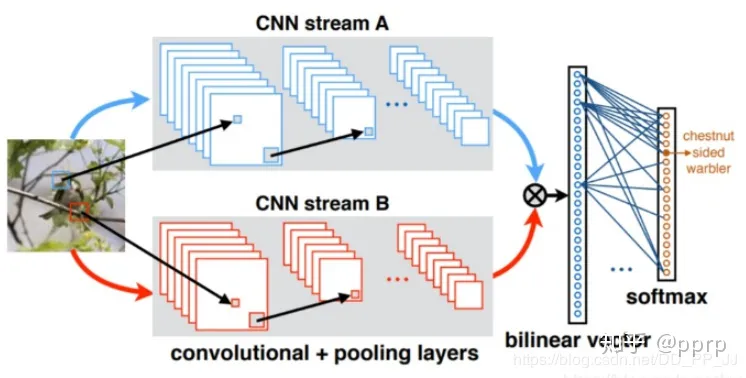
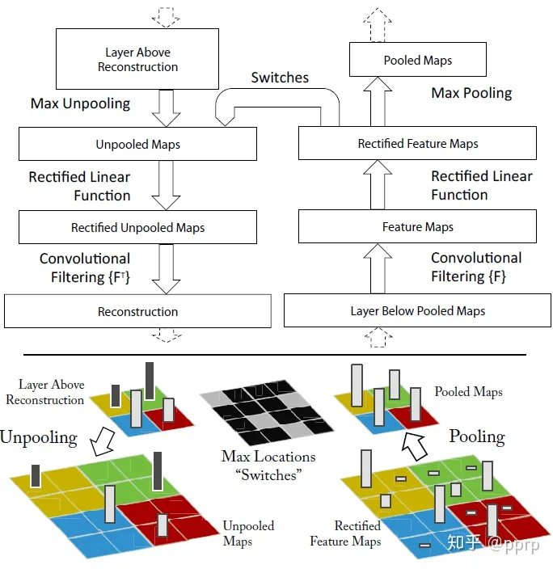

### 9. 感受野

>   是指输出特征图上某个像素对应到输入空间中的区域范围，可以理解为特征图像素到输入区域的映射。


**卷积的核心思想是什么？**

卷积是一种数学运算，广泛应用于信号处理、图像处理、自然语言处理和深度学习等领域。卷积的核心思想是将一个函数与另一个函数进行加权叠加，得到另一个函数。

在信号处理中，卷积可以用于信号滤波、平滑、降噪等操作。在图像处理中，卷积可以用于图像模糊、边缘检测、特征提取等操作。在深度学习中，卷积可以用于构建卷积神经网络，用于图像识别、语音识别等任务。

卷积操作可以看做是在一个区域内按照一定的规则计算两个函数之间的关系，这个区域称为卷积核（或滤波器），表示了卷积操作的计算规则。卷积操作本质上是一种加权求和运算，即在一个区域内对两个函数的对应值进行加权求和，并将结果作为新函数在该点的值。具体的计算方式为，将卷积核从一个函数的左上角对齐到右下角，然后将卷积核中的每一个元素与该位置上的函数值相乘，然后将乘积相加，得到卷积的结果。

卷积核的大小和形状不同，可以实现不同的卷积效果。例如，边缘检测卷积核可以通过计算像素周围的差异来检测图像边缘；平滑卷积核可以通过计算像素周围的加权平均值来使图像变得更加平滑等。

总之，卷积的核心思想是将一个函数与另一个函数进行加权叠加，依据卷积核的大小和形状，可以实现不同的卷积操作，从而实现信号处理、图像处理、深度学习等领域的多种应用。


**卷积核是什么？1 \* 1 卷积核的作用是什么？**

卷积核是神经网络中的一种重要组件，用于实现卷积运算。卷积核是一个二维（或三维）矩阵，包含一组可学习的权重。

在卷积神经网络(Convolutional Neural Networks, CNNs)中，通过将卷积核与输入特征图做卷积运算，生成新的卷积特征图。卷积运算可以理解为在输入图像上滑动卷积核，计算卷积核与输入图像上对应位置的点乘结果，将结果作为卷积特征图的一个像素值。

11卷积核指卷积核的尺寸为11。与其他卷积核相比，11卷积核并没有对输入特征图的局部区域进行有效的感知，但它可以对输入特征图的通道数进行压缩或扩展。通过使用11卷积核，可以实现以下几个作用：

压缩特征图的通道数：使用1 * **1卷积核可以将输入特征图的通道数降低，减少计算量和内存消耗。扩展特征图的通道数：使用1**1卷积核可以将输入特征图的通道数扩展，增强模型的表达能力。

实现卷积层之间的非线性转换：使用1**1卷积核可以实现卷积层之间的非线性转换，提高模型的泛化能力。总之，1**1卷积核在CNNs中扮演了重要的角色，具有压缩特征图通道数、扩展特征图通道数、实现非线性转换等多种作用。


**CNN的优势在哪些地方？相对于普通前馈神经网络？**

CNN相对于普通前馈神经网络具有如下几个优势：

空间结构信息捕捉能力强：卷积层在局部感受野内共享参数的方式能够有效地捕捉输入数据的空间特征，使神经网络具有捕捉输入数据局部结构的能力。这种特征可以被视为图像、音频或文本中的本地模式。而普通前馈神经网络只能简单地考虑输入数据的全局特征。

参数共享：在卷积层中，权重参数是在整个输入中共享的，使得模型具有更少的参数。这使得模型更加高效，减少了过拟合的风险，还使得模型可以处理不同大小的输入数据。而普通的前馈神经网络列向量的每个元素有单独的权重参数。

数据增强：CNN利用数据增强技术，通过对输入数据进行缩放、旋转、平移、翻转等操作，增加了训练数据集的数量，从而提高了模型的鲁棒性和泛化能力。而前馈神经网络通常不能使用数据增强技术，因为它们不受输入的平移、旋转等变换的影响。

层次化特征学习：CNN可通过多层卷积层有效地学习输入数据的高阶、抽象特征，逐层提取更加复杂、抽象的特征，从而提高了模型的识别能力。相对地，普通前馈神经网络只能从输入数据中提取简单特征，这使得它们很难处理更加复杂和高维的输入数据。

总之，相较于普通前馈神经网络，CNN具有更好的空间结构信息捕捉能力、参数共享、数据增强和层次化特征学习等优势，因此在图像、音频、文本等计算机视觉和自然语言处理领域广泛应用。


**池化层的作用；**

池化层是深度学习中常用的一种层，其主要作用是对输入数据进行降维和采样，减少模型参数，控制过拟合，并提高模型的鲁棒性。在卷积神经网络（CNN）中，池化层通常紧跟在卷积层之后。

具体来讲，池化层会对输入特征图进行划分，每个划分区域内的特征值会被聚合为一个输出特征值。池化操作通常有两种类型：最大池化和平均池化。最大池化会选取划分区域内的最大值作为输出特征值，而平均池化则会计算划分区域内特征值的均值。这样，池化层会减小特征图的尺寸，降低计算量，同时保留重要的特征信息。

池化层具有以下几个优点：

降维和采样：池化层可以减小特征图的尺寸和深度，减少网络参数和计算量，进一步提升计算速度和效率。

控制过拟合：池化层可以减少特征图中的冗余信息，保留重要特征，缓解网络过拟合的问题，提高模型的泛化能力。

处理空间不变性：池化层的最大池化操作可以保留特征图中的最显著特征，从而提高网络的空间不变性，使得网络对于输入的位置和大小变化变得更加鲁棒。

总之，池化层在深度学习中具有重要的作用，能够帮助网络提取基本特征和降低计算复杂度，为下一层网络提供更加有用的信息。


### 1. 空洞卷积是什么？有什么应用场景？

>   -   空洞卷积就是在卷积的时候不是对连续的值进行计算，而是会中间隔开几个值，其他与普通的卷积并无差异。可以理解为一个稀疏的大卷积核，只有个别值有效，其余值为零。

* 应用

> 01.在卷积图上注入空洞，增加感受野。注入空洞的数量由dilation rate确定。常规卷积的dilation rate为1。
>
> 02.多尺度检测，利于检测出小物体
>
> 03.语义分割中常用dilation rate。但是人像分割中无用，应该就是我们的应用场景没有特别小的物体。

### 2. resnet提出的背景和核心理论是？

* 背景

> 当模型深度增加到某个程度后，在增加深度，模型效果可能不升反降，出现退化现象。（不是过拟合也不是梯度爆炸或消失）

* 核心理论

> 恒等映射

### 3. CNN如何用于文本分类？

>   CNN（卷积神经网络）最初是为图像处理而设计的，但它也可以用于文本分类任务。文本分类指的是将文本分为预定义类别的任务，例如将垃圾邮件分类为垃圾邮件或正常邮件。以下是如何使用CNN进行文本分类的一般流程：
>
>   文本预处理：首先需要对文本进行预处理，例如标记化（将句子拆分为单词或子句），去除停用词和标点符号等。
>   词嵌入：将每个词表示为一个向量，这称为词嵌入。通常使用预训练的词嵌入模型，例如GloVe或Word2Vec。
>   卷积层：CNN模型由多个卷积层组成，每个卷积层包括多个卷积核，卷积核的大小在空间上通常比较小。在文本分类任务中，一维的卷积核会在每个文本窗口上滑动，并为每个窗口生成一个特征映射。
>   池化层：接下来通常会加上一个池化层，其作用是减少特征映射的大小，并提高模型的鲁棒性。最常见的池化操作是最大池化，它在每个特征映射上选择最大的值作为输出。
>   全连接层：多个卷积层和池化层可以组合成一个深度CNN模型，最后加上几个全连接层来执行分类。全连接层将卷积和池化层的特征转换为固定大小的向量，并通过softmax激活函数输出每个类别的概率。
>   训练和验证：在训练CNN模型时，通常随机初始化模型的参数，并使用随机梯度下降优化损失函数。然后使用验证集来评估模型性能，并根据验证集性能调整模型超参数或模型结构。
>
>   总的来说，通过使用CNN可以从大量文本数据中提取有用的特征，快速准确地进行文本分类。


### 4. 常用的池化操作有哪些？有什么特点？

> https://zhuanlan.zhihu.com/p/112216409

**深度学习常用的池化层及作用**

深度学习中池化层是一种常见的卷积层变体，其作用是通过减少每个特征映射的空间尺寸和参数数量，来缓解过拟合和降低计算复杂度。常见的池化方式有以下几种：

最大池化（Max Pooling）

最大池化是指从输入特征映射中提取大的值。最大池化通常会在卷积层之后使用，它将输入的特征映射按照步幅滑动，并在每个窗口中选择最大的值作为其输出。

平均池化（Average Pooling）

平均池化是指从输入特征映射中提取平均值。与最大池化不同，平均池化在每个窗口中选择特征映射内所有值的平均值作为其输出。

L2池化（L2 Pooling）

L2池化是指从输入特征映射中提取L2范数，它用于计算特征映射中所有值的平方和的平方根。与最大池化和平均池化不同，L2池化通常在卷积层之后不使用，而是在全连接层之前使用。

反池化（DePooling）

反池化是指在池化层的输出上进行区域化的插值操作，以便使卷积操作输出的特征映射的空间分辨率仍能被保留下来。通常使用非线性插值方法来还原池化操作。由于反池化的目的是还原池化操作的结果，因此不像其他池化操作那样常见，通常仅在某些特殊情况下使用。

这些池化方法都是深度学习中常用的操作，可以根据不同的任务和需求选择适当的池化方式。

* 优点

    > 1. 抑制噪声，降低信息冗余
    > 2. 提升模型的尺度不变性、旋转不变性
    > 3. 降低模型计算量
    > 4. 防止过拟合

* 最大/平均池化

    * 最大池化

    > 最大池化就是选择图像区域中最大值作为该区域池化以后的值，反向传播的时候，梯度通过前向传播过程的最大值反向传播，其他位置梯度为0。
    >
    > ```python
    > import torch
    > import torch.nn.functional as F
    > input_ = torch.Tensor(4,3,16,16)
    > output = F.max_pool2d(input_, kernel_size=2, stride=2)
    > print(output.shape)
    > ```
    >
    > 

    * 平均池化

    > 将选择的图像区域中的平均值作为该区域池化以后的值。
    >
    > ```python
    > import torch
    > import torch.nn.functional as F
    > input_ = torch.Tensor(4,3,16,16)
    > output = F.avg_pool2d(input_, kernel_size=2, stride=2)
    > print(output.shape)
    > ```

* 随机池化

    > 特征区域的大小越大，代表其被选择的概率越高

* 中值池化

* 组合池化

    > 组合池化则是同时利用最大值池化与均值池化两种的优势而引申的一种池化策略。
    >
    > 常见组合策略有两种：Cat与Add。
    >
    > 常常被当做分类任务的一个trick，其作用就是丰富特征层，maxpool更关注重要的局部特征，而average pooling更关注全局特征。
    >
    > ```python
    > import torch.nn.functional as F
    > 
    > def add_avgmax_pool2d(x, output_size=1):
    >   x_avg = F.adaptive_avg_pool2d(x, output_size)
    >   x_max = F.adaptive_max_pool2d(x, output_size)
    >   return 0.5 * (x_avg + x_max)
    > 
    > def cat_avgmax_pool2d(x, output_size=1):
    >   x_avg = F.adaptive_avg_pool2d(x, output_size)
    >   x_max = F.adaptive_max_pool2d(x, output_size)
    >   return torch.cat([x_avg, x_max], 1)
    > ```

* Spatial Pyramid Pooling

    > SPP是在SPPNet中提出的，SPPNet提出比较早，在RCNN之后提出的，用于解决重复卷积计算和固定输出的两个问题，具体方法如下图所示：
    >
    > 
    >
    > 在feature map上通过selective search获得窗口，然后将这些区域输入到CNN中，然后进行分类。
    >
    > 实际上SPP就是多个空间池化的组合，对不同输出尺度采用不同的划窗大小和步长以确保输出尺度相同，同时能够融合金字塔提取出的多种尺度特征，能够提取更丰富的语义信息。常用于多尺度训练和目标检测中的RPN网络。
    >
    > * SPP有效地原因
    >
    >     > 1. 从感受野角度来讲，之前计算感受野的时候可以明显发现，maxpool的操作对感受野的影响非常大，其中主要取决于kernel size大小。在SPP中，使用了kernel size非常大的maxpool会极大提高模型的感受野，笔者没有详细计算过darknet53这个backbone的感受野，在COCO上有效很可能是因为backbone的感受野还不够大。
    >     >
    >     > 2. 第二个角度是从Attention的角度考虑，这一点启发自CSDN@小楞（链接在参考文献中），他在文章中这样讲：
    >     >
    >     >     > 出现检测效果提升的原因：通过spp模块实现局部特征和全局特征（所以空间金字塔池化结构的最大的池化核要尽可能的接近等于需要池化的featherMap的大小）的featherMap级别的融合，丰富最终特征图的表达能力，从而提高MAP。
    >     >     >
    >     >     > https://blog.csdn.net/qq_33270279/article/details/103898245
    >
    > 

* Global Average/Max Pooling

    >Gloabel Average Pooling 是NIN里边的做法，一般使用torchvision提供的预训练模型进行finetune的时候，通常使用Global Average Pooling，原因就是可以不考虑图片的输入尺寸，只与filter有关。
    >
    >```python
    >import torch
    >from torch.nn import AdaptiveAvgPool2d
    >input = torch.zeros((4,12,18,18)) # batch size, fileter, h, w
    >gap = AdaptiveAvgPool2d(1)
    >output = gap(input)
    >print(output.shape)
    >print(output.view(input.shape[0],-1).shape)
    >```

* NetVLAD池化

* 双线性池化

    > Bilinear Pooling是在《Bilinear CNN Models for Fine-grained Visual Recognition》被提出的，主要用在细粒度分类网络中。双线性池化主要用于特征融合，对于同一个样本提取得到的特征x和特征y, 通过双线性池化来融合两个特征(外积)，进而提高模型分类的能力。
    >
    > > 主要思想是对于两个不同图像特征的处理方式上的不同。传统的，对于图像的不同特征，我们常用的方法是进行串联（连接），或者进行sum,或者max-pooling。论文的主要思想是，研究发现人类的大脑发现，人类的视觉处理主要有两个pathway, the ventral stream是进行物体识别的，the dorsal stream 是为了发现物体的位置。
    > > 论文基于这样的思想，希望能够将两个不同特征进行结合来共同发挥作用，提高细粒度图像的分类效果。论文希望两个特征能分别表示图像的位置和对图形进行识别。论文提出了一种Bilinear Model。
    >
    > 如果特征 x 和特征y来自两个特征提取器，则被称为**多模双线性池化**（MBP，Multimodal Bilinear Pooling）
    >
    > 如果特征 x = 特征 y，则被称为**同源双线性池化**（HBP，Homogeneous Bilinear Pooling）或者二阶池化（Second-order Pooling）。
    >
    > 
    >
    > ```python
    > import torch
    > X = torch.reshape(N, D, H * W)                        # Assume X has shape N*D*H*W
    > X = torch.bmm(X, torch.transpose(X, 1, 2)) / (H * W)  # Bilinear pooling
    > assert X.size() == (N, D, D)
    > X = torch.reshape(X, (N, D * D))
    > X = torch.sign(X) * torch.sqrt(torch.abs(X) + 1e-5)   # Signed-sqrt normalization
    > X = torch.nn.functional.normalize(X)                  # L2 normalization
    > ```
    >
    > 参考： https://zhuanlan.zhihu.com/p/62532887

* UnPooling

    > 是一种上采样操作
    >
    > 
    >
    > 流程描述：
    >
    > > 1. 在Pooling（一般是Max Pooling）时，保存最大值的位置。
    > > 2. 中间经历若干网络层的运算。
    > > 3. 上采样阶段，利用第1步保存的Max Location，重建下一层的feature map。
    >
    > **UnPooling不完全是Pooling的逆运算**，Pooling之后的feature map，要经过若干运算，才会进行UnPooling操作；对于非Max Location的地方以零填充。然而这样并不能完全还原信息。

### 5. 共享参数有什么优点

* 削减参数量，压缩模型复杂度
* 实现平移不变性

### 6. 网络容量计算方法

参考经典网络结构文档

### 7. 给定卷积核的尺寸，特征图大小计算方法？

$$
featuresize = \frac{inputsize - ksize + 2 * padsize}{stride} + 1
$$

