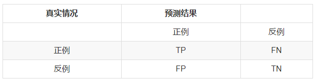
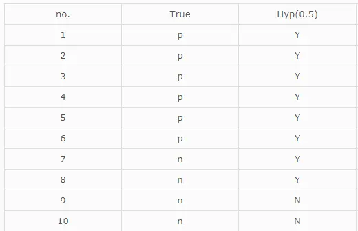
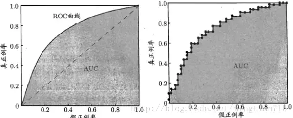
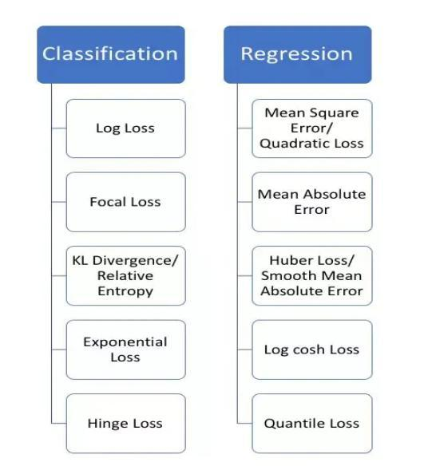

# 算法通用问题

>   参考链接：[PPshrimpGo/AIinterview: 算法工程师面试题整理 (github.com)](https://github.com/PPshrimpGo/AIinterview)


>

## 3. 模型评估方法

### 1. Accuracy作为指标有哪些局限性？

> 准确率是指分类正确的样本占总样本的比例
>
> 准确率是样本分类问题中最简单也是最直观的评价指标。但存在明显的缺陷。
>
> 比如负样本占99%时，分类器把所有样本都预测为负样本也可以获得99%的准确率。所以，当不同类别的样本比例非常不均衡时。占比大的类别往往成为影响准确率的最主要因素。
>
> 此时准确率指标并不足以说明分类器的好坏。

### 2. ROC曲线和PR曲线各是什么？

* PR曲线

> **PR曲线实则是以precision（精准率）和recall（召回率）这两个为变量而做出的曲线，其中recall为横坐标，precision为纵坐标。**
>
> 什么是精准率？什么是召回率？
>
> 在二分类问题中，分类器将一个实例的分类标记为是或否，可以用一个**混淆矩阵**来表示，如下图所示。
>
> 
>
> 把正例正确地分类为正例，表示为TP（true positive），把正例错误地分类为负例，表示为FN（false negative）。
> 把负例正确地分类为负例，表示为TN（true negative）， 把负例错误地分类为正例，表示为FP（false positive）。
>
> 从混淆矩阵可以得出精准率与召回率：**precision = TP/(TP + FP), recall = TP/(TP +FＮ)**
>
> 
>
> **一个阈值对应PR曲线上的一个点。通过选择合适的阈值，比如50%，对样本进行划分，概率大于50%的就认为是正例，小于50%的就是负例,从而计算相应的精准率和召回率。（选取不同的阈值，就得到很多点，连起来就是PR曲线）**
>
> > 举个例子如下：(true这列表示正例或者负例，hyp这列表示阈值0.5的情况下，概率是否大于0.5)
> >
> > 
> >
> > 那么根据这个表格我们可以计算：TP=6，FN=0，FP=2，TN=2。故recall=6/(6+0)=1,precison=6/(6+2)=0.75，那么得出坐标（1，0.75）。同理得到不同阈下的坐标，即可绘制出曲线。
> >
> > 
>
> 
>
> **如果一个学习器的P-R曲线被另一个学习器的P-R曲线完全包住，则可断言后者的性能优于前者，例如上面的A和B优于学习器C。**但是A和B的性能无法直接判断，我们可以根据曲线下方的面积大小来进行比较，但更常用的是平衡点或者是F1值。**平衡点（BEP）是P=R时的取值，如果这个值较大，则说明学习器的性能较好。而F1  =  2 \* P \* R ／( P + R )，同样，F1值越大，我们可以认为该学习器的性能较好。**

* ROC 曲线

> 有了前面的PR的铺垫，ROC曲线就会更好理解了。
>  **在ROC曲线中，横轴是假正例率（FPR），纵轴是真正例率（TPR）。**
>  **(1)真正类率(True Postive Rate)TPR: TP/(TP+FN),代表分类器预测的正类中实际正实例占所有正实例的比例。
>  (2)负正类率(False Postive Rate)FPR: FP/(FP+TN)，代表分类器预测的正类中实际负实例占所有负实例的比例。**
>  我们可以发现：**TPR=Recall。**
>  ROC曲线也需要相应的阈值才可以进行绘制，原理同上的PR曲线。
>
> 下图为ROC曲线示意图，因现实任务中通常利用有限个测试样例来绘制ROC图，因此应为无法产生光滑曲线，如右图所示。
>
> 
>
> > 绘图过程：给定m个正例子，n个反例子，根据学习器预测结果进行排序，先把分类阈值设为最大，使得所有例子均预测为反例，此时TPR和FPR均为0，在（0，0）处标记一个点，再将分类阈值依次设为每个样例的预测值，即依次将每个例子划分为正例。设前一个坐标为(x,y)，若当前为真正例，对应标记点为(x,y+1/m)，若当前为假正例，则标记点为（x+1/n,y），然后依次连接各点。
>
> >**ROC曲线图中的四个点**
> > 第一个点：(0,1)，即FPR=0, TPR=1，这意味着FN=0，并且FP=0。这是完美的分类器，它将所有的样本都正确分类。
> > 第二个点：(1,0)，即FPR=1，TPR=0，类似地分析可以发现这是一个最糟糕的分类器，因为它成功避开了所有的正确答案。
> > 第三个点：(0,0)，即FPR=TPR=0，即FP=TP=0，可以发现该分类器预测所有的样本都为负样本（negative）。
> > 第四个点：（1,1），分类器实际上预测所有的样本都为正样本。
> >
> >经过以上的分析，ROC曲线越接近左上角，该分类器的性能越好。
>
> **PR曲线与ROC曲线的对比**
>
> 

>##### AUC
>
>这里补充一下AUC的简单介绍。
> **AUC (Area under Curve)：ROC曲线下的面积，介于0.1和1之间，作为数值可以直观的评价分类器的好坏，值越大越好。**
> AUC = 1，是完美分类器，采用这个预测模型时，存在至少一个阈值能得出完美预测。绝大多数预测的场合，不存在完美分类器。
> 0.5 < AUC < 1，优于随机猜测。这个分类器（模型）妥善设定阈值的话，能有预测价值。
> AUC = 0.5，跟随机猜测一样（例：丢铜板），模型没有预测价值

```
https://www.jianshu.com/p/ac46cb7e6f87
http://www.fullstackdevel.com/computer-tec/data-mining-machine-learning/501.html
```

### 3. 编程实现AUC的计算，并指出复杂度？

> 有两种计算AUC的方法:
>
> 1.绘制ROC曲线，ROC曲线下面的面积就是AUC的值
>
> 2.假设总共有（m+n）个样本，其中正样本m个，负样本n个，总共有mn个样本对，计数，正样本预测为正样本的概率值大于负样本预测为正样本的概率值记为1，累加计数，然后除以（mn）就是AUC的值

```
def get_roc(pos_prob,y_true):
    pos = y_true[y_true==1]
    neg = y_true[y_true==0]
    threshold = np.sort(pos_prob)[::-1]        # 按概率大小逆序排列
    y = y_true[pos_prob.argsort()[::-1]]
    tpr_all = [0] ; fpr_all = [0]
    tpr = 0 ; fpr = 0
    x_step = 1/float(len(neg))
    y_step = 1/float(len(pos))
    y_sum = 0     # 用于计算AUC
    for i in range(len(threshold)):
        if y[i] == 1:
            tpr += y_step
            tpr_all.append(tpr)
            fpr_all.append(fpr)
        else:
            fpr += x_step
            fpr_all.append(fpr)
            tpr_all.append(tpr)
            y_sum += tpr
   return tpr_all,fpr_all,y_sum*x_step   # 获得总体TPR，FPR和相应的AUC
   
排序复杂度：O(log2(P+N))

计算AUC的复杂度：O(P+N)
```


### 4. AUC指标有什么特点？放缩结果对AUC是否有影响？

* AUC反映的是分类器对样本的排序能力。

	> 根据这个解释，如果我们完全随机的对样本分类，那么AUC应该接近0.5。另外值得注意的是，AUC对样本类别是否均衡并不敏感，这也是不均衡样本通常用AUC评价分类器性能的一个原因
	>
	> AUC（Area under Curve）指的是ROC曲线下的面积，介于0和1之间。AUC作为数值可以直观地评价分类器的好坏，值越大越好。
	>
	> 它的统计意义是从所有正样本随机抽取一个正样本，从所有负样本随机抽取一个负样本，当前score使得正样本排在负样本前面的概率。

* 放缩结果对AUC没有影响

### 5. 余弦距离与欧式距离有什么特点？

* 余弦距离

	> 余弦距离也称为余弦相似度，是用向量空间中的两个向量之间夹角的余弦值作为衡量两个向量间差异大小的度量；值越小，表示两个向量越相近

* 欧式距离

	

## 4. 基本方法

### 1. 如何划分训练集？如何选取验证集？

>1. 根据经验
>
>（1.）通常80%为训练集，20%为测试集
>
>（2.）当数据量较小时（万级别及以下）的时候将训练集、验证集以及测试集划分为6：2：2；若是数据很大，可以将训练集、验证集、测试集比例调整为98：1：1
>
>（3.）当数据量很小时，可以采用K折交叉验证
>
>（4.）划分数据集时可采用随机划分法（当样本比较均衡时），分层采样法（当样本分布极度不均衡时）
>
>2. 随机采样
>
>```python
>import numpy as np
>def split_train_test(data,test_ratio):
>        #设置随机数种子，保证每次生成的结果都是一样的
>        np.random.seed(42)
>        #permutation随机生成0-len(data)随机序列
>        shuffled_indices = np.random.permutation(len(data))
>        #test_ratio为测试集所占的半分比
>        test_set_size = int(len(data)) * test_ratio
>        test_indices = shuffled_indices[:test_ratio]
>        train_indices = shuffled_indices[test_set_size:]
>        #iloc选择参数序列中所对应的行
>        return data.iloc[train_indices],data.iloc[test_indices]
>#测试
>train_set,test_set = split_train_test(data,0.2)print(len(train_set), "train +", len(test_set), "test")
>```
>
>

### 2. 什么是偏差和方差？

* 偏差是描述预测值与真实值之间的差异，差异越大模型的预测能力越差
* 方差是描述预测值的变化范围。方差越大说明模型越不稳定
* 过拟合高方差，欠拟合高偏差

### 5. 深度模型参数调整的一般方法论？

**重要性：学习率 > 正则值 > dropout**

> 1. 学习率：遵循小->大->小原则
> 1. 初始化：选择合适的初始化方式，有预训练模型更好
> 1. 优化器选择：adam比较快，sgd较慢
> 1. loss：回归问题选L2 loss，分类问题选交叉熵
> 1. 从小数据大模型入手，先过拟合，再增加数据并根据需要调整模型复杂度
> 1. 可视化

## 5. 优化方法

### 1. 简述了解的优化器，发展综述？

**深度学习优化算法经历了 SGD -> SGDM -> NAG ->AdaGrad -> AdaDelta -> Adam -> Nadam 这样的发展历程。**


### 2. 常用的损失函数

**损失函数的应用场景**




### 3. 梯度下降与拟牛顿法的异同？

* 参数更新模式相同
* 梯度下降法利用误差的梯度来更新参数，拟牛顿法利用海塞矩阵的近似来更新参数
* 梯度下降是泰勒级数的一阶展开，而拟牛顿法是泰勒级数的二阶展开
* SGD能保证收敛，但是L-BFGS在非凸时不收敛

## 其他

### 1. cbow和skipgram如何选择？

> 参考：https://zhuanlan.zhihu.com/p/37477611

> - CBOW ：根据上下文词语来预测当前词的生成概率
> - Skip-gram ：根据当前词来预测上下文中各词的生成概率

### 2. word2vec的原理，glove的原理，fasttext的原理？

> 参考： https://zhuanlan.zhihu.com/p/56382372

### 3. 了解elmo和bert吗？简述与word embedding的联系和区别

> 参考：https://zhuanlan.zhihu.com/p/264989685

### 4. 图像和文本和语音数据各有哪些数据增强方法？

> 视频数据增强参考：https://zhuanlan.zhihu.com/p/385311896
>
> 音频数据增强参考：https://blog.csdn.net/qq_36999834/article/details/109851965
>
> 图像和文本数据增强参考：https://juejin.cn/post/7027307485061251102

### 5. rcnn、fatse rcnn、fatser rcnn、mask rcnn的原理？

> 参考： https://blog.csdn.net/qq_43799400/article/details/123127851

### 6. 介绍resnet和GoogLeNet中的inception module的结构？

> 参考： https://zhuanlan.zhihu.com/p/41691301

### 7. 介绍yolo和ssd ？

> https://www.jianshu.com/p/aab93e615a62

### 8. 介绍FM，FFM，deepFM，deepWide.

> 参考： https://zhuanlan.zhihu.com/p/268776484

### 9. 机器翻译如何解决oov？

> 参考：https://www.zhihu.com/question/55172758

> OOV` 问题是NLP中常见的一个问题，其全称是`Out-Of-Vocabulary`，下面简要的说了一下`OOV
>
> 


