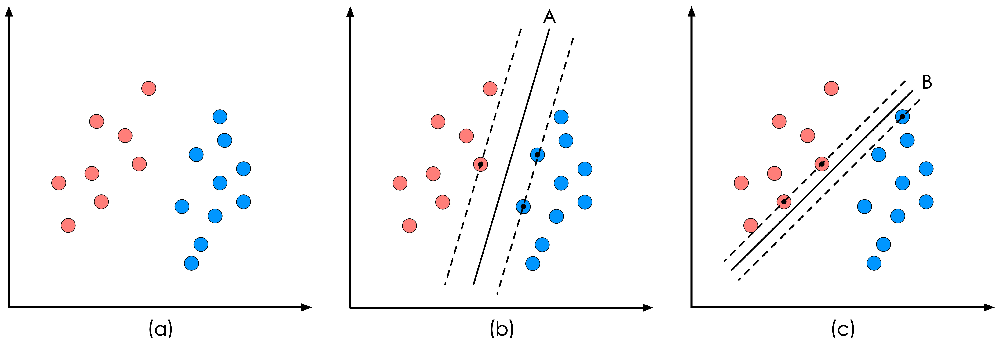

# 支持向量机（Support Vector Machine）

支持向量机是一种分类算法，它在解决小样本、非线性及高维模式识别中表现出许多特有的优势，并能够推广到函数拟合等机器学习问题中。

## 什么是SVM？

支持向量是指在求解的过程中，会发现只根据部分数据就可以确定分类器，这些数据就是**支持向量**

SVM就是通过**支持向量**运算的分类器

在一个二维环境中，其中点$R$、$S$、$G$和其他靠近中间$g$线的点都可以看作为支持向量，它们可以决定分类器，即$g$线的具体参数。如下图所示：

SVM是一种二分类模型，它的目的是寻找一个超平面来对样本进行分割。分割的原则是边界最大化，最终转换为一个凸二次规划问题来求解。由简至繁模型包括以下几点：

1）当训练样本线性可分时，通过硬边界（Hard Margin）最大化，学习一个线性可分支持向量机

2）当训练样本近似线性可分时，通过软边界（Soft Margin）最大化，学习一个线性可分支持向量机

3）当训练样本线性不可分时，通过核技巧和软边界最大化，得到一个非线性可分支持向量机

## SVM可以解决的问题

1） 线性分类

如下图所示，红色和蓝色的二维数据点显然是可以被一条直线分开的，在模式识别领域称为线性可分问题。

然而将两类数据点分开的直线显然不止一条。图1(b)和(c)分别给出了A、B两种不同的分类方案，其中黑色实线为分界线，术语称为“**决策面**”。每个决策面对应了一个线性分类器。

虽然在目前的数据上看，这两个分类器的分类结果是一样的，但如果考虑潜在的其他数据，则两者的分类性能是有差别的。

SVM算法认为上图中的分类器A在性能上优于分类器B，其依据是A的分类间隔比B要大。这里涉及到第一个SVM独有的概念“**分类间隔**”，SVM算法要找的就是最优的分类间隔。

2）非线性分类

可以结合**拉格朗日乘子法(Lagrange Multiplier)**、**KKT(Karush Kuhn Tucker)**条件，以及**核函数**可以生成非线性分类器，进而支持非线性数据的分类。

## 核函数的特点及作用

*   目的

>   把原坐标系里线性不可分的数据用核函数Kernel投影到另一个空间，尽量使得数据在新的空间里线性可分

*   特点

1）避免了“维数灾难”，大大减少了计算量。输入空间的维数n对核函数矩阵无影响。因此，核函数方法可以有效处理高维输入。

2）无须知道非线性变换函数的形式和参数。

3）核函数的形式和参数的变化会隐式地改变从输入空间到特征空间的映射，进而对特征空间的性质产生影响，最终改变各种核函数方法的性能。

4）核函数方法可以和不同的算法相结合，形成多种不同的基于核函数技术的方法，且这两部分的设计可以单独进行，并可以为不同的应用选择不同的核函数和算法。

## SVM的主要特点

1） SVM算法的理论基础是非线性映射，利用内积核函数向高维空间进行非线性映射。

2）目标是对特征空间划分得到最优超平面，SVM算法的核心是最大化分类边界。

3）支持向量是SVM的训练结果，在分类决策中起决定作用的是支持向量

4）SVM是一种有坚实理论基础的新颖的适用小样本学习方法。它基本上不涉及概率测度集大数定理等问题，也简化了通常的分类和回归问题。

5）SVM的最终决策函数只由少数的支持向量所确定，计算的复杂性取决于支持向量的数目，而不是样本空间的维度，这在某种意义上避免了“维数灾难”。

6）少数支持向量决定了最终结果，这不但可以帮助我们抓住关键样本、“剔除”大量冗余样本，而且注定了SVM算法简单，具有较好的鲁棒性。鲁棒性主要体现在：

>   增删非支持向量对模型没有影响
>
>   支持向量样本集具有一定的鲁棒性
>
>   在有些成功的应用的中，svm对核的选取不敏感

7）SVM学习问题可以表示为凸优化问题，因此可以利用已知的有效算法发现目标函数的全局最小值。

8）SVM通过最大化决策边界的边缘来控制模型的能力。

9）SVM在小样本训练集上能够得到比其他算法好很多的结果。SVM优化的目标是结构化风险最小，而不是经验风险最小，避免了过拟合问题，通过得到对数据分布的结构化描述，降低了对数据规模和数据分布的要求，有优秀的泛化能力

10）SVM是一个凸优化问题，因此具有局部最优解一定是全局最优解的特点。

## SVM的缺点

1） 对大规模训练样本难以实施。

>   SVM的空间消耗主要是存储训练样本和核矩阵，由于SVM是借助二次规划来求解支持向量的，而求解二次规划将涉及m阶矩阵的计算。

2）解决多分类问题存在困难。

3）对缺失数据敏感，对参数和核函数的选择敏感。

## 逻辑回归和SVM的异同

*   相同点

1） 都是分类算法

2）都是监督学习算法

3）都是判别模型

4）不考虑核函数，都是线性分类算法

*   不同点

1）损失函数不同，LR使用log损失，SVM使用合页损失。

2）LR对异常值敏感，SVM则不是。

3）计算复杂度不同。对于海量数据，SVM的效率很低，LR效率比较高。

4）对于非线性问题的处理方式不同。LR主要靠特征构造，必须组合交叉验证，特征离散化。SVM也可以这样，也可以通过核函数。SVM利用核函数，通过对偶求解高效处理。

5）SVM的损失函数自带正则。

6）SVM自带结构风险最小化，LR是经验风险最小化。

7）SVM会采用核函数，LR一般不会。

## 参考资料

>   https://zhuanlan.zhihu.com/p/24638007
>
>   [SVM原理篇之手撕SVM_chenchenchenchenyi的博客-CSDN博客](https://blog.csdn.net/weixin_39605679/article/details/81170300)