# 行人重识别

## 1. 什么是行人重识别？

行人重识别（Person Re-identification也称行人再识别，简称为ReID），是利用计算机视觉技术判断图像或者视频序列中是否存在特定行人的技术；或者说行人重识别是在已有的可能来源与非重叠摄像机领域的视频序列中识别出目标行人。广泛被认为是图像检索的子问题。

## 2. 行人重识别研究的背景、意义及现状

## 3. 行人重识别的应用和目前存在的问题

### 3.1 应用场景

 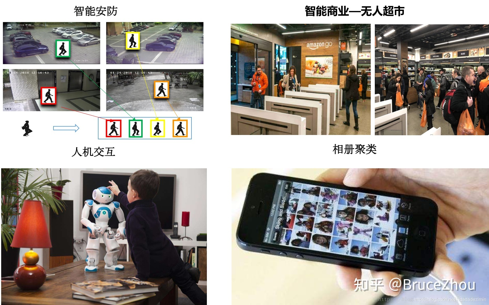

### 3.2 困难及解决方案

#### 3.2.1 面临的困难

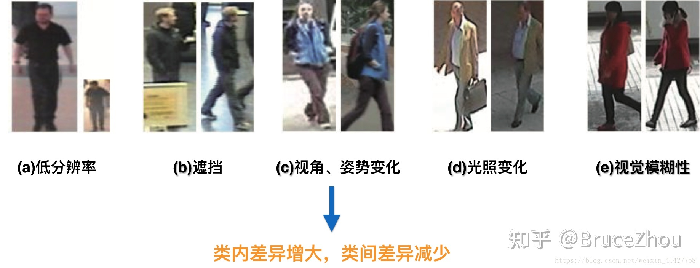

*   低分辨率
*   遮挡
*   视角、姿势变化
*   光照变化
*   视觉模糊性：在不同的光照条件下，行人的外观特征也会有很大的差异

#### 3.2.2 由于存在这上述的问题那么我们是否可以考虑从其他方向来ReID？

##### 1. 能不能用人脸识别做重识别？

理论上可以。但有2个原因使得比较难应用：

a) 广泛存在后脑勺和侧脸的情况，做正脸的人脸识别难

b) 摄像头拍摄的像素可能不高

##### 2. 有些人靠衣服的颜色就可以判断出来了，还需要行人重识别吗？

衣服颜色是行人重识别做出判断的重要因素之一。但仍有不足：

a) 摄像头之间有色差，并且会有光照的影响；

b) 有撞衫的可能

##### 3. 使用图像检索的指标来衡量行人重识别的结果是否合适？

不合适。早期的数据集每个query只有一个正确的retrieval目标，所以采用top1比较合适。但是目前随着大数据集的提出，数据集中往往包含多个摄像头的多个正确目标。光使用top1的话，不能反应模型的真实能力。所以类似图像检索，重识别加入了mAP作为衡量标准，将top2,top3...topn都考虑进去。

## 4. 行人重识别的方法

### ①基于表征学习的ReID方法

这主要得益于深度学习，尤其是卷积神经网络(Convolutional neural network, CNN)的快速发展。由于CNN可以自动从原始的图像数据中根据任务需求自动提取出表征特征(Representation)，所以有些研究者把行人重识别问题看做分类(Classification/Identification)问题或者验证(Verification)问题：

a) 分类问题是指利用行人的ID或者属性等作为训练标签来训练模型；b) 验证问题是指输入一对（两张）行人图片，让网络来学习这两张图片是否属于同一个行人。示意图如下：

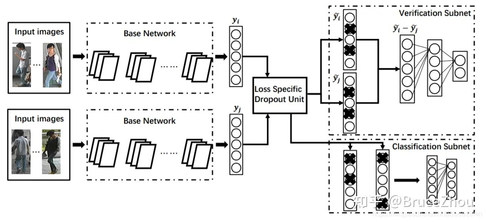

```
网络输入为若干对行人图片，包括分类子网络(Classification Subnet)和验证子网络(Verification Subnet)。

分类子网络对图片进行ID预测，根据预测的ID来计算分类误差损失。

验证子网络融合两张图片的特征，判断这两张图片是否属于同一个行人，该子网络实质上等于一个二分类网络。

经过足够数据的训练，再次输入一张测试图片，网络将自动提取出一个特征，这个特征用于行人重识别任务。
```

基于特征表示的方法重点在于**设计鲁棒可靠的行人图像特征表示模型**，即能够区分不同行人，同时能够不受光照和视角变化的影响。

#### 特征分类

##### 1） 底层视觉特征

这种方法基本上都是将图像划分成多个区域，对每个区域提取多种不同的底层视觉特征，组合后得到鲁棒性更好的特征表示形式。

最常用的就是颜色直方图，多数情况下行人的衣服颜色结构简单，因此颜色表示是有效的特征，通常用RGB、HSV直方图表示。把RGB空间的图像转化成HSL和YCbCr颜色空间，观察对数颜色空间中目标像素值的分布，颜色特征在不同光照或角度等行人识别的不适环境中具有一定的不变性。以及局部特征，如局部不变特征–尺度不变特征变换（scale-invariant feature transform，SIFT），SURF和Covariance描述子ELF（ensemble of localized features）方法中，结合RGB、YCbCr、HS颜色空间的颜色直方图，具有旋转不变性的Schmid和Gabor滤波器计算纹理直方图。还有纹理特征、Haar-like Represention、局部二值模式（LBP）、Gabor滤波器、共生矩阵（Co-occurrence Matrics）。

##### 2）中层语义属性

可以通过语义信息来判断两张图像中是否属于同一行人，比如颜色、衣服以及携带的包等信息。

相同的行人在不同视频拍摄下，语义属性很少变化。

有的采用15种语义来描述行人，包括鞋子、头发颜色长短、是否携带物品等，分类器用SVM定义每幅行人图像的以上语义属性。结合语义属性重要性加权以及与底层特征融合，最终描述行人图像。对图像超像素划分，最近分割算法对图像块定义多种特征属性，颜色、位置和SIFT特征，效果有提高。

##### 3）高级视觉特征

```
特征的选择技术对行人再识别的识别率的性能进行提升，如Fisher向量[编码]；提取颜色或纹理直方图，预先定义块或条纹形状的图像区域；或者编码区域特征描述符来建立高级视觉特征。用某种描述符对密集轨迹、纹理、直方图进行编码，突出重要信息。

受到多视角行为识别研究和Fisher向量编码的影响，一种捕获软矩阵的方法，即DynFV（dynamic fisher vector）特征和捕获步态和移动轨迹的Fisher向量编码的密集短轨迹时间金字塔特征被提出。

Fisher向量编码方法是首先用来解决大尺度图像分类的方法，也能改善行为识别的性能。有的对行人的每个图像分成6个水平条带，在每个条带上计算纹理和颜色直方图。在YCbCr、HSV、白化的RGB颜色空间计算直方图建立颜色描述符，并用local fisher disrciminant analysis（LFDA）降维。学习出的矩阵把特征转换到新的空间，LFDA能在嵌入过程中使特征的局部结构适用于图像遮挡，背景变化和光照变化的情况，最后把计算变换空间中的特征向量的均值作为这个行人最终的特征向量表示。
```


```
T. Matsukawa提出GOG（Gaussian Of Gaussian），把一幅图像分成水平条带和局部块，每个条带用一个高斯分布建模。每个条带看作一系列这样的高斯分布，然后用一个单一的高斯分布总体表示。GOG特征提取的方法好表现在用像素级特征的一个局部高斯分布来描述全局颜色和纹理分布，并且GOG是局部颜色和纹理结构的分层模型，可以从一个人的衣服的某些部分得到。
```


```
此外，深度学习也被应用于行人重识别的特征提取中，在AlexNet-Finetune中，开始在ImageNet数据集上预训练的基于AlexNet结构的CNN，并用这个数据集对数据进行微调。在微调过程中，不修改卷积层的权重，训练后两个全连接层。

McLaughlin等采用了类似的方法，对图像提取颜色和光流特征，采用卷积神经网络（CNN）处理得到高层表征，然后用循环神经网络（RNN）捕捉时间信息，然后池化得到序列特征。T对来自各个领域的数据训练出同一个卷积神经网络（CNN），有些神经元学习各个领域共享的表征，而其他的神经元对特定的某个区域有效，得到鲁棒的CNN特征表示。
```

#### 损失计算

##### 1) 分类损失

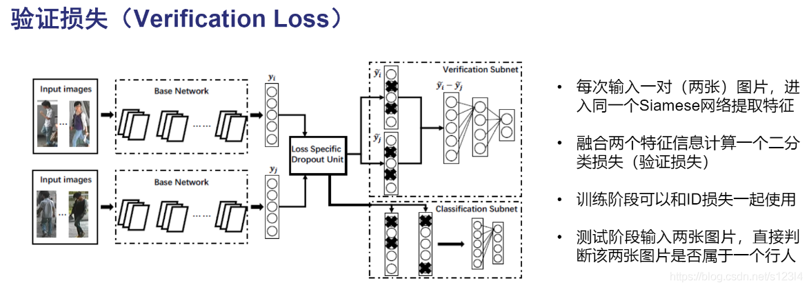

##### 2) 属性损失

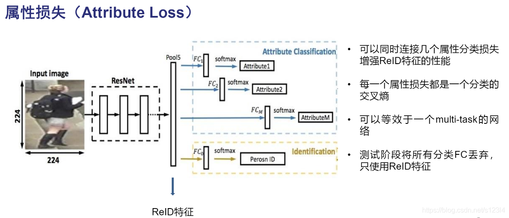

##### 3) 验证损失


### ② 基于度量学习的ReID方法

```
度量学习(Metric learning)是广泛用于图像检索领域的一种方法。

不同于特征学习，度量学习旨在通过网络学习出两张图片的相似度。

在行人重识别问题上，具体为同一行人的不同图片相似度大于不同行人的不同图片。

最后网络的损失函数使得相同行人图片（正样本对）的距离尽可能小，不同行人图片（负样本对）的距离尽可能大。

常用的度量学习损失方法有对比损失(Contrastive loss)、三元组损失(Triplet loss)、 四元组损失(Quadruplet loss)、难样本采样三元组损失(Triplet hard loss with batch hard mining, TriHard loss)。
```

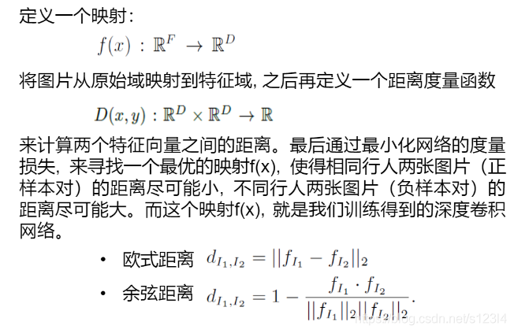

#### 度量学习损失方法

##### 1. 对比损失

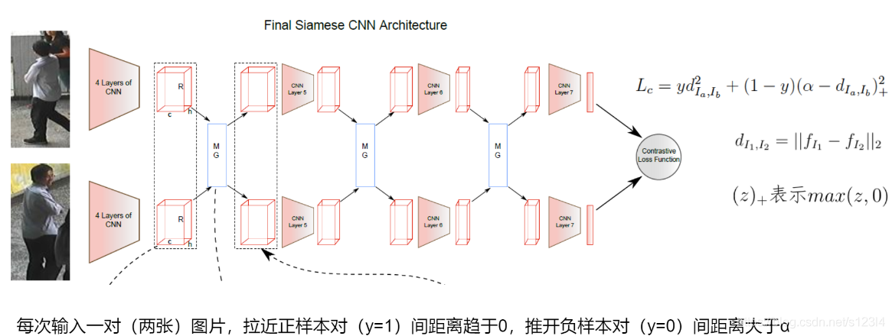

##### 2. 三元组损失

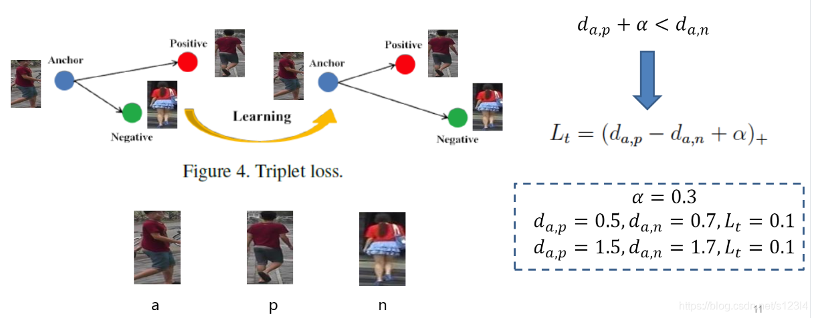

缺点:没有考虑距离的绝对值，不利目标跟踪

##### 3. 改进三元组损失

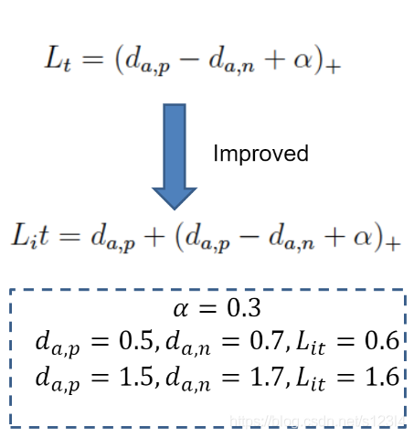

##### 4. 四元组损失

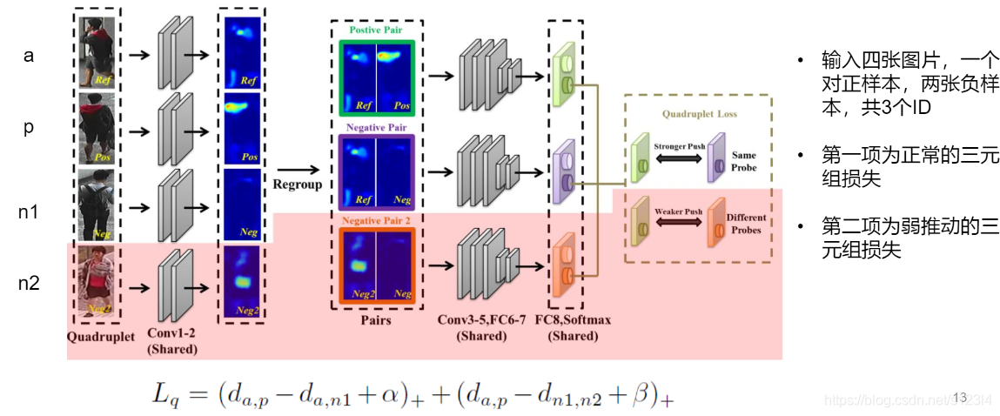

##### 5. 难样本挖掘，难样本采样三元组损失


TriHard loss只考虑了极端样本的信息，造成局部梯度特别大，使得网络崩溃。
提出了一种自适应权重损失：对于正样本对，距离越大权值就越大；对于负样本对，距离越大权值就越小

### ③基于局部特征的ReID方法

常用的提取局部特征的思路主要有**图像切块**、**利用骨架关键点定位**以及**姿态矫正**等等。

#### a. 图像切块

如下图：图片被垂直等分为若干份，因为垂直切割更符合我们对人体识别的直观感受，所以行人重识别领域很少用到水平切割。

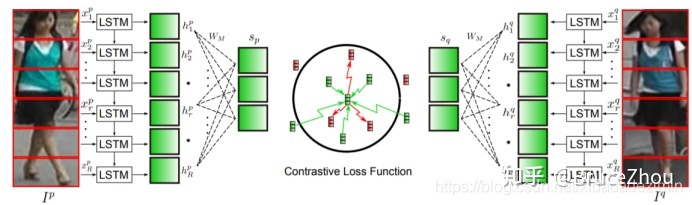

#### b. 骨架关键点定位

为了解决上图中图像不对齐情况下手动图像切片失效的问题，一些论文利用一些先验知识先将行人进行对齐，这些先验知识主要是**预训练的人体姿态(Pose)**和**骨架关键点(Skeleton) 模型**。论文先用姿态估计的模型估计出行人的关键点，然后用仿射变换使得相同的关键点对齐。如下图所示：

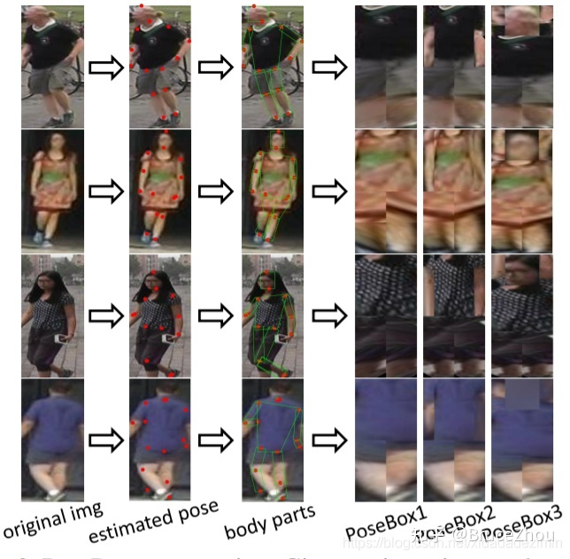

```
一个行人通常被分为**14个关键点**，这14个关键点把人体结果分为若干个区域。

为了提取不同尺度上的局部特征，作者设定了**3个不同的PoseBox组合**。

之后这3个PoseBox矫正后的图片和原始为矫正的图片一起送到网络里去提取特征，这个特征包含了全局信息和局部信息。

特别提出，这个仿射变换可以在进入网络之前的预处理中进行，也可以在输入到网络后进行。如果是后者的话需要需要对仿射变换做一个改进，因为传统的仿射变化是不可导的。为了使得网络可以训练，需要引入可导的近似放射变化，在本文中不赘述相关知识。
```


##### * Spindle Net

CVPR2017的工作Spindle Net也利用了14个人体关键点来提取局部特征。但并没有用仿射变换来对齐局部图像区域，而是直接利用这些关键点来抠出感兴趣区域(Region of interest, ROI)。如下图所示：

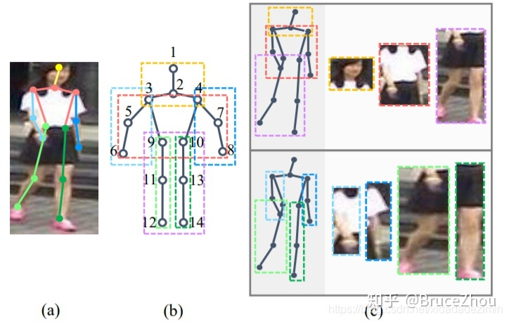

```
首先通过骨架关键点提取的网络提取14个人体关键点，之后利用这些关键点提取7个人体结构ROI。

网络中所有提取特征的CNN（橙色表示）参数都是共享的，这个CNN分成了线性的三个子网络FEN-C1、FEN-C2、FEN-C3。

对于输入的一张行人图片，有一个预训练好的骨架关键点提取CNN（蓝色表示）来获得14个人体关键点，从而得到7个ROI区域，其中包括三个大区域（头、上身、下身）和四个四肢小区域。

这7个ROI区域和原始图片进入同一个CNN网络提取特征。

原始图片经过完整的CNN得到一个全局特征。

三个大区域经过FEN-C2和FEN-C3子网络得到三个局部特征。

四个四肢区域经过FEN-C3子网络得到四个局部特征。

之后这8个特征按照图示的方式在不同的尺度进行联结，最终得到一个融合全局特征和多个尺度局部特征的行人重识别特征。
```

##### * GLAD(Global-Local-Alignment Descriptor)全局-局部对齐特征描述子

解决**行人姿态变化**的问题。如下图所示：

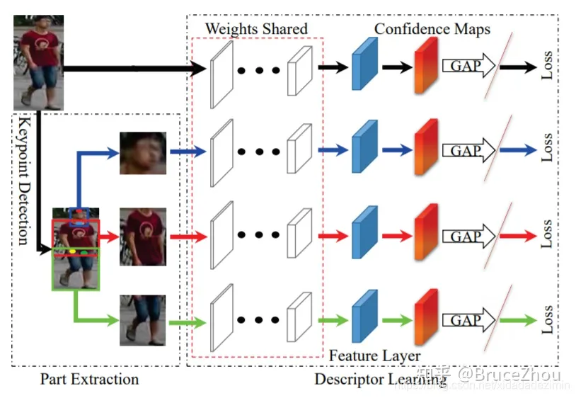

```
与Spindle Net类似，GLAD利用提取的人体关键点把图片分为头部、上身和下身三个部分。

之后将整图和三个局部图片一起输入到一个参数共享CNN网络中，最后提取的特征融合了全局和局部的特征。

为了适应不同分辨率大小的图片输入，网络利用全局平均池化(Global average pooling, GAP)来提取各自的特征。

和Spindle Net略微不同的是四个输入图片各自计算对应的损失，而不是融合为一个特征计算一个总的损失。
```

*   自动对齐模型

上述局部特征对齐方法都需要一个额外的骨架关键点或者姿态估计的模型，而训练一个可以达到实用程度的模型需要收集足够多的训练数据，这个代价是非常大的。

为了解决以上问题，AlignedReID提出基于SP距离的自动对齐模型如图12，在不需要额外信息的情况下来自动对齐局部特征。而采用的方法就是**动态对齐算法，或者也叫最短路径距离**。这个最短距离就是自动计算出的local distance。

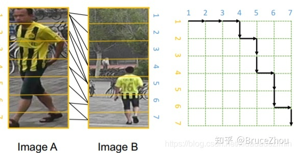

### ④ 基于视频序列的ReID方法

目前单帧的ReID研究还是主流，但是通常单帧图像的信息是有限的，因此有很多工作集中在**利用视频序列来进行行人重识别方法**的研究。基于视频序列的方法最主要的不同点就是这类方法**不仅考虑了图像的内容信息，还考虑了帧与帧之间的运动信息**等。

主要思想是**利用CNN来提取图像的空间特征，而基于视频序列的方法主要思想是利用CNN 来提取空间特征的同时利用递归循环网络(Recurrent neural networks, RNN)来提取时序特征**。如下图：

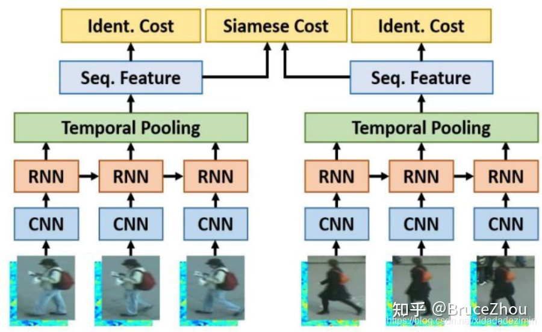

```
网络输入为图像序列。

每张图像都经过一个共享的CNN提取出图像空间内容特征，

之后这些特征向量被输入到一个RNN网络去提取最终的特征。

最终的特征融合了单帧图像的内容特征和帧与帧之间的运动特征。而这个特征用于代替前面单帧方法的图像特征来训练网络。
```

*   AMOC(Accumulative motion context network)累计运动背景网络

AMOC输入的包括原始的图像序列和提取的光流序列。

通常提取光流信息需要用到传统的光流提取算法，但是这些算法计算耗时，并且无法与深度学习网络兼容。

为了能够得到一个自动提取光流的网络，作者首先训练了一个运动信息网络(Motion network, Moti Nets)。

这个运动网络输入为原始的图像序列，标签为传统方法提取的光流序列。

如下图所示，

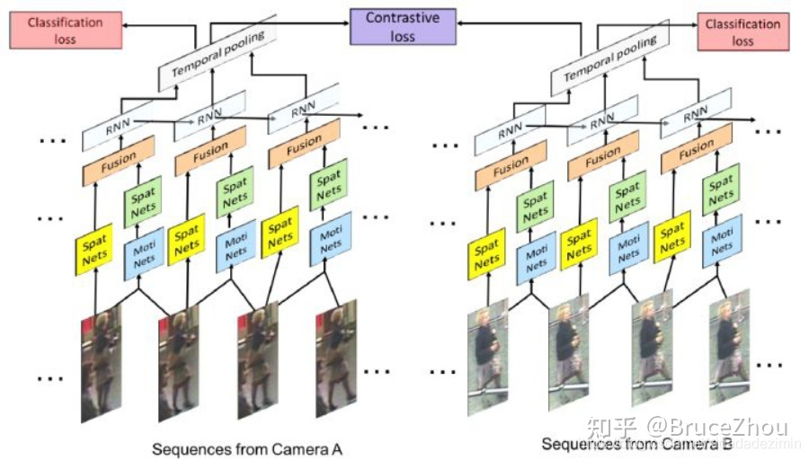

```
原始的图像序列显示在第一排，提取的光流序列显示在第二排。

网络有三个光流预测的输出，分别为Pred1，Pred2，Pred3，这三个输出能够预测三个不同尺度的光流图。

最后网络融合了三个尺度上的光流预测输出来得到最终光流图，预测的光流序列在第三排显示。

通过最小化预测光流图和提取光流图的误差，网络能够提取出较准确的运动特征。
```

```
AMOC的核心思想在于网络除了要提取序列图像的特征，还要提取运动光流的运动特征。

AMOC拥有空间信息网络(Spatial network, Spat Nets)和运动信息网络两个子网络。

图像序列的每一帧图像都被输入到Spat Nets来提取图像的全局内容特征。

而相邻的两帧将会送到Moti Nets来提取光流图特征。

之后空间特征和光流特征融合后输入到一个RNN来提取时序特征。

通过AMOC网络，每个图像序列都能被提取出一个融合了内容信息、运动信息的特征。

网络采用了分类损失和对比损失来训练模型。融合了运动信息的序列图像特征能够提高行人重识别的准确度。
```

*   新工作

>   [Region-based Quality Estimation Network for Large-scale Person Re-identification (arxiv.org)](https://arxiv.org/pdf/1711.08766.pdf)

该论文**从另外一个角度展示了多帧序列弥补单帧信息不足的作用**。

>   目前大部分video based ReID方法还是不管三七二十一的把序列信息输给网络，让网络去自己学有用的信息，并没有直观的去解释为什么多帧信息有用。

该论文则很明确地指出当单帧图像遇到遮挡等情况的时候，可以用多帧的其他信息来弥补，直接诱导网络去对图片进行一个质量判断，降低质量差的帧的重要度。如下图，

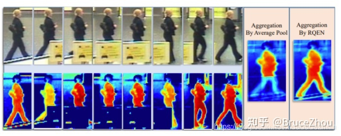

文章认为在遮挡较严重的情况下，如果用一般的pooling会造成attention map变差，遮挡区域的特征会丢失很多。

而利用论文的方法每帧进行一个质量判断，就可以着重考虑那些比较完整的几帧，使得attention map比较完整。

而**关键的实现**就是**利用一个pose estimation的网络**，论文叫做landmark detector。**当**landmark不完整的时候就证明存在遮挡，则图片质量就会变差。

之后pose feature map和global feature map都同时输入到网络，让网络对每帧进行一个权重判断，给高质量帧打上高权重，然后对feature map进行一个线性叠加。

思路比较简单但是还是比较让人信服的。

### ⑤ 基于局部特征的ReID方法

1.   存在的问题：

数据获取困难

数据集存在bias

姿态的不同

2.   解决方案：

利用GAN网络

>   [[1701.07717\] Unlabeled Samples Generated by GAN Improve the Person Re-identification Baseline in vitro (arxiv.org)](https://arxiv.org/abs/1701.07717)

发表在ICCV17会议，虽然论文比较简单，但是作为挖坑鼻祖引出一系列很好的工作。

如下图，

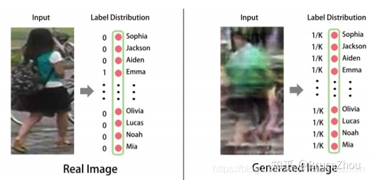

```
这篇论文生成的图像质量还不是很高，甚至可以用很惨来形容。

另外一个问题就是由于图像是随机生成的，也就是说是没有可以标注label可以用。

为了解决这个问题，论文提出一个标签平滑的方法。实际操作也很简单，就是把label vector每一个元素的值都取一样，满足加起来为1。反正也看不出属于哪个人，那就一碗水端平。

生成的图像作为训练数据加入到训练之中，由于当时的baseline还不像现在这么高，所以效果还挺明显的，至少数据量多了过拟合能避免很多。
```


>   [[1712.02225\] Pose-Normalized Image Generation for Person Re-identification (arxiv.org)](https://arxiv.org/abs/1712.02225)

对于姿态的不同，该论文使用GAN造出了一系列标准的姿态图片。

```
论文总共提取了8个pose，这个8个pose基本涵盖了各个角度。

每一张图片都生成这样标准的8个pose，那么pose不同的问题就解决。

最终用这些图片的feature进行一个average pooling得到最终的feature，这个feature融合了各个pose的信息，很好地解决的pose bias问题。

无论从生成图还是从实验的结果来看，这个工作都是很不错的。

这个工作把single query做成了multi query，但是你没法反驳，因为所有的图都是GAN生成的。

除了生成这些图需要额外的时间开销以外，并没有利用额外的数据信息。

当然这个工作也需要一个预训练的pose estimation网络来进行pose提取。
```

## 5. 数据集

>   [Person Re-Identification Datasets (neu.edu)](http://robustsystems.coe.neu.edu/sites/robustsystems.coe.neu.edu/files/systems/projectpages/reiddataset.html)

## 6. 评价指标

常用的评测指标mAP、CMC、ROC等，

### 1. ROC

ROC曲线是检测、分类、识别任务中很常用的一项评价指标。曲线上每个点反映着对同一信号刺激的感受性。具体到识别任务中就是，ROC曲线上的每一点反映的是不同的阈值对应的FP（false positive）和TP（true positive）之间的关系,如下图所示：

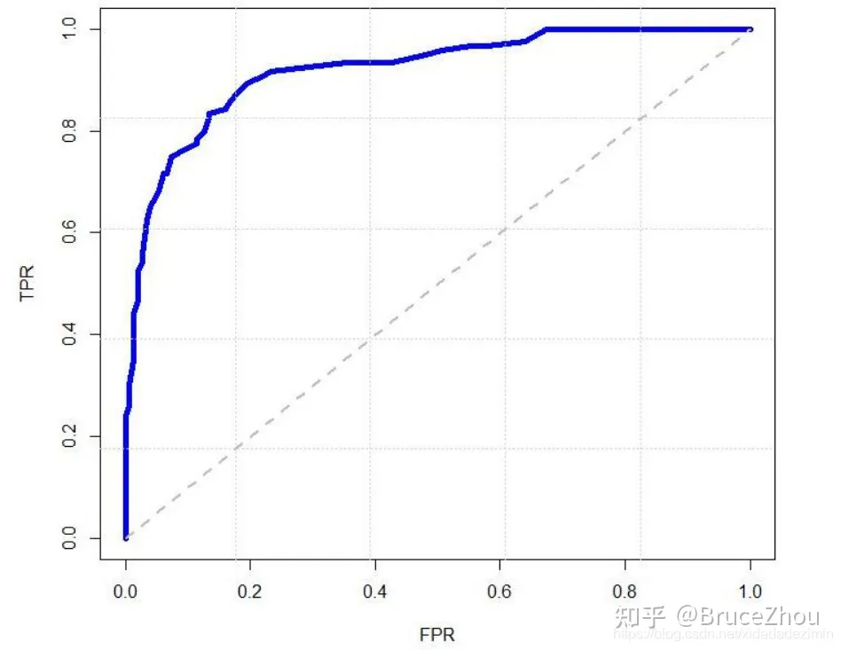

通常情况下，ROC曲线越靠近（0，1）坐标表示性能越好。

### 2. CMC

CMC曲线是算一种top-k的击中概率，主要用来评估闭集中rank的正确率。

>   举个很简单的例子，假如在人脸识别中，底库中有100个人，现在来了1个待识别的人脸（假如label为m1），与底库中的人脸比对后将底库中的人脸按照得分从高到低进行排序，我们发现：
>
>   **2.1.**如果识别结果是m1、m2、m3、m4、m5……，则此时rank-1的正确率为100%；rank-2的正确率也为100%；rank-5的正确率也为100%；
>   **2.2.**如果识别结果是m2、m1、m3、m4、m5……，则此时rank-1的正确率为0%；rank-2的正确率为100%；rank-5的正确率也为100%；
>   **2.3.**如果识别结果是m2、m3、m4、m5、m1……，则此时rank-1的正确率为0%；rank-2的正确率为0%；rank-5的正确率为100%；
>
>   同理，当待识别的人脸集合有很多时，则采取取平均值的做法。例如待识别人脸有3个（假如label为m1，m2，m3），同样对每一个人脸都有一个从高到低的得分，
>
>   **2-1.**比如人脸1结果为m1、m2、m3、m4、m5……，人脸2结果为m2、m1、m3、m4、m5……，人脸3结果m3、m1、m2、m4、m5……，则此时rank-1的正确率为（1+1+1）/3=100%；rank-2的正确率也为（1+1+1）/3=100%；rank-5的正确率也为（1+1+1）/3=100%；
>   **2-2.**比如人脸1结果为m4、m2、m3、m5、m6……，人脸2结果为m1、m2、m3、m4、m5……，人脸3结果m3、m1、m2、m4、m5……，则此时rank-1的正确率为（0+0+1）/3=33.33%；rank-2的正确率为（0+1+1）/3=66.66%；rank-5的正确率也为（0+1+1）/3=66.66%；

### 3. Precision & Recall & mAP

Precision就是检索出来的条目（比如：文档、网页等）有多少是准确的，

Recall就是所有准确的条目有多少被检索出来了。

正确率 = 提取出的正确信息条数 / 提取出的信息条数

召回率 = 提取出的正确信息条数 / 样本中的信息条数 

>   准确率和召回率都是针对同一类别来说的，并且只有当检索到当前类别时才进行计算，比如在person re-id中，一个人的label为m1，在测试集中包含3张此人的图像，检索出来的图像按照得分从高到低顺序为m1、m2、m1、m3、m4、m1….，此时
>
>   **3.1.**第一次检索到m1，提取出的正确信息条数=1，提取出的信息条数=1，样本中的信息条数=3，正确率=1/1=100%，召回率=1/3=33.33%；
>   **3.2.**第二次检索到m1，提取出的正确信息条数=2，提取出的信息条数=3，样本中的信息条数=3，正确率=2/3=66.66%，召回率=2/3=66.66%；
>   **3.3.**第三次检索到m1，提取出的正确信息条数=3，提取出的信息条数=6，样本中的信息条数=3，正确率=3/6=50%，召回率=3/3=100%；
>
>   平均正确率AP=（100%+66.66%+50%）/3=72.22%
>   而当需要检索的不止一个人时，此时正确率则取所有人的平均mAP。

## 7. 测试

2种方案：

>   **a.测试的输入是一对行人，输出为这对行人的相似度，然后再按相似度排序；**
>   **b.输入单个人，提取特征，再计算与其他人的欧式距离，然后再按距离排序。**

第一种方案的优点是，判断两个人是不是一个人，简单的二分类（是／否）。但缺点是如果我们搜索库中有m张图片，那么与目标图片组成m对图片对。每一对都要进一次模型，估算相似度，这极大的增加了测试的时间。如果我们有n个query，那么我们要计算nm次相似度（而m往往很大）。

另一种方案是，预先提取行人的特征，我们只要预先提好n+m次特征。之后只要比较就好了，比较特征可以简单的用矩阵乘法实现。 

目前两种方案都有在用，但是后一种更接近实际中图像搜索的要求，用特征来快速检索。

## 8.参考

>   [行人重识别(Person re-identification)概述 - 知乎 (zhihu.com)](https://zhuanlan.zhihu.com/p/456060221)
>
>   [(2条消息) 行人重识别——表征学习与度量学习_s123l4的博客-CSDN博客](https://blog.csdn.net/s123l4/article/details/106944012)

>   综述文章：[[[2001.04193\] Deep Learning for Person Re-identification: A Survey and Outlook (arxiv.org)](https://arxiv.org/abs/2001.04193)](https://arxiv.org/pdf/2001.04193.pdf)
>
>   [TPAMI2021|深度学习行人重识别综述与展望 - 知乎 (zhihu.com)](https://zhuanlan.zhihu.com/p/342249413)