# 经典网络结构

## LeNet

### 概念（背景）

> 1. LeNet是卷积神经网络的祖师爷LeCun在1998年提出，用于解决手写数字识别的视觉任务。 
> 1. 共有7层，其中2层卷积和2层池化层交替出现，最后3层全连接层输出得到整体的结果。
> 1. 没有添加激活层。

* 图1，每层的输出形状，参数数量

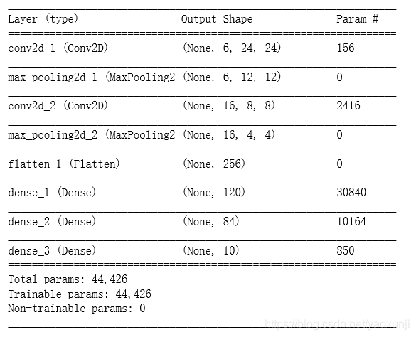

### 网络结构详解

> 卷积层块⾥的基本单位是卷积层后接最⼤池化层：
>
> * 卷积层⽤来识别图像⾥的空间模式，如线条和物体局部，卷积层块由两个这样的基本单位重复堆叠构成。
>
> 	> 1. 每个卷积层都使⽤5 × 5的窗口，并在输出上使⽤sigmoid激活函数。
> 	>
> 	> 	> 第⼀个卷积层输出通道数为6，第⼆个卷积层输出通道数则增加到16。这是因为第⼆个卷积层⽐第⼀个卷积层的输⼊的⾼和宽要小，所以增加输出通道使两个卷积层的参数尺⼨类似。
>
> * 之后的最⼤池化层则⽤来降低卷积层对位置的敏感性。
>
> 	> 两个最⼤池化层的窗口形状均为2 × 2，且步幅为2。由于池化窗口与步幅形状相同，池化窗口在输⼊上每次滑动所覆盖的区域互不重叠。
>
> * 全连接层块会将小批量中每个样本变平（flatten）
>
> 	* 全连接层的输⼊形状将变成⼆维，其中第⼀维是小批量中的样本，第⼆维是每个样本变平后的向量表⽰，且向量⻓度为通道、⾼和宽的乘积。(卷积层块的卷积层块的输出形状为(批量⼤小, 通道, ⾼, 宽)
>
> 	> 全连接层块含3个全连接层。它们的输出个数分别是120、84和10，其中10为输出的类别个数。

* 图2，网络结构

	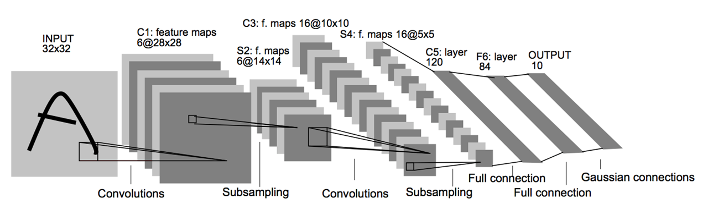

	

### pytorch代码实现

```python
import torch.nn as nn

class Lenet(nn.Module):
    def __init__(self):
        super(Lenet,self).__init__()
        layer1 = nn.Sequential()
        layer1.add_module('conv1',nn.Conv2d(1,6,3,padding=1))
        layer1.add_module('pool1',nn.MaxPool2d(2,2))
        self.layer1 = layer1
        
        layer2 = nn.Sequential()s
        layer2.add_module('conv2',nn.Conv2d(6,16,5))
        layer2.add_module('pool2',nn.MaxPool2d(2,2))
        self.layer2 = layer2
        
        layer3 = nn.Sequential()
        layer3.add_module('fc1',nn.Linear(400,120))
        layer3.add_module('fc2',nn.Linear(120,84))
        layer3.add_module('fc3',nn.Linear(84,10))
        
        self.layer3 = layer3
        
    def forward(self,x):
        x = self.layer1(x)
        x = self.layer2(x)
        x = x.view(x.size(0),-1)
        x = self.layer3(x)
        
        return x

```


## AlexNet

### 概念（背景）

> 与LeNet相比，
>
> * AlexNet包含8层变换，其中有5层卷积和2层全连接隐藏层，以及1个全连接输出层
> * AlexNet将sigmoid激活函数改成了更加简单的ReLU激活函数
> * AlexNet通过丢弃法来控制全连接层的模型复杂度。而LeNet并没有使⽤丢弃法
> * AlexNet引⼊了⼤量的图像增⼴，如翻转、裁剪和颜⾊变化，从而进⼀步扩⼤数据集来缓解过拟合

* 图1，每层输出形状，参数数量

	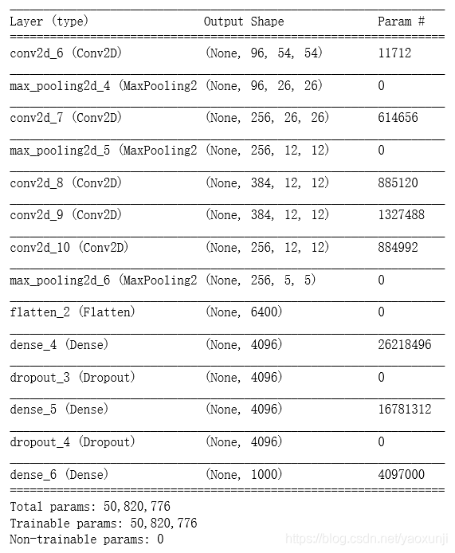

### 网络结构

> 1. AlexNet第⼀层中的卷积窗口形状是11 × 11。
>
> 	> 因为ImageNet中绝⼤多数图像的⾼和宽均⽐MNIST图像的⾼和宽⼤10倍以上，ImageNet图像的物体占⽤更多的像素，所以需要更⼤的卷积窗口来捕获物体。
>
> 2.  第⼆层中的卷积窗口形状减小到5 × 5，之后全采⽤3 × 3。
>
> 3. 此外，第⼀、第⼆和第五个卷积层之后都使⽤了窗口形状为3 × 3、步幅为2的最⼤池化层。而且，
>
> 4. AlexNet使⽤的卷积通道数也⼤于LeNet中的卷积通道数数⼗倍。
>
> 5. 最后⼀个卷积层的是两个输出个数为4096的全连接层。

* 图片

	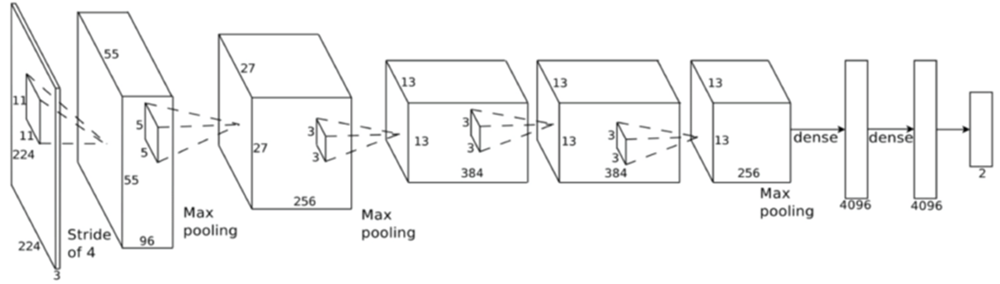

	

### pytorch代码实现

```python
class AlexNet(nn.Module):
    def __init__(self,num_classes):
        super(AlexNet,self).__init__()
        #特征抽取
        self.features = nn.Sequential(
            nn.Conv2d(2,64,kernel_size=11,stride=4,padding=2),
            nn.ReLU(inplace=True),
            nn.MaxPool2d(kernel_size=3,stride=2),
            
            nn.Conv2d(64,192,kernel_size=3,padding=2),
            nn.ReLU(inplace=True),
            nn.MaxPool2d(kernel_size=3,stride=2),
            
            nn.Conv2d(192,384,kernel_size=3,padding=1),
            nn.ReLU(inplace=True),
            
            nn.Conv2d(384,256,kernel_size=3,padding=1),
            nn.ReLU(inplace=True),
            
            nn.Con2d(256,256,kernel_size-3,padding=1),
            nn.ReLu(inplace=True),
            nn.MaxPool2d(kernel_size=3,stride=2))
        self.classifier = nn.Sequential(
            nn.Dropout(),
            nn.Linear(256,6,6,4096),
            nn.ReLU(inplace=True),
            nn.Dropout(),
            nn.Linear(4096,4096),
            nn.ReLu(inplace=True),
            nn.Linear(4096,num_classes))
        
    def forward(self,x):
        x = self.features(x)
        x = view(x.size(0),256*6*6)
        x = self.classifier(x)
        return x 

```


## VGGNet

### 概念（背景）

> 连续使⽤数个相同的填充为1、窗口形状为3 × 3的卷积层后接上⼀个步幅为2、窗口形状为2 × 2的最⼤池化层。
>
> 卷积层保持输⼊的⾼和宽不变，而池化层则对其减半。

* VGGNet，每层输出，参数数量

	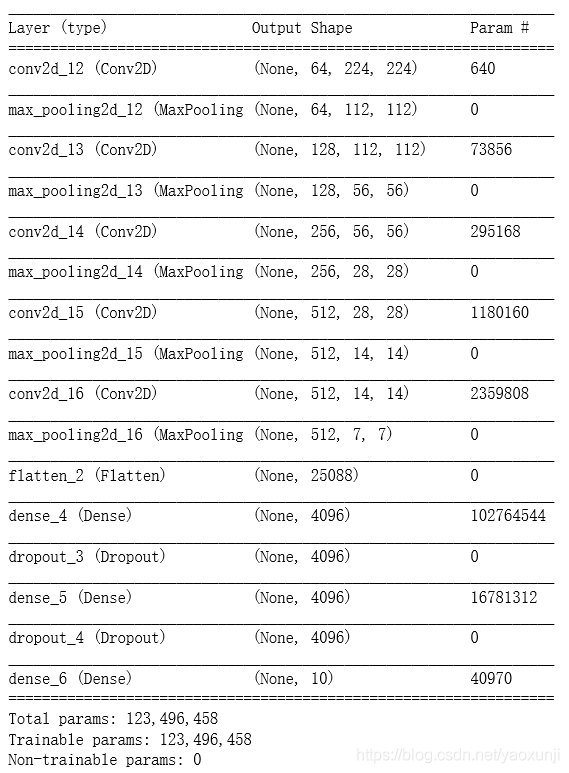

### 网路结构详解

> 而VGGNet有16-19层网络。AlexNet使用11*11的大滤波器，而VGGNet使用3*3的卷积滤波器和2*2的大池化层。AlexNet和VGGNet对比图：

* 图1, AlexNet VS VGG Net

	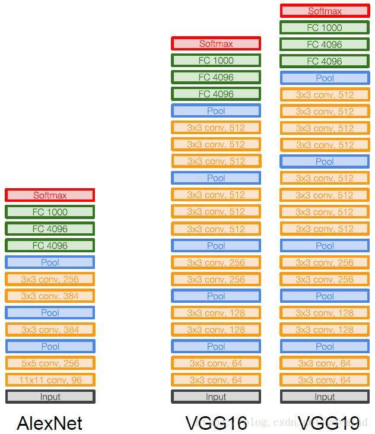

* VGG Net

	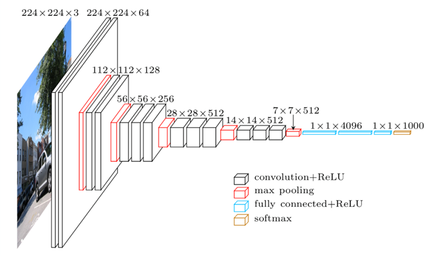

	

### pytorch实现

```python
class VGG(nn.Module):
    def __init__(self,num_classes):
        super(VGG,self).__init__()
        self.features = nn.Sequential(
            nn.Conv2d(3,64,kernel_size=3,padding=1),
            nn.ReLU(True),
            
            nn.Conv2d(64,64,kernel_size=3,padding=1),
            nn.ReLU(True),
            nn.MaxPool2d(kernel_size=2,stride=2),
            
            nn.Conv2d(64,128,kernel_size=3,padding=1),
            nn.ReLU(True),

            nn.Conv2d(128,128,kernel_size=3,padding=1),
            nn.ReLU(True),
            nn.MaxPool2d(kernel_size=2,stride=2),
            
            nn.Conv2d(128,256,kernel_size=3,padding=1),
            nn.ReLU(True),
            
            nn.Conv2d(256,256,kernel_size=3,padding=1),
            nn.ReLU(True),

            nn.Conv2d(256,256,kernel_size=3,padding=1),
            nn.ReLU(True),
            nn.MaxPool2d(kernel_size=2,stride=2),
            
            nn.Conv2d(256,512,kernel_size=3,padding=1),
            nn.ReLU(True),
            
            nn.Conv2d(512,512,kernel_size=3,padding=1),
            nn.ReLU(True),

            nn.Conv2d(512,512,kernel_size=3,padding=1),
            nn.ReLU(True),
            nn.MaxPool2d(kernel_size=2,stride=2),
            
            nn.Conv2d(512,512,kernel_size=3,padding=1),
            nn.ReLU(True),
            
            nn.Conv2d(512,512,kernel_size=3,padding=1),
            nn.ReLU(True),

            nn.Conv2d(512,512,kernel_size=3,padding=1),
            nn.ReLU(True),
            nn.MaxPool2d(kernel_size=2,stride=2))
        
        self.classifier = nn.Sequential(
            nn.Linear(512*7*7,4096),
            nn.ReLU(True),
            nn.Dropout(),
            
            nn.Linear(4096,4096),
            nn.ReLu(True),
            nn.Dropout(),
            
            nn.Linear(4096,num_classes))
        
        self._initialize_weights()
        
    def forward(self,x):
        x = self.features(x)
        x = x.view(x.size(0),-1)
        x = self.classifier(x)

```

## NIN块

### 概念（背景）

> 卷积层的输⼊和输出通常是四维数组 （样本， 通道， ⾼， 宽） ， 而全连接层的输⼊和输出则通常是⼆维数组 （样本， 特征） 。 如果想在全连接层后再接上卷积层， 则需要将全连接层的输出变换为四维。 回忆在 “多输⼊通道和多输出通道” ⼀节⾥介绍的1×1卷积层。 它可以看成全连接层， 其中空间维度 （⾼和宽） 上的每个元素相当于样本， 通道相当于特征。 因此， NiN使⽤1×1卷积层来替代全连接层， 从而使空间信息能够⾃然传递到后⾯的层中去。 下图对⽐了NiN同AlexNet和VGG等⽹络在结构上的主要区别。

* 图1， NIN 块

	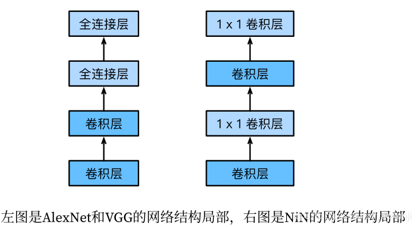

	* 每层输出，参数数量

	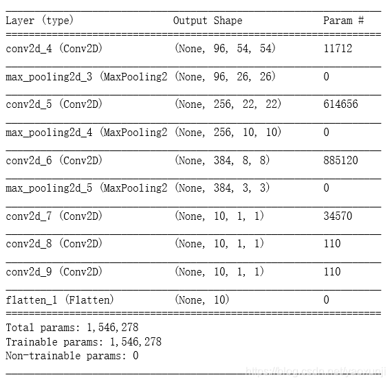

	> NiN是在AlexNet问世不久后提出的。它们的卷积层设定有类似之处。
	>
	> NiN使⽤卷积窗口形状分别为11 × 11、5 × 5和3 × 3的卷积层，相应的输出通道数也与AlexNet中的⼀致。
	>
	> 每个NiN块后接⼀个步幅为2、窗口形状为3 × 3的最⼤池化层。
	>
	> NiN还有⼀个设计与AlexNet显著不同：NiN去掉了AlexNet最后的3个全连接层，取而代之地，NiN使⽤了输出通道数等于标签类别数的NiN块，然后使⽤全局平均池化层对每个通道中所有元素求平均并直接⽤于分类。 这⾥的全局平均池化层即窗口形状等于输⼊空间维形状的平均池化层。NiN的这个设计的好处是可以显著减小模型参数尺⼨，从而缓解过拟合。然而，该设计有时会造成获得有效模型的训练时间的增加。


## GoogleNet

### 概念（背景）

> 在2014年的ImageNet图像识别挑战赛中，⼀个名叫GoogLeNet的⽹络结构⼤放异彩 。它虽然在名字上向LeNet致敬，但在⽹络结构上已经很难看到LeNet的影⼦。GoogLeNet吸收了NiN中⽹络串联⽹络的思想，并在此基础上做了很大改进。

### inception块

> 该结构将CNN中常用的卷积（1x1，3x3，5x5）、池化操作（3x3）堆叠在一起（卷积、池化后的尺寸相同，将通道相加）
>
> 一方面增加了网络的宽度，另一方面也增加了网络对尺度的适应性。
>
> 网络卷积层中的网络能够提取输入的每一个细节信息，同时5x5的滤波器也能够覆盖大部分接受层的的输入。还可以进行一个池化操作，以减少空间大小，降低过度拟合。
>
> 在这些层之上，在每一个卷积层后都要做一个ReLU操作，以增加网络的非线性特征。
>
> 然而这个Inception原始版本，所有的卷积核都在上一层的所有输出上来做，而那个5x5的卷积核所需的计算量就太大了，造成了特征图的厚度很大

* 图1，简单版inception块结构

	

> 1. 优化后的Inception块⾥有4条并⾏的线路。
>
> > 前3条线路使⽤窗口⼤小分别是1 × 1、3 ×3和5 × 5的卷积层来抽取不同空间尺⼨下的信息，其中中间2个线路会对输⼊先做1 × 1卷积来减少输⼊通道数，以降低模型复杂度。
> >
> > 第四条线路则使⽤3 × 3最⼤池化层，后接1 × 1卷积层来改变通道数。
>
> 2. 4条线路都使⽤了合适的填充来使输⼊与输出的⾼和宽⼀致。
>
> 3. 将每条线路的输出在通道维上连结，并输⼊接下来的层中去。

* 图2，优化版inception块结构

	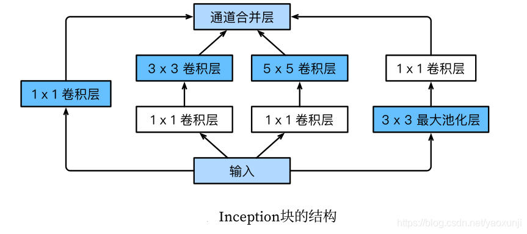

	

	

### 网络结构详解

> GoogLeNet跟VGG⼀样， 在主体卷积部分中使⽤5个模块 （block） ， 每个模块之间使⽤步幅为2的3×3最⼤池化层来减小输出⾼宽。
>
> 第⼀模块使⽤⼀个64通道的7 × 7卷积层。
>
> 第⼆模块使⽤2个卷积层：⾸先是64通道的1 × 1卷积层， 然后是将通道增⼤3倍的3 × 3卷积层。它对应Inception块中的第⼆条线路。
>
> 第三模块串联2个完整的Inception块。 第⼀个Inception块的输出通道数为64+128+32+32 = 256，其中4条线路的输出通道数⽐例为64 : 128 : 32 : 32 = 2 : 4 : 1 : 1。 其中第⼆、 第三条线路先分别将输⼊通道数减小⾄96/192 = 1/2和16/192 = 1/12后，再接上第⼆层卷积层。第⼆个Inception块输出通道数增⾄128 + 192 + 96 + 64 = 480，每条线路的输出通道数之⽐为128 : 192 : 96 : 64 =4 : 6 : 3 : 2。其中第⼆、第三条线路先分别将输⼊通道数减小⾄128/256 = 1/2和32/256 = 1/8。
>
> 第四模块更加复杂。它串联了5个Inception块，其输出通道数分别是192 + 208 + 48 + 64 = 512、160+224+64+64 = 512、128+256+64+64 = 512、 112+288+64+64 = 528和256+320+128+128 =832。这些线路的通道数分配和第三模块中的类似，⾸先含3 × 3卷积层的第⼆条线路输出最多通道， 其次是仅含1 × 1卷积层的第⼀条线路， 之后是含5 × 5卷积层的第三条线路和含3 × 3最⼤池化层的第四条线路。 其中第⼆、 第三条线路都会先按⽐例减小通道数。 这些⽐例在各个Inception块中都略有不同。
>
> 第五模块有输出通道数为256 + 320 + 128 + 128 = 832和384 + 384 + 128 + 128 = 1024的两个Inception块。 其中每条线路的通道数的分配思路和第三、 第四模块中的⼀致， 只是在具体数值上有所不同。需要注意的是，第五模块的后⾯紧跟输出层，该模块同NiN⼀样使⽤全局平均池化层来将每个通道的⾼和宽变成1。最后我们将输出变成⼆维数组后接上⼀个输出个数为标签类别数的全连接层。GoogLeNet模型的计算复杂，而且不如VGG那样便于修改通道数。

### pytorch实现

```python
import torch.nn as nn
class BasicConv2d(nn.Module):
    def __init__(self,in_channels,out_channels,**kwargs):
        super(BasicConv2d,self).__init__()
        self.conv = nn.Conv2d(in_channels,out_channels,bias=False,**kwargs)
        self.bn = nn.BatchNorm2d(out_channels,eps=0.001)
        
    def forward(self,x):
        x = self.conv(x)
        x = self.bn(x)
        return F.relu(x,inplace=True)
    
class Inception(nn.Module):
    def __init__(self,in_channels,pool_features):
        super(Inception,self).__init__()
        self.branch1x1 = BasicConv2d(in_channels,64,kernel_size=1)
        
        self.branch5x5_1 = BasicConv2d(in_channels,48,kernel_size=1)
        self.branch5x5_2 = BasicConv2d(48,64,kernel_size=5,padding=2)
        
        self.branch3x3dbl_1 = BasicConv2d(in_channels,64,kernel_size=1)
        self.branch3x3dbl_2 = BasicConv2d(64,96,kernel_size=3,padding=1)
        self.branch3x3dbl_3 = BasicConv2d(96,96,kernel_size=3,padding=1)
        
        self.branch_pool = BasicConv2d(in_channels,pool_features,kernel_size=1)
        
    def forward(self,x):
        branch1x1 = self.branch1x1(x)
        
        branch5x5 = self.branch5x5_1(x)
        branch5x5 = self.branch5x5_2(branch5x5)
        
        branch3x3dbl = self.branch3x3dbl_1(x)
        branch3x3dbl = self.branch3x3dbl_2(branch3x3dbl)
        branch3x3dbl = self.branch3x3dbl_3(branch3x3dbl)
        
        branch_pool = F.avg_pool2d(x,kernel_size=3,stride=1,padding=1)
        branch_pool = self.branch_pool(branch_pool)
        
        outputs = [branch1x1,branch5x5,branch3x3dbl,branch_pool]

        return torch.cat(outputs,1)                                     

```


## ResNet

### 概念（背景）

>ResNet 最初的设计灵感来自这两个问题：
>
>1. 梯度消失
>
>	> 随着网络深度增加，网络的准确度应该同步增加，当然要注意过拟合问题。但是网络深度增加的一个问题在于这些增加的层是参数更新的信号，因为梯度是从后向前传播的，增加网络深度后，比较靠前的层梯度会很小。这意味着这些层基本上学习停滞了，这就是问题。
>2. 退化问题:
>
>	> 这个问题在于训练，当网络更深时意味着参数空间更大，优化问题变得更难，因此简单地去增加网络深度反而出现更高的训练误差。在不断加深度神经网络的时候，会出现一个Degradation，即准确率会先上开然后达到饱和，再持续增加深度则会导致模型准确率下降。比如下图，一个56层的网络的性能却不如20层的性能好，这不是因为过拟合（训练集训练误差依然很高），这就是网络退化问题。
>
>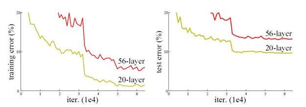
>
>理论上，原模型解的空间只是新模型解的空间的⼦空间。也就是说，如果我们能将新添加的层训练成恒等映射f(x) = x，新模型和原模型将同样有效。由于新模型可能得出更优的解来拟合训练数据集，因此添加层似乎更容易降低训练误差。然而在实践中，添加过多的层后训练误差往往不降反升。即使利⽤批量归⼀化带来的数值稳定性使训练深层模型更加容易，该问题仍然存在。 针对这⼀问题， 何恺明等⼈提出了残差⽹络（ResNet）。 它在2015年的ImageNet图像识别挑战赛夺魁，并深刻影响了后来的深度神经⽹络的设计。
>

### 残差块

> 让我们聚焦于神经⽹络局部。如图所⽰，设输⼊为x。假设我们希望学出的理想映射为f(x)，从而作为图上⽅激活函数的输⼊。左图虚线框中的部分需要直接拟合出该映射f(x)，而右图虚线框中的部分则需要拟合出有关恒等映射的残差映射f(x) − x。残差映射在实际中往往更容易优化。以本节开头提到的恒等映射作为我们希望学出的理想映射f(x)。我们只需将图中右图虚线框内上⽅的加权运算（如仿射）的权重和偏差参数学成0，那么f(x)即为恒等映射。实际中，当理想映射f(x)极接近于恒等映射时，残差映射也易于捕捉恒等映射的细微波动。右图也是ResNet的基础块，即残差块（residual block） 。在残差块中，输⼊可通过跨层的数据线路更快地向前传播。

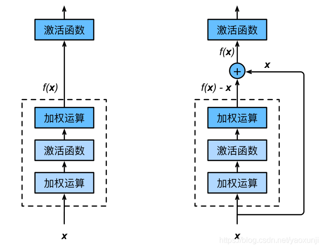

> ResNet的前两层跟之前介绍的GoogLeNet中的⼀样：
>
> 在输出通道数为64、步幅为2的7 × 7卷积层后接步幅为2的3 × 3的最⼤池化层。
>
> 不同之处在于ResNet每个卷积层后增加的批量归⼀化层。
>
> > GoogLeNet在后⾯接了4个由Inception块组成的模块。
> >
> > ResNet则使⽤4个由残差块组成的模块， 每个模块使⽤若⼲个同样输出通道数的残差块。第⼀个模块的通道数同输⼊通道数⼀致。由于之前已经使⽤了步幅为2的最⼤池化层，所以⽆须减小⾼和宽。之后的每个模块在第⼀个残差块⾥将上⼀个模块的通道数翻倍，并将⾼和宽减半。

### 网络结构

> 下图展示了两种形态的残差模块，
>
> 左图是常规残差模块，有两个3×3卷积核卷积核组成，但是随着网络进一步加深，这种残差结构在实践中并不是十分有效。
>
> 右图的“瓶颈残差模块”（bottleneck residual block）可以有更好的效果，它依次由1×1、3×3、1×1这三个卷积层堆积而成，这里的1×1的卷积能够起降维或升维的作用，从而令3×3的卷积可以在相对较低维度的输入上进行，以达到提高计算效率的目的。


### pytorch实现

```python
def conv3x3(in_plans,out_planes,stride=1):
    return nn.Conv2d(in_plans,out_planes,kernel_size=3,stride=stride
                    ,padding=1,bias=False)

class BasicBlock(nn.Module):
    def __init__(self,inplanes,planes,stride=1,downsample=None):
        super(BasicBlock,self).__init__()
        self.conv1 = conv3x3(inplanes,planes,stride)
        self.bn1 = nn.BatchNorm2d(planes)
        self.relu = nn.ReLU(inplace=True)
        self.conv2 = conv3x3(planes,planes)
        self.bn2 = nn.BatchNorm2d(planes)
        self.downsample = downsample
        self.stride = stride
        
    def forward(self,x):
        residual = x
        
        x = self.conv1(x)
        x = self.bn1(x)
        x = self.relu(x)
        
        x = self.conv2(x)
        out = self.bn2(x)
        
        if self.downsample is not None:
            residual = self.downsample(out)
            
        out += residual
        out = self.relu(out)
        
        return out
       
```

