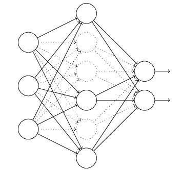

# Al问题

## 1. 范数（Norm）

> 具体定义
>
> * a function that assigns a strictly positive length or size to each vector in a vector space， except for the zero vector. ——Wikipedia
>
> 一个向量的范数就是**将向量投影到[0,1)范围的值**，其中0只有零向量的范数可以取到

### L1 和 L2 范数

> 可以用距离的概念来看

> 具体应用：
>
> 1. 作为损失函数使用
>
> 	> 主要用L2原因是：L2求导计算方便，一定存在一条最优的线;L1则可能存在多个最优解
> 	>
> 	> L1优点：鲁棒性更强，对异常值不敏感
>
> 2. 作为正则项来使用
>
> 	> L2 计算起来非常方便，L1则在非稀疏向量的计算上效率非常低
> 	>
> 	> L1输出稀疏，会把不重要的特征置为0，L2不会
> 	>
> 	> L2存在唯一解，L1则存在多个解

- L1和L2正则分别有什么特点？为何L1稀疏？


> > 为何L1稀疏？
> >
> > 
> >
> > 在梯度更新时，不管 L1 的大小是多少（只要不是0）梯度都是1或者-1，所以每次更新时，它都是稳步向0前进。从而导致L1输出稀疏。

>参考： https://www.zhihu.com/question/26485586/answer/616029832

## 2. 激活函数

```
损失函数和激活函数决定的是模型会不会收敛，也影响训练速度；优化器决定的是模型能不能跳出局部极小值、跳出鞍点、能不能快速下降这些问题的。

https://www.cnblogs.com/eilearn/p/9028394.html
```

### **a. 为什么使用激活函数**

> 如果不用激励函数，每一层输出都是上层输入的线性函数，无论神经网络有多少层，输出都是输入的线性组合。
> 如果使用的话，激活函数给神经元引入了非线性因素，使得神经网络可以任意逼近任何非线性函数，这样神经网络就可以应用到众多的非线性模型中。

### **b. 为什么分类问题不能使用mse损失函数？**

> 1. 在线性回归中用到的最多的是MSE(最小二乘损失函数)，这个比较好理解，就是预测值和目标值的欧式距离。而交叉熵是一个信息论的概念，交叉熵能够衡量同一个随机变量中的两个不同概率分布的差异程度，在机器学习中就表示为真实概率分布与预测概率分布之间的差异。交叉熵的值越小，模型预测效果就越好。
> 	所以交叉熵本质上是概率问题，表征真实概率分布与预测概率分布差异，和几何上的欧氏距离无关，在线性回归中才有欧氏距离的说法，在分类问题中label的值大小在欧氏空间中是没有意义的。所以分类问题不能用mse作为损失函数。
> 2. 分类问题是逻辑回归，必须有激活函数这个非线性单元在，比如sigmoid（也可以是其他非线性激活函数），mse已经是非凸函数了，有多个极值点，所以不适用做损失函数了。
> 3. mse作为损失函数，求导的时候都会有对激活函数的求导连乘运算，对于sigmoid、tanh，有很大区域导数为0的。该激活函数的输入很可能直接就在平坦区域，那么导数就几乎是0，梯度就几乎不会被反向传递，梯度直接消失了。所以mse做损失函数的时候最后一层不能用sigmoid做激活函数，其他层可以用sigmoid做激活函数。当然，用其他损失函数只能保证在第一步不会直接死掉，反向传播如果激活函数和归一化做得不好，同样会梯度消失。所以从梯度这个原因说mse不好不是很正确。

* 梯度消失问题存在两个地方
	1. 损失函数对权值w求导，这是误差反向传播的第一步，mse的损失函数会在损失函数求导这一个层面上就导致梯度消失；所以使用交叉熵损失函数
	2. 误差反向传播时，链式求导也会使得梯度消失。
* 使用交叉熵损失函数也不能避免反向传播带来的梯度消失，此时规避梯度消失的方法：
	* ReLU等激活函数；
	* 输入归一化、每层归一化；
	* 网络结构上调整，比如LSTM、GRU等。

### c. 常用激活函数

#### 1. softmax函数

> 具体定义
>
> * 是一种概率函数，将原始的输出映射到(0, 1)中，并且最最终结果的总和为1.
>
> 公式：
>
> 用处：可用于多分类问题

##### softmax激活函数

> 特点：保证较小的值有较小的概率，而不是直接丢弃
>
> ​			获得所有概率彼此相关，因为分母结合了原始输出值的所有因子
>
> ​			在0处不可微
>
> ​			负输入的梯度为零，这意味着对于该区域的激活，权重不会在反向传播期间更新，因此会产生永不激活的死亡神经元

> 转换成概率的步骤
>
> * 分子：利用指数函数转为非负数的值
> * 分母：将所有结果相加，进行归一化

#### 2. tanh函数

双曲正切函数

* 优点

	> 1. 在特征相差明显时的效果会很好，在循环过程中会不断扩大特征效果
	> 1. 是 0-mean的，实际应用中比sigmoids函数要好


#### 3. Relu函数的定义、优缺点

* 优点

	> 1. 反向求导时，计算量较少；
	> 1. 反向传播时，不会出现较小的梯度，不会出现饱和现象
	> 1. 会使一部分网络激活输出值为0，这样就造成了网络的稀疏性，并且减少了参数的相互依存关系，缓解了过拟合问题的发生

* 缺点

	> 1. 不是0-centered
	> 2. 很容易导致神经元坏死
	> 3. 不会对数据进行幅度压制
	
* **ReLu是如何表现出高阶的非线性组合的？**

	> ReLU在正负半轴都是线性的，确实没错。但是，**它实现网络非线性映射的魔法在于对不同样本的不同状态**。
	>
	> 考虑对于一个激活函数只包含ReLU和线性单元的简单网络：首先，我们考虑有一个输入样本 ![[公式]](https://www.zhihu.com/equation?tex=x_%7B1%7D) ，网络中所有的ReLU对它都有一个确定的状态，整个网络最终对![[公式]](https://www.zhihu.com/equation?tex=x_%7B1%7D)的映射等效于一个线性映射:![[公式]](https://www.zhihu.com/equation?tex=y_%7B1%7D%3Dw_%7B1%7Dx_%7B1%7D%2Bb_%7B1%7D)考虑另一个输入样本 ![[公式]](https://www.zhihu.com/equation?tex=x_%7B2%7D) ，它的特征与![[公式]](https://www.zhihu.com/equation?tex=x_%7B1%7D)不同。因此，网络中某些ReLU的激活状态因为输入变化可能发生变化，比如一些以前在右侧接通区域的变到左侧切断区域（或反之）；这样整个网络对于样本![[公式]](https://www.zhihu.com/equation?tex=x_%7B2%7D)有一个新的等效线性映射：![[公式]](https://www.zhihu.com/equation?tex=y_%7B2%7D%3Dw_%7B2%7Dx_%7B2%7D%2Bb_%7B2%7D) 这两个函数都是线性的，但是他们的参数是不同的。进一步，可以这样设想，在 ![[公式]](https://www.zhihu.com/equation?tex=x_%7B1%7D) 的周围，有一小块区域 ![[公式]](https://www.zhihu.com/equation?tex=%5B%7Bx_%7B1%7D%5E%7B1%7D%7D%5Cpm%5Cvarepsilon_%7B1%7D%2C%7Bx_%7B1%7D%5E%7B2%7D%7D%5Cpm%5Cvarepsilon_%7B2%7D%2C...%2C%7Bx_%7B1%7D%5E%7Bn%7D%7D%5Cpm%5Cvarepsilon_%7Bn%7D%5D)（为了表达简单，假定了两侧 ![[公式]](https://www.zhihu.com/equation?tex=%5Cpm%5Cvarepsilon_%7Bi%7D) 都是对称的，实际通常不是）。所有特征位于这一小块区域内的样本，在网络中激活的ReLU状态都和 ![[公式]](https://www.zhihu.com/equation?tex=x_%7B1%7D) 激活的完全一样。（因为这些点离![[公式]](https://www.zhihu.com/equation?tex=x_%7B1%7D)非常接近，在这个变化范围，网络中所有的ReLU都没有翻转）。那么这一小块区域内，网络拟合的出的线性映射都是一样的，去掉x,y的角标，表示为![[公式]](https://www.zhihu.com/equation?tex=y%3Dw_%7B1%7Dx%2Bb_%7B1%7D)您一定发现了，这就是由 ![[公式]](https://www.zhihu.com/equation?tex=%5Bw_%7B1%7D%EF%BC%8Cb_%7B1%7D%5D) 定义的一个超平面，但是这个超平面可能只在![[公式]](https://www.zhihu.com/equation?tex=x_%7B1%7D)的附近才成立。一旦稍微远离，导致至少一个ReLU翻转，那么网络将有可能拟合出另一个不同参数的超平面。
	>
	> 　　所以，这具有不同参数的超平面拼接在一起，不就拟合出了各种各样的非线性特性了吗？所以，虽然ReLU的每个部分都是线性的，但是通过对ReLU各种状态的组合进行改变，导致了网络等效映射的变化，也就构造了各种非线性映射。表现在多维空间，就是很多不同的小块超平面拼接成的奇形怪状的近似超曲面。

#### 4. sigmoid函数定义、优缺点

* 优点

	> 1. 用于二分类问题

* 缺点

	> 1. 激活函数计算量大，反向传播求误差梯度时，求导涉及除法
	> 1. 反向传播时，很容易就会出现梯度消失的情况，从而无法完成深层网络的训练
	> 1. Sigmoids函数饱和且kill掉梯度
	> 1. Sigmoids函数收敛缓慢。
	> 1. 输出不是以0为中心的
	
* **导致梯度消失的原因**

	> 1. 当神经元的激活在接近0或1处时会饱和，在这些区域，梯度几乎为0。
	> 2. 可以作为概率，但导数值小于1，最大为0.25，如果损失函数 mse，则梯度计算与 sigmoid 导数相关，导致梯度消失。
	
* **输出不是以0为中心问题**

	
	
	> 在 Sigmoid 函数中，输出值恒为正。这也就是说，如果上一级神经元采用 Sigmoid 函数作为激活函数，那么我们无法做到 x0 和 x1 符号相反。此时，模型为了收敛，不得不向逆风前行的风助力帆船一样，走 Z 字形逼近最优解。
	>
	> 

### d. 激活函数的比较

#### **1) Sigmoid 和 ReLU 比较：**

> 1. 对于深层网络，sigmoid函数反向传播时，很容易就会出现梯度消失的情况（在sigmoid接近饱和区时，变换太缓慢，导数趋于0，这种情况会造成信息丢失）。而relu函数在大于0的部分梯度为常数，所以不会产生梯度弥散现象。
> 2. relu函数在负半区的导数为0 ，所以一旦神经元激活值进入负半区，那么梯度就会为0，造成了网络的稀疏性，缓解过拟合。
> 3. relu计算简单，采用sigmoid等函数，反向传播求误差梯度时，计算量大，而采用Relu激活函数，整个过程的计算量节省很多。

#### 2) **Sigmoid 和 Softmax 区别：**

> 1. sigmoid将一个real value映射到（0,1）的区间（当然也可以是（-1,1）），这样可以用来做二分类。 
> 2. 而softmax把一个k维的real value向量（a1,a2,a3,a4….）映射成一个（b1,b2,b3,b4….）其中 bi 是一个 0～1 的常数，输出神经元之和为 1.0，所以相当于概率值，然后可以根据 bi 的概率大小来进行多分类的任务。
> 3. 二分类问题时 sigmoid 和 softmax 是一样的，求的都是 cross entropy loss，而 softmax 可以用于多分类问题。
> 4. 多个logistic回归通过叠加也同样可以实现多分类的效果，但是 softmax回归进行的多分类，类与类之间是**互斥**的，即一个输入只能被归为一类；多个logistic回归进行多分类，输出的类别并不是互斥的，即"苹果"这个词语既属于"水果"类也属于"3C"类别。

## 3. 模型评估方法

### 1. Accuracy作为指标有哪些局限性？

> 准确率是指分类正确的样本占总样本的比例
>
> 准确率是样本分类问题中最简单也是最直观的评价指标。但存在明显的缺陷。
>
> 比如负样本占99%时，分类器把所有样本都预测为负样本也可以获得99%的准确率。所以，当不同类别的样本比例非常不均衡时。占比大的类别往往成为影响准确率的最主要因素。
>
> 此时准确率指标并不足以说明分类器的好坏。

### 2. ROC曲线和PR曲线各是什么？

* PR曲线

> **PR曲线实则是以precision（精准率）和recall（召回率）这两个为变量而做出的曲线，其中recall为横坐标，precision为纵坐标。**
>
> 什么是精准率？什么是召回率？
>
> 在二分类问题中，分类器将一个实例的分类标记为是或否，可以用一个**混淆矩阵**来表示，如下图所示。
>
> 
>
> 把正例正确地分类为正例，表示为TP（true positive），把正例错误地分类为负例，表示为FN（false negative）。
> 把负例正确地分类为负例，表示为TN（true negative）， 把负例错误地分类为正例，表示为FP（false positive）。
>
> 从混淆矩阵可以得出精准率与召回率：**precision = TP/(TP + FP), recall = TP/(TP +FＮ)**
>
> 
>
> **一个阈值对应PR曲线上的一个点。通过选择合适的阈值，比如50%，对样本进行划分，概率大于50%的就认为是正例，小于50%的就是负例,从而计算相应的精准率和召回率。（选取不同的阈值，就得到很多点，连起来就是PR曲线）**
>
> > 举个例子如下：(true这列表示正例或者负例，hyp这列表示阈值0.5的情况下，概率是否大于0.5)
> >
> > 
> >
> > 那么根据这个表格我们可以计算：TP=6，FN=0，FP=2，TN=2。故recall=6/(6+0)=1,precison=6/(6+2)=0.75，那么得出坐标（1，0.75）。同理得到不同阈下的坐标，即可绘制出曲线。
> >
> > 
>
> 
>
> **如果一个学习器的P-R曲线被另一个学习器的P-R曲线完全包住，则可断言后者的性能优于前者，例如上面的A和B优于学习器C。**但是A和B的性能无法直接判断，我们可以根据曲线下方的面积大小来进行比较，但更常用的是平衡点或者是F1值。**平衡点（BEP）是P=R时的取值，如果这个值较大，则说明学习器的性能较好。而F1  =  2 \* P \* R ／( P + R )，同样，F1值越大，我们可以认为该学习器的性能较好。**

* ROC 曲线

> 有了前面的PR的铺垫，ROC曲线就会更好理解了。
>  **在ROC曲线中，横轴是假正例率（FPR），纵轴是真正例率（TPR）。**
>  **(1)真正类率(True Postive Rate)TPR: TP/(TP+FN),代表分类器预测的正类中实际正实例占所有正实例的比例。
>  (2)负正类率(False Postive Rate)FPR: FP/(FP+TN)，代表分类器预测的正类中实际负实例占所有负实例的比例。**
>  我们可以发现：**TPR=Recall。**
>  ROC曲线也需要相应的阈值才可以进行绘制，原理同上的PR曲线。
>
> 下图为ROC曲线示意图，因现实任务中通常利用有限个测试样例来绘制ROC图，因此应为无法产生光滑曲线，如右图所示。
>
> 
>
> > 绘图过程：给定m个正例子，n个反例子，根据学习器预测结果进行排序，先把分类阈值设为最大，使得所有例子均预测为反例，此时TPR和FPR均为0，在（0，0）处标记一个点，再将分类阈值依次设为每个样例的预测值，即依次将每个例子划分为正例。设前一个坐标为(x,y)，若当前为真正例，对应标记点为(x,y+1/m)，若当前为假正例，则标记点为（x+1/n,y），然后依次连接各点。
>
> >**ROC曲线图中的四个点**
> > 第一个点：(0,1)，即FPR=0, TPR=1，这意味着FN=0，并且FP=0。这是完美的分类器，它将所有的样本都正确分类。
> > 第二个点：(1,0)，即FPR=1，TPR=0，类似地分析可以发现这是一个最糟糕的分类器，因为它成功避开了所有的正确答案。
> > 第三个点：(0,0)，即FPR=TPR=0，即FP=TP=0，可以发现该分类器预测所有的样本都为负样本（negative）。
> > 第四个点：（1,1），分类器实际上预测所有的样本都为正样本。
> >
> >经过以上的分析，ROC曲线越接近左上角，该分类器的性能越好。
>
> **PR曲线与ROC曲线的对比**
>
> 

>##### AUC
>
>这里补充一下AUC的简单介绍。
> **AUC (Area under Curve)：ROC曲线下的面积，介于0.1和1之间，作为数值可以直观的评价分类器的好坏，值越大越好。**
> AUC = 1，是完美分类器，采用这个预测模型时，存在至少一个阈值能得出完美预测。绝大多数预测的场合，不存在完美分类器。
> 0.5 < AUC < 1，优于随机猜测。这个分类器（模型）妥善设定阈值的话，能有预测价值。
> AUC = 0.5，跟随机猜测一样（例：丢铜板），模型没有预测价值

```
https://www.jianshu.com/p/ac46cb7e6f87
http://www.fullstackdevel.com/computer-tec/data-mining-machine-learning/501.html
```

### 3. 编程实现AUC的计算，并指出复杂度？

> 有两种计算AUC的方法:
>
> 1.绘制ROC曲线，ROC曲线下面的面积就是AUC的值
>
> 2.假设总共有（m+n）个样本，其中正样本m个，负样本n个，总共有mn个样本对，计数，正样本预测为正样本的概率值大于负样本预测为正样本的概率值记为1，累加计数，然后除以（mn）就是AUC的值

```
def get_roc(pos_prob,y_true):
    pos = y_true[y_true==1]
    neg = y_true[y_true==0]
    threshold = np.sort(pos_prob)[::-1]        # 按概率大小逆序排列
    y = y_true[pos_prob.argsort()[::-1]]
    tpr_all = [0] ; fpr_all = [0]
    tpr = 0 ; fpr = 0
    x_step = 1/float(len(neg))
    y_step = 1/float(len(pos))
    y_sum = 0     # 用于计算AUC
    for i in range(len(threshold)):
        if y[i] == 1:
            tpr += y_step
            tpr_all.append(tpr)
            fpr_all.append(fpr)
        else:
            fpr += x_step
            fpr_all.append(fpr)
            tpr_all.append(tpr)
            y_sum += tpr
   return tpr_all,fpr_all,y_sum*x_step   # 获得总体TPR，FPR和相应的AUC
   
排序复杂度：O(log2(P+N))

计算AUC的复杂度：O(P+N)
```


### 4. AUC指标有什么特点？放缩结果对AUC是否有影响？

* AUC反映的是分类器对样本的排序能力。

	> 根据这个解释，如果我们完全随机的对样本分类，那么AUC应该接近0.5。另外值得注意的是，AUC对样本类别是否均衡并不敏感，这也是不均衡样本通常用AUC评价分类器性能的一个原因
	>
	> AUC（Area under Curve）指的是ROC曲线下的面积，介于0和1之间。AUC作为数值可以直观地评价分类器的好坏，值越大越好。
	>
	> 它的统计意义是从所有正样本随机抽取一个正样本，从所有负样本随机抽取一个负样本，当前score使得正样本排在负样本前面的概率。

* 放缩结果对AUC没有影响

### 5. 余弦距离与欧式距离有什么特点？

* 余弦距离

	> 余弦距离也称为余弦相似度，是用向量空间中的两个向量之间夹角的余弦值作为衡量两个向量间差异大小的度量；值越小，表示两个向量越相近

* 欧式距离

	

## 4. 基本方法

### 1. 如何划分训练集？如何选取验证集？

>1. 根据经验
>
>（1.）通常80%为训练集，20%为测试集
>
>（2.）当数据量较小时（万级别及以下）的时候将训练集、验证集以及测试集划分为6：2：2；若是数据很大，可以将训练集、验证集、测试集比例调整为98：1：1
>
>（3.）当数据量很小时，可以采用K折交叉验证
>
>（4.）划分数据集时可采用随机划分法（当样本比较均衡时），分层采样法（当样本分布极度不均衡时）
>
>2. 随机采样
>
>```python
>import numpy as np
>def split_train_test(data,test_ratio):
>        #设置随机数种子，保证每次生成的结果都是一样的
>        np.random.seed(42)
>        #permutation随机生成0-len(data)随机序列
>        shuffled_indices = np.random.permutation(len(data))
>        #test_ratio为测试集所占的半分比
>        test_set_size = int(len(data)) * test_ratio
>        test_indices = shuffled_indices[:test_ratio]
>        train_indices = shuffled_indices[test_set_size:]
>        #iloc选择参数序列中所对应的行
>        return data.iloc[train_indices],data.iloc[test_indices]
>#测试
>train_set,test_set = split_train_test(data,0.2)print(len(train_set), "train +", len(test_set), "test")
>```
>
>

### 2. 什么是偏差和方差？

* 偏差是描述预测值与真实值之间的差异，差异越大模型的预测能力越差
* 方差是描述预测值的变化范围。方差越大说明模型越不稳定
* 过拟合高方差，欠拟合高偏差

### 3. 什么是过拟合？深度学习解决过拟合的方法有哪些

* 过拟合

	> 是指模型泛化能力低，过度学习了数据中的噪声

* 解决方法

	> * 增加数据，丰富数据多样性
	> * 缩减模型表达能力，L1，L2正则化
	> * Dropout
	> * 训练提前终止
	> * 集成多种模型

### 4. 解决欠拟合的方法

> * 增加模型复杂度
> * 调整模型初始化方式
> * 调整学习率
> * 集成多种模型

### 5. 深度模型参数调整的一般方法论？

**重要性：学习率 > 正则值 > dropout**

> 1. 学习率：遵循小->大->小原则
> 1. 初始化：选择合适的初始化方式，有预训练模型更好
> 1. 优化器选择：adam比较快，sgd较慢
> 1. loss：回归问题选L2 loss，分类问题选交叉熵
> 1. 从小数据大模型入手，先过拟合，再增加数据并根据需要调整模型复杂度
> 1. 可视化

## 5. 优化方法

### 1. 简述了解的优化器，发展综述？

**深度学习优化算法经历了 SGD -> SGDM -> NAG ->AdaGrad -> AdaDelta -> Adam -> Nadam 这样的发展历程。**


### 2. 常用的损失函数

**损失函数的应用场景**


### 3. 梯度下降与拟牛顿法的异同？

* 参数更新模式相同
* 梯度下降法利用误差的梯度来更新参数，拟牛顿法利用海塞矩阵的近似来更新参数
* 梯度下降是泰勒级数的一阶展开，而拟牛顿法是泰勒级数的二阶展开
* SGD能保证收敛，但是L-BFGS在非凸时不收敛

## 6. 深度学习基础

### 1. 以一层隐层的神经网络，relu激活，MSE作为损失函数推导反向传播

### 2. NN的权重参数能否初始化为0？

不能，可能导致模型无法收敛。

### 3. 什么是梯度消失和梯度爆炸？

> 参考：https://cloud.tencent.com/developer/article/1374163

* 梯度消失

	> 根据链式法则，如果每一层神经元对上一层神经元的输出的偏导乘上权重结果都小于1的话，即使这个结果是0.99，在经过多层传播后，误差对输入层的偏导会趋于0
	>
	> 这种情况会导致靠近输入层的隐藏层神经元调整极小

* 梯度爆炸

	> 根据链式法则，如果每一层神经元对上一层神经元的输出的偏导乘上权重结果都大于1的话，在经过多层传播后，误差对输入层的偏导会趋于无穷大
	>
	> 这种情况会导致靠近输入层的隐藏层神经元调整极大

* 解决方案

	* 预训练加微调

	> 此方法来自Hinton在2006年发表的一篇论文，Hinton为了解决梯度的问题，提出采取无监督逐层训练方法，其基本思想是每次训练一层隐节点，训练时将上一层隐节点的输出作为输入，而本层隐节点的输出作为下一层隐节点的输入，此过程就是逐层“预训练”（pre-training）；在预训练完成后，再对整个网络进行“微调”（fine-tunning）。
	>
	> Hinton在训练深度信念网络（Deep Belief Networks）中，使用了这个方法，在各层预训练完成后，再利用BP算法对整个网络进行训练。此思想相当于是先寻找局部最优，然后整合起来寻找全局最优，此方法有一定的好处，但是目前应用的不是很多了。

		* 梯度剪切、正则(梯度爆炸)

	> 其思想是设置一个梯度剪切阈值，然后更新梯度的时候，如果梯度超过这个阈值，那么就将其强制限制在这个范围之内，通过这种直接的方法就可以防止梯度爆炸。

	> 权重正则化（weithts regularization）比较常见的是l1正则，和l2正则
	>
	> 正则化是通过对网络权重做正则限制过拟合，仔细看正则项在损失函数的形式：
	>
	> 
	>
	> 其中，α 是指正则项系数，因此，如果发生梯度爆炸，权值的范数就会变的非常大，通过正则化项，可以部分限制梯度爆炸的发生。

	* ##### **relu、leakrelu、elu等激活函数**

	> 思想也很简单，如果激活函数的导数为1，那么就不存在梯度消失爆炸的问题了，每层的网络都可以得到相同的更新速度，relu就这样应运而生。
	>
	> Relu的主要贡献在于：
	>
	> * 解决了梯度消失、爆炸问题
	> * 计算方便、计算速度快
	> * 加速了网络的训练
	>
	> 缺点：
	>
	> * 由于负数部分恒为0，会导致一些神经元无法激活（可通过设置小学习率部分解决）
	> * 输出不是以0为中心的

	* ##### **Batchnorm**

	> Batchnorm是深度学习发展以来提出的最重要的成果之一了，目前已经被广泛的应用到了各大网络中，具有加速网络收敛速度，提升训练稳定性的效果，Batchnorm本质上是解决反向传播过程中的梯度问题。
	>
	> 通过规范化操作将输出x规范化以此来保证网络的稳定性。
	>
	> batchnorm就是通过对每一层的输出规范为均值和方差一致的方法，消除了w带来的放大缩小的影响，进而解决梯度消失和爆炸的问题。
	>
	> 
	>
	> 参考：https://blog.csdn.net/qq_25737169/article/details/79048516

	* 残差结构
	* LSTM

### 4. sigmoid和tanh为什么会导致梯度消失？

* sigmoid函数出现梯度消失的原因

> 当神经元的激活在接近0或者1处时，梯度几乎为0
>
> 在反向传播时，这个（局部）梯度将会与整个损失函数关于改门单元输出的梯度相乘。因此，如果局部梯度非常小，那么相乘的结果也会非常小，这会有效地“杀死”梯度，几乎就没有信号通过神经元传到权重再到数据了。
>
> 为了防止饱和，在权重初始化时也需特别留意。如果过大，将会导致神经元饱和，不再学习了

* tanh函数出现梯度消失的原因

> 函数tanh和函数sigmoid一样，在其饱和区的接近于0，都容易产生后续梯度消失、计算量大的问题

### 5. dropout为何能防止过拟合？

> https://zhuanlan.zhihu.com/p/23178423

> 防止参数过分依赖训练数据，增加参数对数据集的泛化能力
>
> > 假设要训练这样一个网络：
> >
> > 
> >
> > 正常的流程是：首先把x通过网络前向传播；然后把误差反向传播以决定 如何更新参数 让网络进行学习。
> >
> > 使用dropout之后过程变成：
> >
> > 
> >
> > 1. 首先随机（临时）删掉网络中一半的隐藏神经元，输入输出神经元保持不变（下图中虚线为部分临时被删除的神经元）
> > 2. 然后把输入x通过修改后的网络前向传播，然后把得到的损失结果通过修改的网络反向传播。一小批训练样本执行完这个过程后就按照随机梯度下降法更新（没有被删除的神经元）对应的参数（w，b）。
> > 3. 然后继续重复这一过程：
> > 	- 恢复被删掉的神经元（此时 被删除的神经元 保持原样，而没有被删除的神经元已经有所更新）
> > 	- 从隐藏神经元中随机选择一个一半大小的子集 临时删除掉（备份被删除神经元的参数）。
> > 	- 对一小批训练样本，先前向传播然后反向传播损失并根据随机梯度下降法更新参数（w，b） （没有被删除的那一部分参数得到更新，删除的神经元参数保持被删除前的结果）
> > 4. 重复这一过程
>
> 为什么能防止过拟合呢？
>
> * **取平均的作用**： 先回到正常的模型（没有dropout），我们用相同的训练数据去训练5个不同的神经网络，一般会得到5个不同的结果，此时我们可以采用 “5个结果取均值”或者“多数取胜的投票策略”去决定最终结果。（例如 3个网络判断结果为数字9,那么很有可能真正的结果就是数字9，其它两个网络给出了错误结果）。这种“综合起来取平均”的策略通常可以有效防止过拟合问题。**因为不同的网络可能产生不同的过拟合，取平均则有可能让一些“相反的”拟合互相抵消**。dropout掉不同的隐藏神经元就类似在训练不同的网络（随机删掉一半隐藏神经元导致网络结构已经不同)，**整个dropout过程就相当于 对很多个不同的神经网络取平均**。而不同的网络产生不同的过拟合，一些互为“反向”的拟合相互抵消就可以达到整体上减少过拟合。
> * **减少神经元之间复杂的共适应关系**： 因为dropout程序导致两个神经元不一定每次都在一个dropout网络中出现。（这样权值的更新不再依赖于有固定关系的隐含节点的共同作用，阻止了某些特征仅仅在其它特定特征下才有效果的情况）。 迫使网络去学习更加鲁棒的特征 （这些特征在其它的神经元的随机子集中也存在）。换句话说假如我们的神经网络是在做出某种预测，它不应该对一些特定的线索片段太过敏感，即使丢失特定的线索，它也应该可以从众多其它线索中学习一些共同的模式（鲁棒性）。（这个角度看 dropout就有点像L1，L2正则，减少权重使得网络对丢失特定神经元连接的鲁棒性提高）

### 6. dropout和BN 在前向传播和方向传播阶段的区别？

### 7. 一个隐层需要多少节点能实现包含n元输入的任意布尔函数？

### 8. 多个隐层实现包含n元输入的任意布尔函数，需要多少节点和网络层？

> 问题7 和 8 参考：https://zhuanlan.zhihu.com/p/32579088

## CNN

### 1. 空洞卷积是什么？有什么应用场景？


* 应用

> 01.在卷积图上注入空洞，增加感受野。注入空洞的数量由dilation rate确定。常规卷积的dilation rate为1。
>
> 02.多尺度检测，利于检测出小物体
>
> 03.语义分割中常用dilation rate。但是人像分割中无用，应该就是我们的应用场景没有特别小的物体。

### 2. resnet提出的背景和核心理论是？

* 背景

> 当模型深度增加到某个程度后，在增加深度，模型效果可能不升反降，出现退化现象。（不是过拟合也不是梯度爆炸或消失）

* 核心理论

> 恒等映射

### 3. CNN如何用于文本分类？

### 4. 常用的池化操作有哪些？有什么特点？

> https://zhuanlan.zhihu.com/p/112216409

* 优点

	> 1. 抑制噪声，降低信息冗余
	> 2. 提升模型的尺度不变性、旋转不变性
	> 3. 降低模型计算量
	> 4. 防止过拟合

* 最大/平均池化

	* 最大池化

	> 最大池化就是选择图像区域中最大值作为该区域池化以后的值，反向传播的时候，梯度通过前向传播过程的最大值反向传播，其他位置梯度为0。
	>
	> ```python
	> import torch
	> import torch.nn.functional as F
	> input_ = torch.Tensor(4,3,16,16)
	> output = F.max_pool2d(input_, kernel_size=2, stride=2)
	> print(output.shape)
	> ```
	>
	> 

	* 平均池化

	> 将选择的图像区域中的平均值作为该区域池化以后的值。
	>
	> ```python
	> import torch
	> import torch.nn.functional as F
	> input_ = torch.Tensor(4,3,16,16)
	> output = F.avg_pool2d(input_, kernel_size=2, stride=2)
	> print(output.shape)
	> ```

* 随机池化

	> 特征区域的大小越大，代表其被选择的概率越高

* 中值池化

* 组合池化

	> 组合池化则是同时利用最大值池化与均值池化两种的优势而引申的一种池化策略。
	>
	> 常见组合策略有两种：Cat与Add。
	>
	> 常常被当做分类任务的一个trick，其作用就是丰富特征层，maxpool更关注重要的局部特征，而average pooling更关注全局特征。
	>
	> ```python
	> import torch.nn.functional as F
	> 
	> def add_avgmax_pool2d(x, output_size=1):
	>     x_avg = F.adaptive_avg_pool2d(x, output_size)
	>     x_max = F.adaptive_max_pool2d(x, output_size)
	>     return 0.5 * (x_avg + x_max)
	> 
	> def cat_avgmax_pool2d(x, output_size=1):
	>     x_avg = F.adaptive_avg_pool2d(x, output_size)
	>     x_max = F.adaptive_max_pool2d(x, output_size)
	>     return torch.cat([x_avg, x_max], 1)
	> ```

* Spatial Pyramid Pooling

	> SPP是在SPPNet中提出的，SPPNet提出比较早，在RCNN之后提出的，用于解决重复卷积计算和固定输出的两个问题，具体方法如下图所示：
	>
	> 
	>
	> 在feature map上通过selective search获得窗口，然后将这些区域输入到CNN中，然后进行分类。
	>
	> 实际上SPP就是多个空间池化的组合，对不同输出尺度采用不同的划窗大小和步长以确保输出尺度相同，同时能够融合金字塔提取出的多种尺度特征，能够提取更丰富的语义信息。常用于多尺度训练和目标检测中的RPN网络。
	>
	> * SPP有效地原因
	>
	> 	> 1. 从感受野角度来讲，之前计算感受野的时候可以明显发现，maxpool的操作对感受野的影响非常大，其中主要取决于kernel size大小。在SPP中，使用了kernel size非常大的maxpool会极大提高模型的感受野，笔者没有详细计算过darknet53这个backbone的感受野，在COCO上有效很可能是因为backbone的感受野还不够大。
	> 	>
	> 	> 2. 第二个角度是从Attention的角度考虑，这一点启发自CSDN@小楞（链接在参考文献中），他在文章中这样讲：
	> 	>
	> 	> 	> 出现检测效果提升的原因：通过spp模块实现局部特征和全局特征（所以空间金字塔池化结构的最大的池化核要尽可能的接近等于需要池化的featherMap的大小）的featherMap级别的融合，丰富最终特征图的表达能力，从而提高MAP。
	> 	> 	>
	> 	> 	> https://blog.csdn.net/qq_33270279/article/details/103898245
	>
	> 

* Global Average/Max Pooling

	>Gloabel Average Pooling 是NIN里边的做法，一般使用torchvision提供的预训练模型进行finetune的时候，通常使用Global Average Pooling，原因就是可以不考虑图片的输入尺寸，只与filter有关。
	>
	>```python
	>import torch
	>from torch.nn import AdaptiveAvgPool2d
	>input = torch.zeros((4,12,18,18)) # batch size, fileter, h, w
	>gap = AdaptiveAvgPool2d(1)
	>output = gap(input)
	>print(output.shape)
	>print(output.view(input.shape[0],-1).shape)
	>```

* NetVLAD池化

* 双线性池化

	> Bilinear Pooling是在《Bilinear CNN Models for Fine-grained Visual Recognition》被提出的，主要用在细粒度分类网络中。双线性池化主要用于特征融合，对于同一个样本提取得到的特征x和特征y, 通过双线性池化来融合两个特征(外积)，进而提高模型分类的能力。
	>
	> > 主要思想是对于两个不同图像特征的处理方式上的不同。传统的，对于图像的不同特征，我们常用的方法是进行串联（连接），或者进行sum,或者max-pooling。论文的主要思想是，研究发现人类的大脑发现，人类的视觉处理主要有两个pathway, the ventral stream是进行物体识别的，the dorsal stream 是为了发现物体的位置。
	> > 论文基于这样的思想，希望能够将两个不同特征进行结合来共同发挥作用，提高细粒度图像的分类效果。论文希望两个特征能分别表示图像的位置和对图形进行识别。论文提出了一种Bilinear Model。
	>
	> 如果特征 x 和特征y来自两个特征提取器，则被称为**多模双线性池化**（MBP，Multimodal Bilinear Pooling）
	>
	> 如果特征 x = 特征 y，则被称为**同源双线性池化**（HBP，Homogeneous Bilinear Pooling）或者二阶池化（Second-order Pooling）。
	>
	> 
	>
	> ```python
	> import torch
	> X = torch.reshape(N, D, H * W)                        # Assume X has shape N*D*H*W
	> X = torch.bmm(X, torch.transpose(X, 1, 2)) / (H * W)  # Bilinear pooling
	> assert X.size() == (N, D, D)
	> X = torch.reshape(X, (N, D * D))
	> X = torch.sign(X) * torch.sqrt(torch.abs(X) + 1e-5)   # Signed-sqrt normalization
	> X = torch.nn.functional.normalize(X)                  # L2 normalization
	> ```
	>
	> 参考： https://zhuanlan.zhihu.com/p/62532887

* UnPooling

	> 是一种上采样操作
	>
	> 
	>
	> 流程描述：
	>
	> > 1. 在Pooling（一般是Max Pooling）时，保存最大值的位置。
	> > 2. 中间经历若干网络层的运算。
	> > 3. 上采样阶段，利用第1步保存的Max Location，重建下一层的feature map。
	>
	> **UnPooling不完全是Pooling的逆运算**，Pooling之后的feature map，要经过若干运算，才会进行UnPooling操作；对于非Max Location的地方以零填充。然而这样并不能完全还原信息。

### 5. 共享参数有什么优点

* 削减参数量，压缩模型复杂度
* 实现平移不变性

### 6. 网络容量计算方法

参考经典网络结构文档

### 7. 给定卷积核的尺寸，特征图大小计算方法？


## RNN

### 1. 简述RNN，LSTM，GRU的区别和联系

> 参考： https://blog.csdn.net/softee/article/details/54292102

> RNN(Recurrent Neural Networks,循环神经网络)不仅学习当前输入的信息，还要依赖之前的信息，如处理由重多词组成的序列。但它并不能很好地处理长的序列。是因为会出现梯度消失和梯度爆炸现象，由此出现了LSTM。LSTM和RNN相同都是利用BPTT传播和随机梯度或者其他优化算法来拟合参数。但是RNN在利用梯度下降算法链式求导时是连乘的形式,而LSTM是相加的形式，这也是最主要的区别。GRU与LSTM相比，少了一个gate,由此就少了一些矩阵乘法，GRU虽与LSTM的效果较近，但却因此在训练中节省了很多时间，在文本类处理中，相比用LSTM，导师更建议用GRU来训练。最小GRU可看最近南大教授的篇论文是用最小GRU来进行计算的，比GRU又少了一个门，这就使计算时间更短了，计算维度降低，占用内存减少。

* RNN 

	> 在传统的神经网络中，输入是相互独立的，但是在RNN中则不是这样。一条语句可以被视为RNN的一个输入样本，句子中的字或者词之间是有关系的，后面字词的出现要依赖于前面的字词。RNN被称为并发的（recurrent），是因为它以同样的方式处理句子中的每个字词，并且对后面字词的计算依赖于前面的字词。
	>
	> 典型的RNN如下图所示：
	>
	> 
	>
	> 图中左边是RNN的一个基本模型，右边是模型展开之后的样子。展开是为了与输入样本匹配。
	>
	> > * $ x_{t} $代表输入序列中的第t步元素，例如语句中的一个汉字。一般使用一个one-hot向量来表示，向量的长度是训练所用的汉字的总数（或称之为字典大小），而唯一为1的向量元素代表当前的汉字。
	> > * $ s_{t} $代表第t步的隐藏状态，其计算公式为$s_{t}=tanh(U_{X_{t}} + W_{S_{t-1}})$。也就是说，当前的隐藏状态由前一个状态和当前输入计算得到。考虑每一步隐藏状态的定义，可以把$s_{t}$视为一块内存，它保存了之前所有步骤的输入和隐藏状态信息。$s_{-1}$是初始状态，被设置为全0。
	> > * $o_{t}$是第t步的输出。可以把它看作是对第 t+1 步的输入的预测，计算公式为：$o_{t} = softmax(V_{s_{t}})$。可以通过比较$o_{t}$ 和$x_{t+1}$之间的误差来训练模型
	> > * U, V, W 是RNN的参数，并且在展开之后的每一步中依然保持不变。这就大大减少了RNN中参数的数量
	>
	> * 举例
	>
	> 	> 假设我们要训练的中文样本中一共使用了3000个汉字，每个句子中最多包含50个字符，则RNN中每个参数的类型可以定义如下。
	>
	> 	> * $x_{t} \in R^{3000}$ , 第t步的输入，是一个one-hot向量，代表3000个汉字中的某一个。
	> 	> * $o_{t} \in R^{3000}$,第t步的输出，类型同$x_{t}$
	> 	> * $s_{t} \in R^{50}$，第t步的隐藏状态，是一个包含50个元素的向量。RNN展开后每一步的隐藏状态是不同的。
	> 	> * $U \in R^{50 * 3000}$，在展开后的每一步都是相同的。
	> 	> * $V \in R^{3000 * 50}$，在展开后的每一步都是相同的。
	> 	> * $W \in R^{50 * 50}$，在展开后的每一步都是相同的。
	> 	>
	> 	> 其中，$x_{t}$是输入，$U, V, W$是参数，$s_{t}$是有输入和参数计算所得到的隐藏状态，而$o_{t}$是输出。
	>
	> * 
	
* LSTM

	> LSTM是为了解决RNN中的反馈消失问题而被提出的模型，它也可以被视为RNN的一个变种。与RNN相比，增加了3个门（gate）：input门，forget门和output门，门的作用就是为了控制之前的隐藏状态、当前的输入等各种信息，确定哪些该丢弃，哪些该保留，如下图表示：
	>
	> 
	>
	> LSTM的隐藏状态g的计算公式：$g = tanh(U^{g}_{X_{t}} + W^{g}_{s_{t-1}})$ 。但是这个隐藏状态的输出受各种门的限制。
	>
	> 内部存储用$c$来表示，它由前一步的内部存储和当前的隐藏状态计算得出，并且受到input门和forget门的控制。前者确定当前隐藏状态中需要保留的信息，后者确定前一步的内部存储中需要保留的信息:$c_{t}= c_{t-1}·f + g · i$。 LSTM的输出则使用$s_{t}$ 表示，并且受输出们的限制：$s_{t} = tanh(c_{t}) · o$。综上所述，第t步的LSTM种输出信息的计算公式如下：
	>
	> * $i = \sigma(U^{i}_{X_{t}} + W^{i}_{S_{t - 1}})$
	> * $f = \sigma(U^{f}_{X_{t}} + W^{f}_{S_{t - 1}})$
	> * $o = \sigma(U^{o}_{X_{t}} + W^{o}_{S_{t - 1}})$
	> * $g = tanh(U^{g}_{X_{t}} + W^{g}_{S_{t - 1}})$
	> * $c_{t}= c_{t-1}·f + g · i$
	> * $s_{t}= tanh(c_{t})·o$
	>
	> 公式中的变量$i,f,o,g,c_{t}$的数据类型与$s_{t}$一样，是一个向量。圆点表示向量之间逐个元素相乘而得到一个新向量。这些式子具有以下特点。
	>
	> * 三个门input、forget、output具有相同的形式，只是参数不同。它们各自的参数$U,W$都需要在对样本的训练过程中学习。
	> * 隐藏状态$g$的计算与RNN中的隐藏状态相同，但是不能直接使用，必须通过input门的约束，才能够作用到内部存储$c_{t}$之中。
	> * 当前的内部存储的计算，不仅依赖于当前的隐藏状态，也依赖于前一步的内部存储$c_{t-1}$，并且$c_{t-1}$受forget门的约束。
	> * 输出信息在$c_{t}$的基础上又施加了一层tanh函数，并且受到输出门的约束。
	> * 如果input门全为1，forget门全为0，output门全为1的话，则LSTM与RNN相似，只是多了一层tanh函数的作用。
	
	总之，门机制的存在，就使得LSTM能够显示地为序列中长距离的依赖建模，通过对门参数的学习，网络能够找到合适的内部存储行为。

* GRU

	> GRU具有与LSTM类似的结构，但是更为简化，如下图所示。
	>
	> 
	>
	> GRU中状态与输出的计算包含以下步骤。
	>
	> * $z = \sigma(U^{z}_{x_{t}} + W^{z}_{s_{t - 1}})$
	> * $r = \sigma(U^{r}_{x_{t}} + W^{r}_{s_{t - 1}})$
	> * $h = tanh(U^{h}_{x_{t}} + W^{h}_{s_{t - 1} · r})$
	> * $ s_{t} = (1 - z) · h + z · s_{t - 1}$

	* 与LSTM相比，GRU存在着下述特点。
		* 门数不同。GRU只有两个门reset门r和update门z。
		* 在GRU中，r和z共同控制了如何从之前的隐藏状态（$s_{t-1}$）计算获得新的隐藏状态（$s_{t}$），而取消了LSTM中的output门。
		* 如果reset门为1，而update门为0的话，则GRU完全退化为一个RNN。

### 2. 画出lstm的结构图，写出公式

> 参考问题 1

### 3. RNN的梯度消失问题？如何解决？

* 梯度消失与梯度爆炸的原因

	> RNN的梯度是多个激活函数偏导乘积的形式来计算，如果这些激活函数的偏导比较小（小于1）或者为0，那么随时间很容易发生梯度消失；相反，如果这些激活函数的偏导比较大（大于1），那么很有可能就会梯度爆炸。
	>
	> 
	>
	> 例如：小明是中国人，小明国家的首都是：_____。这时，RNN只需要参考横线前面的词，
	>
	> 最易懂的RNN的结构图：
	>
	> 
	>
	> 简单的RNN内部结构为：
	>
	> 
	>
	> 
	>
	> 
	>
	> 但，当我们推测如下的：小明很喜欢吃蛋挞，所以小明下班后决定去商店__两个蛋挞。这时，不仅需要参考前面的词，还需要参考后面的词，才能推测出中间横线上的词，最大的概率是买。这就需要双向循环神经网络。如下图：
	>
	> 
	>
	> 以及深层神经网络
	>
	> 
	>
	> 具体公式实现可参考：https://zybuluo.com/hanbingtao/note/541458
	>
	> 
	>
	> * LSTM
	>
	> 	* 前向计算：有三个门：遗忘门、输入门、输出门
	>
	> 	>**遗忘门（forget gate）**，它决定了上一时刻的单元状态有多少保留到当前时刻；
	> 	>
	> 	>**输入门（input gate）**，它决定了当前时刻网络的输入有多少保存到单元状态。
	> 	>
	> 	>**输出门（output gate）**来控制单元状态有多少输出到LSTM的当前输出值。
	> 	>
	> 	>
	> 	>
	> 	>
	> 	>
	> 	>
	>
	> 	* 遗忘门
	>
	> 	> sigmod函数，0代表舍弃，1代表保留。
	> 	>
	> 	> 
	> 	>
	> 	> 
	>
	> 	* 输入门
	>
	> 	>决定什么样的新信息被存放在细胞状态中。当前输入的单元状态通过 tanh 进行处理（得到一个在 -1 到 1 之间的值）。
	> 	>
	> 	>
	> 	>
	> 	>计算当前时刻的单元状态：它是由上一次的单元状态按元素乘以遗忘门，再用当前输入的单元状态按元素乘以输入门，再将两个积加和产生的，
	> 	>
	> 	>
	>
	> 	* 输出门
	>
	> 	>LSTM最终的输出，是由输出门和单元状态共同确定的：把细胞状态通过 tanh 进行处理（得到一个在 -1 到 1 之间的值）并将它和 sigmoid 门的输出相乘，最终我们仅仅会输出我们确定输出的那部分。
	> 	>
	> 	>
	> 	>
	> 	>
	>
	> * GRU
	>
	> > 省略了一个门，而且余下的两个门是z,1-z的关系。
	> >
	> > 
	> >
	> > 

* LSTM为什么可以解决梯度消失问题：

	> 

### 4. lstm中是否可以用relu作为激活函数？

> 在默认的情况下，LSTM使用tanh函数作为其激活函数。看到当LSTM组成的神经网络层数比较少的时候，才用其默认饿tanh函数作为激活函数比Relu要好很多。随着LSTM组成的网络加深，再继续使用tanh函数，就存在了梯度消失的的风险，导致一直徘徊在一个点无法搜索最优解，这种情况下，可以采用Relu函数进行调整，注意学习率需要变地更小一点防止进入死神经元。

### 5. lstm各个门分别使用什么激活函数？

* sigmoid 用在了各种gate上，产生0~1之间的值，这个一般只有sigmoid最直接了。
* tanh 用在了状态和输出上，是对数据的处理，这个用其他激活函数或许也可以

### 6. 简述seq2seq模型？

* 前言

	> RNN Encoder-Decoder结构，简单的来说就是算法包含两部分，一个负责对输入的信息进行Encoding，将输入转换为向量形式。
	>
	> 然后由Decoder对这个向量进行解码，还原为输出序列。
	>
	> 而RNN Encoder-Decoder结构就是编码器与解码器都是使用RNN算法，一般为LSTM

* LSTM

	> 优势在于处理序列，它可以将上文包含的信息保存在隐藏状态中，这样就提高了算法对于上下文的理解能力。
	>
	> 很好的抑制了原始RNN算法中的梯度消失弥散（Vanishing Gradient）问题。
	>
	> 一个LSTM神经元（Cell）可以接收两个信息，其中一个是序列的某一位输入，另一个是上一轮的隐藏状态。
	>
	> 而一个LSTM神经元也会产生两个信息，一个是当前轮的输出，另一个是当前轮的隐藏状态。
	>
	> 假设我们输入序列长度为`2`，输出序列长度也为`2`，流程如下：
	>
	> 

* seq to seq

	> 举例
	>
	> > 以机器翻译为例，假设我们要将`How are you`翻译为`你好吗`，模型要做的事情如下图：
	> >
	> > 
	> >
	> > 流程说明：
	> >
	> > > 上图中，LSTM Encoder是一个LSTM神经元，Decoder是另一个，Encoder自身运行了`3`次，Decoder运行了`4`次。
	> > >
	> > > 可以看出，Encoder的输出会被抛弃，我们只需要保留隐藏状态（即图中EN状态）作为下一次ENCODER的状态输入。
	> > >
	> > > Encoder的最后一轮输出状态会与Decoder的输入组合在一起，共同作为Decoder的输入。
	> > >
	> > > 而Decoder的输出会被保留，当做下一次的的输入。注意，这是在说预测时时的情况，一般在训练时一般会用真正正确的输出序列内容，而预测时会用上一轮Decoder的输出。
	> > >
	> > > 给Decoder的第一个输入是`<S>`，这是我们指定的一个特殊字符，它用来告诉Decoder，你该开始输出信息了。
	> > >
	> > > 而最末尾的`<E>`也是我们指定的特殊字符，它告诉我们，句子已经要结束了，不用再运行了

### 7. seq2seq在解码时候有哪些方法？

> 参考：https://blog.csdn.net/jlqCloud/article/details/104516802

### 8. Attention机制是什么？

* 导言

	> attention机制是模仿人类注意力而提出的一种解决问题的办法，简单地说就是从大量信息中快速筛选出高价值信息。主要用于解决LSTM/RNN模型输入序列较长的时候很难获得最终合理的向量表示问题，做法是保留LSTM的中间结果，用新的模型对其进行学习，并将其与输出进行关联，从而达到信息筛选的目的。

* 知识点前述

	> encoder+decoder，中文名字是编码器和解码器，应用于seq2seq问题，其实就是固定长度的输入转化为固定长度输出。其中encoder和decoder可以采用的模型包括CNN/RNN/BiRNN/GRU/LSTM等，可以根据需要自己的喜好自由组合。
	>
	> 
	>
	> encoder过程将输入的句子转换为语义中间件，decoder过程根据语义中间件和之前的单词输出，依次输出最有可能的单词组成句子。
	>
	> 
	>
	> 问题就是当输入长度非常长的时候，这个时候产生的语义中间件效果非常的不好，需要调整。

* attention 模型

	> attention模型用于解码过程中，它改变了传统decoder对每一个输入都赋予相同向量的缺点，而是根据单词的不同赋予不同的权重。在encoder过程中，输出不再是一个固定长度的中间语义，而是一个由不同长度向量构成的序列，decoder过程根据这个序列子集进行进一步处理。
	>
	> 
	>
	> 举例说明：
	>
	> > 假设输入为一句英文的话：Tom chase Jerry
	> >  那么最终的结果应该是逐步输出 “汤姆”，“追逐”，“杰瑞”。
	> >  那么问题来了，如果用传统encoder-decoder模型，那么在翻译Jerry时，所有输入单词对翻译的影响都是相同的，但显然Jerry的贡献度应该更高。
	> >  引入attention后，每个单词都会有一个权重：（Tom,0.3）(Chase,0.2) (Jerry,0.5)，现在的关键是权重怎么算的呢。
	> >
	> > 
	> >
	> > 从图上可以看出来，加了attention机制以后，encoder层的每一步输出都会和当前的输出进行联立计算（wx+b形式），最后用softmx函数生成概率值。
	> > 概率值出来了，最后的结果就是一个加权和的形式。
	> >
	> > 
	> >
	> > 基本上所有的attention都采用了这个原理，只不过算权重的函数形式可能会有所不同，但想法相同。

* 应用

	> 文本：应用于seq2seq模型，最常见的应用是翻译。
	> 图片：应用于卷积神经网络的图片提取

* attention的简单实现

	1. 思路一：直接对原文本进行权重计算

		> 这个思路非常暴力，我们说过要对输入进行权重计算，此种方法的计算很简单，就是将输入来一个全连接，随后采用softmax函数激活算概率。先看代码：
		>
		> ```python
		> from keras.layers import Permute
		> from keras.layers import Dense
		> from keras.layers import Lambda
		> from keras.layers import RepeatVector
		> from keras.layers import Multiply
		> 
		> def attention_3d_block(inputs, single_attention_blick=False):
		>     time_steps = K.int_shape()[1]#返回输入的元组，以列表的形式储存
		>     input_dim = K.int_shape()[2]#记住输入是[训练批量，时间长度，输入维度]
		>     #下面是函数建模方式
		>     a = Permute((2, 1))(inputs)
		>     a = Dense(time_steps, activation='softmax')(a)
		>     if single_attention_blick:
		>         a = Lambda(lambda x: K.mean(x, axis=1))(a)
		>         a = RepeatVector(input_dim)(a)
		>     a_probs = Permute((2, 1))(a)
		>     output_attention_mul = Multiply()([inputs, a.prob])
		>     return output_attention_mul
		> ```

	2. 思路2：加入激活函数并求和

		> 这个的思路是权重计算之后加了一个tanh激活函数，然后求完权重进行了加和，更加符合attention机制的习惯，其实方法是一样的只不过返回是乘完加和而已。代码来自网上，原作者自己定义了一个attention层。
		>
		> 
		>
		> * 代码实现
		>
		> 	```python
		> 	class attention_layers(Layer):
		> 	    def __init__(self, **kwargs):
		> 	        super(attention_layers, self).__init__(**kwargs)
		> 						
		> 	    def build(self,inputshape):
		> 	        assert len(inputshape) == 3
		> 	        #以下是keras的自己开发工作
		> 	        self.W = self.add_weight(name='attr_weight',
		> 	                                 shape=(inputshape[1], inputshape[2]),
		> 	                                 initializer='uniform',
		> 	                                 trainable=True)
		> 	        self.b = self.add_weight(name='attr_bias',
		> 	                                 shape=(inputshape[1],),
		> 	                                 initializer='uniform',
		> 	                                 trainable=True)
		> 	        super(attention_layers, self).bulid(inputshape)
		> 						
		> 	    def call(self,inputs):
		> 	        x = K.permute_dimensions(inputs, (0, 2, 1))
		> 	        a = K.softmax(K.tanh(K.dot(x, self.W) + self.b))
		> 	        outputs = K.permute_dimensions(a*x, (0, 2, 1))
		> 	        outputs = K.sum(outputs, axis=1)
		> 	        return  outputs
		> 						
		> 	    def compute_output_shape(self, input_shape):
		> 	        return input_shape[0], input_shape[2]
		> 	```
		>
		> 	


## 机器学习

### 1. 为什么PCA不被推荐用来避免过拟合？

>  PCA降维抛弃了一部分信息,并且它抛弃信息时根本不会看label.

## 基础

### 1. 样本不均衡如何处理？

* 选择合适的评价标准

	* 不要使用accuracy
	* 主流评估方法包括：ROC，Precision-Recall curve，F1;

* 若样本极不均衡，可作为异常问题处理

* 欠采样/过采样

	> 对于样本比较多的类别进行欠采样，对样本比较少的类别进行过采样

	* 常用的过采样方法

		>- 随机打乱数据；
		>- 加入噪声，或随机剔除部分词；
		>- 裁剪掉某一句；
		>- 复制；
		>- 翻译成另一种语言，再翻译回来，eg.中文->英文->中文；

	* 欠采样方法

		> 即对样本比较多的类别进行采样。

	* 缺点

		- 过采样：过拟合风险；
		- 欠采样：样本缺失，偏差较大；

	* 下采样缺失样本的解决方法

		> 1.EasyEnsemble:多次下采样（放回采样），训练多个不同的分类器
		>
		> 2.BalanceCascade：首先一次下采样产生训练集，对于分类正确的多样本类别不放回，只放回分类错误的样本；
		>
		> 3.利用KNN试图挑选那些最具代表性的大众样本，叫做NearMiss；

### 2. 什么是生成模型，什么是判别模型？

> 监督学习方法又分生成方法（Generative approach）和判别方法（Discriminative approach），所学到的模型分别称为生成模型（Generative Model）和判别模型（Discriminative Model)。


* 生成模型

	> 由数据学习联合概率密度分布P(X,Y)，然后求出条件概率分布P(Y|X)作为预测的模型，即生成模型：P(Y|X)= P(X,Y)/ P(X)。基本思想是首先建立样本的联合概率概率密度模型P(X,Y)，然后再得到后验概率P(Y|X)，再利用它进行分类。常见的有NB HMM模型。
	>
	> 而生成式模型求得P(Y,X)，对于未见示例X，你要求出X与不同标记之间的[联合概率分布](https://www.zhihu.com/search?q=联合概率分布&search_source=Entity&hybrid_search_source=Entity&hybrid_search_extra={"sourceType"%3A"answer"%2C"sourceId"%3A256466823})，然后大的获胜，如上图右边所示，并没有什么边界存在，对于未见示例（红三角），求两个联合概率分布（有两个类），比较一下，取那个大的。机器学习中[朴素贝叶斯模型](https://www.zhihu.com/search?q=朴素贝叶斯模型&search_source=Entity&hybrid_search_source=Entity&hybrid_search_extra={"sourceType"%3A"answer"%2C"sourceId"%3A256466823})、[隐马尔可夫模型](https://www.zhihu.com/search?q=隐马尔可夫模型&search_source=Entity&hybrid_search_source=Entity&hybrid_search_extra={"sourceType"%3A"answer"%2C"sourceId"%3A256466823})HMM等都是生成式模型，熟悉Naive Bayes的都知道，对于输入X，需要求出好几个联合概率，然后较大的那个就是预测结果~（根本原因个人认为是对于某示例X_1，对正例和反例的标记的联合概率不等于1，即P(Y_1,X_1)+P(Y_2,X_1)<1，要遍历所有的X和Y的联合概率求和，即sum(P(X,Y))=1，具体可参见楼上woodyhui提到的[维基百科](https://www.zhihu.com/search?q=维基百科&search_source=Entity&hybrid_search_source=Entity&hybrid_search_extra={"sourceType"%3A"answer"%2C"sourceId"%3A256466823})[Generative model](https://link.zhihu.com/?target=https%3A//en.wikipedia.org/wiki/Generative_model)里的例子）

* 判别模型

	> 由数据直接学习决策函数Y=f(X)或者条件概率分布P(Y|X)作为预测的模型，即判别模型。基本思想是有限样本条件下建立判别函数，不考虑样本的产生模型，直接研究预测模型。典型的判别模型包括k近邻，感知级，决策树，支持向量机等。
	>
	> 对于判别式模型来说求得P(Y|X)，对未见示例X，根据P(Y|X)可以求得标记Y，即可以直接判别出来，如上图的左边所示，实际是就是直接得到了判别边界，所以传统的、耳熟能详的机器学习算法如[线性回归模型](https://www.zhihu.com/search?q=线性回归模型&search_source=Entity&hybrid_search_source=Entity&hybrid_search_extra={"sourceType"%3A"answer"%2C"sourceId"%3A256466823})、[支持向量机](https://www.zhihu.com/search?q=支持向量机&search_source=Entity&hybrid_search_source=Entity&hybrid_search_extra={"sourceType"%3A"answer"%2C"sourceId"%3A256466823})SVM等都是判别式模型，这些模型的特点都是输入属性X可以直接得到Y（对于二分类任务来说，实际得到一个score，当score大于[threshold](https://www.zhihu.com/search?q=threshold&search_source=Entity&hybrid_search_source=Entity&hybrid_search_extra={"sourceType"%3A"answer"%2C"sourceId"%3A256466823})时则为正类，否则为反类）~（根本原因个人认为是对于某示例X_1，对正例和反例的标记的条件概率之和等于1，即P(Y_1|X_1)+P(Y_2|X_1)=1）

	

## 集成学习

### 1. 集成学习的分类？有什么代表性的模型和方法？

>   集成学习的思路是通过合并多个模型来提升机器学习性能，这种方法相较于当个单个模型通常能够获得更好的预测结果。这也是集成学习在众多高水平的比赛如奈飞比赛，KDD和Kaggle，被首先推荐使用的原因。
>
>   一般分为三类：
>
>   -   用于减少方差的bagging
>   -   用于减少偏差的boosting
>   -   用于提升预测结果的stacking
>
>   集成学习方法也可以归为如下两大类：
>
>   -   串行集成方法，这种方法串行地生成基础模型（如AdaBoost）。串行集成的基本动机是利用基础模型之间的依赖。通过给错分样本一个较大的权重来提升性能。
>   -   并行集成方法，这种方法并行地生成基础模型（如Random Forest）。并行集成的基本动机是利用基础模型的独立性，因为通过平均能够较大地降低误差。

*   Bagging

>   Bagging是引导聚合的意思。减少一个估计方差的一种方式就是对多个估计进行平均。
>
>   
>
>   Bagging使用装袋采样来获取数据子集训练基础学习器。通常分类任务使用投票的方式集成，而回归任务通过平均的方式集成。
>
>   下面通过应用Iris数据集的分类问题来距离说明bagging。我们可以使用两种基础模型：决策树和KNN。图像1展示了基础模型与集成模型学习得到的决策边界。
>
>   Accuracy: 0.63 (+/- 0.02) [Decision Tree]
>
>   Accuracy: 0.70 (+/- 0.02) [K-NN]
>
>   Accuracy: 0.64 (+/- 0.01) [Bagging Tree]
>
>   Accuracy: 0.59 (+/- 0.07) [Bagging K-NN]
>
>   
>
>   决策树学到的是轴平行边界，然而k=1最近邻对数据拟合的最好。bagging通过训练10个基础模型以及）。**随机选择80%的数据作为训练集，同样随机选择80%的特征进行训练。**
>
>   决策树bagging集成相比K-NN bagging集成获得了更高的准确率。K-NN对于训练样本的扰动并不敏感，这也是为什么K-NN成为稳定学习器的原因。
>
>   **整合稳定学习器对于提升泛化性能没有帮助。**
>
>   图像结果同样展示了通过增加集成模型的个数带来的测试准确率变化。基于交叉验证的结果，我们可以看到整合基础模型个数大于10个之后性能就基本不再提升了，只是带来了计算复杂度的增加。
>
>   最后一张图绘制的是集成学习模型的学习曲线，注意训练集数据的平均误差为0.3，在对训练集做80%采样的时候训练集和验证集误差最小。


*   **Boosting(提高)**

>   Boosting指的是通过算法集合将弱学习器转换为强学习器。boosting的主要原则是训练一系列的弱学习器，所谓弱学习器是指仅比随机猜测好一点点的模型，例如较小的决策树，训练的方式是**利用加权的数据**。在训练的早期对于错分数据给予较大的权重。
>
>   对于训练好的弱分类器，如果是分类任务按照权重进行投票，而对于回归任务进行加权，然后再进行预测。boosting和bagging的区别在于是对加权后的数据利用弱分类器依次进行训练。
>
>   下面描述的算法是最常用的一种boosting算法，叫做AdaBoost，表示自适应boosting。
>
>   
>
>   我们可以看到第一个分类器y1(x)是用相等的权重系数进行训练的。在随后的boosting中，错分的数据权重系数将会增加，正确分类的数据权重系数将会减小。
>
>   epsilon表示单个分类器的加权错误率。alpha是分类器的权重，正确的分类器alpha较大。
>
>   
>
>   AdaBoost算法的表现如上图所示。每个基础模型包含一个深度为1的决策树，这种决策树依靠线性划分进行分类，决策平面跟其中一个轴平行。上图还展示了集成规模的增加带来的测试准确率变化以及训练和测试集的学习曲线。
>
>   梯度树提升（Gradient Tree Boosting）是一个boosting算法在损失函数上的泛化。能够用于分类和回归问题。Gradient Boosting采用串行方式构建模型.
>   $$
>   F_{m}(x) = F_{m - 1}(x) + \gamma_{m}h_{m}(x)
>   $$
>   每新增一个决策树hm(x)都尽可能的选择是的当前模型Fm-1(x)损失最小的那个：
>
>   
>
>   注意：分类和回归使用的损失函数有所差别。

*   Stacking(堆叠)

>   Stacking是通过一个元分类器或者元回归器来整合多个分类模型或回归模型的集成学习技术。基础模型利用整个训练集做训练，元模型将基础模型的特征作为特征进行训练。
>
>   基础模型通常包含不同的学习算法，因此stacking通常是异质集成。算法伪代码如下：
>
>   
>
>   
>
>   各基础模型的预测结果如下：
>
>   Accuracy: 0.91 (+/- 0.01) [KNN]
>
>   Accuracy: 0.91 (+/- 0.06) [Random Forest]
>
>   Accuracy: 0.92 (+/- 0.03) [Naive Bayes]
>
>   Accuracy: 0.95 (+/- 0.03) [Stacking Classifier]
>
>   Stacking集成效果如上图所示。分别在K-NN，Random Forest,Naive Bayes做训练和预测，然后将其输出结果作为特征，利用逻辑回归作为元模型进一步训练。如图所示，stacking集成的结果由于每个基础模型，并且没有过拟合。
>
>   Stacking被Kaggle竞赛获奖者广泛使用。例如，Otto Group Product分类挑战赛的第一名通过对30个模型做stacking赢得了冠军。他将30个模型的输出作为特征，继续在三个模型中训练，这三个模型XGBoost，Neural Network和Adaboost，最后再加权平均。详见文章([https://www.kaggle.com/c/otto-group-product-classification-challenge/discussion/14335](https://link.zhihu.com/?target=https%3A//www.kaggle.com/c/otto-group-product-classification-challenge/discussion/14335))。

>   代码参考
>
>   https://github.com/vsmolyakov/experiments_with_python/blob/master/chp01/ensemble_methods.ipynb

### 2. 如何从偏差和方差的角度解释bagging和boosting的原理？

*   什么是集成学习？

    >   集成学习通过构建并结合多个学习器来完成学习任务，有时也被称为多分类器系统、基于委员会的学习。只包含同种类型的个体学习器，这样的集成是“同质”的；包含不同类型的个体学习器，这样的集成是“异质”的。集成学习通过将多个学习器进行结合，常可获得比单一学习器显著优越的泛化性能。这对“弱学习器”（弱学习器常指泛化性能略优于随机猜测的学习器）尤为明显。要获得好的集成，学习器之间要具有差异性。根据个体学习器的生成方式，目前的集成学习方法大致可分为两大类，即个体学习器间存在强依赖关系、必须串行生成的序列化方法，以及个体学习器间不存在强依赖关系、可同时生成的并行化方法；前者的代表是Boosting，后者的代表是Bagging和“随机森林”。

*   什么是boosting？

    >   Boosting是一族可将弱学习器提升为强学习器的算法。
    >   关于Boosting的工作机制：
    >   1）提高那些在前一轮被弱分类器分错样例的权值，减小前一轮分对样本的权值，使误分的样本在后续受到更多的关注。
    >   2）加法模型将弱分类器进行线性组合，比如AdaBoost通过加权多数表决的方式，即增大错误率小的分类器的权值，同时减小错误率较大的分类器的权值。
    >   如此反复（1）、（2），直到满足训练停止条件。
    >   需要注意的是：Boosting算法在训练的每一轮要检查当前生成的基学习器是否满足基本条件（比如：检查当前分类器是否比随机猜测好）

*   什么是Bagging

    >   Bagging即套袋法，其算法过程如下：
    >   1）从原始样本集中抽取训练集。每轮从原始样本集中使用Bootstraping法（即自助法，是一种有放回的抽样方法，可能抽到重复的样本）抽取n个训练样本（在训练集中，有些样本可能被多次抽取到，而有些样本可能一次都没有被抽中）.共进行k轮抽取，得到k个训练集.（k个训练集相互独立）
    >   2）每次使用一个训练集得到一个模型，k个训练集共得到k个模型.（注：根据具体问题采用不同的分类或回归方法，如决策树、神经网络等）
    >   3）对分类问题：将上步得到的k个模型采用投票的方式得到分类结果；对回归问题，计算上述模型的均值作为最后的结果。
    >   Bagging的典型代表是随机森林：
    >   随机森林改变了决策树容易过拟合的问题，这主要是由两个操作所优化的：
    >   1、Boostrap从袋内有放回的抽取样本值
    >   2、每次随机抽取一定数量的特征（通常为sqr(n)）
    >   分类问题：采用Bagging投票的方式选择类别频次最高的
    >   回归问题：直接取每颗树结果的平均值

*   区别

    >   1）偏差—方差
    >   Boosting：从偏差—方差分解角度看，降低偏差。
    >   Bagging：从偏差—方差分解角度看，降低方差。
    >   2）样本选择：
    >   Boosting：每一轮的训练集不变，只是训练集中每个样例在分类器中的权重发生变化.而权值是根据上一轮的分类结果进行调整。
    >   Bagging：训练集是在原始集中有放回选取的，从原始集中选出的各轮训练集之间是独立的。
    >   3）样例权重：
    >   Boosting：根据错误率不断调整样例的权值，错误率越大则权重越大。
    >   Bagging：使用均匀取样，每个样例的权重相等
    >   4）基学习器权重：
    >   Boosting：每个弱分类器都有相应的权重，对于分类误差小的分类器会有更大的权重.
    >   Bagging：所有弱分类器的权重相等.
    >   5）串、并行计算：
    >   Boosting：串行，各个及学习器只能顺序生成，因为后一个模型参数需要前一轮模型的结果。
    >   Bagging：各个预测函数可以并行生成。

### 3. GBDT的原理？和Xgboost的区别联系？

>   参考链接
>
>   https://blog.csdn.net/u011094454/article/details/78948989

### 4. adaboost和gbdt的区别联系？

>   参考链接
>
>   https://zhuanlan.zhihu.com/p/31639299

## 模型

### 1. 手推LR、Kmeans、SVM

### 2. 简述ridge和lasson的区别和联系

> 回归分析是机器学习中的经典算法之一，用途广泛，在用实际数据进行分析时，可能会遇到以下两种问题
>
> 1. 过拟合, overfitting
> 2. 欠拟合, underfitting
>
> 在机器学习中，首先根据一批数据集来构建一个回归模型，然后在用另外一批数据来检验回归模型的效果。构建回归模型所用的数据集称之为训练数据集，而验证模型的数据集称之为测试数据集。模型来训练集上的误差称之为训练误差，或者经验误差；在测试集上的误差称之为泛化误差。
>
> 过拟合指的是模型在训练集中表现良好，而测试集中表现很差，即泛化误差大于了经验误差，说明拟合过度，模型泛化能力降低，只能够适用于训练集，通用性不强 ；欠拟合指的是模型在训练集中的表现就很差，即经验误差很大，图示如下
>
> 
>
> 第一张图代表过拟合，可以看到为了完美匹配每个点，模型非常复杂，这种情况下，经验误差非常小，但是预测值的方差会很大，第二张图代表欠拟合，此时模型过于简单，在训练集上的误差就很大，第三张图则表示一个理想的拟合模型。
>
> 欠拟合出现的原因是模型复杂度太低，可能是回归模型自变量较少，模型不合适。针对欠拟合，要做的是增大模型复杂度，可以增加自变量，或者改变模型，比如将自变量由1次方改为2次方。
>
> 过拟合出现的原因则是模型复杂度太高或者训练集太少，比如自变量过多等情况。针对过拟合，除了增加训练集数据外，还有多种算法可以处理，正则化就是常用的一种处理方式。
>
> 所谓正则化`Regularization`, 指的是在回归模型代价函数后面添加一个约束项， 在线性回归模型中，有两种不同的正则化项
>
> 1. 所有参数绝对值之和，即L1范数，对应的回归方法叫做Lasso回归
> 2. 所有参数的平方和，即L2范数，对应的回归方法叫做Ridge回归，岭回归
>
> 岭回归对应的代价函数如下
>
> 
>
> lasso回归对应的代价函数如下
>
> 
>
> 红框标记的就是正则项，需要注意的是，正则项中的回归系数为每个自变量对应的回归系数，不包含回归常数项。
>
> L1和L2各有优劣，L1是基于特征选择的方式，有多种求解方法，更加具有鲁棒性；L2则鲁棒性稍差，只有一种求解方式，而且不是基于特征选择的方式。
>
> 在GWAS分析中，当用多个SNP位点作为自变量时，采用基于特征选择的L1范式，不仅可以解决过拟合的问题，还可以筛选重要的SNP位点，所以lasso回归在GWAS中应用的更多一点。

### 3. 树模型如何调参

> * 当样本少数量但是样本特征非常多的时候，决策树很容易过拟合，一般来说，样本数比特征数多一些会比较容易建立健壮的模型
> * 如果样本数量少但是样本特征非常多，在拟合决策树模型前，推荐先做维度规约，比如主成分分析（PCA），特征选择（Losso）或者独立成分分析（ICA）。这样特征的维度会大大减小。再来拟合决策树模型效果会好。
> * 推荐多用决策树的可视化，同时先限制决策树的深度（比如最多3层），这样可以先观察下生成的决策树里数据的初步拟合情况，然后再决定是否要增加深度。
> * 在训练模型先，注意观察样本的类别情况（主要指分类树），如果类别分布非常不均匀，就要考虑用class_weight来限制模型过于偏向样本多的类别。
> * 决策树的数组使用的是numpy的float32类型，如果训练数据不是这样的格式，算法会先做copy再运行。
> * 如果输入的样本矩阵是稀疏的，推荐在拟合前调用csc_matrix稀疏化，在预测前调用csr_matrix稀疏化。

### 4. 树模型如何剪枝？

> 参考：https://blog.csdn.net/u012328159/article/details/79285214
>
> https://blog.csdn.net/yujianmin1990/article/details/49864813

### 5. 是否存一定存在参数，使得SVM的训练误差能到0

>  参考 https://zhuanlan.zhihu.com/p/32870566

### 6. 逻辑回归如何处理多分类？

> * one vs all 模型
>
> > 把一个多分类的问题变成多个二分类的问题。转变的思路就如同方法名称描述的那样，选择其中一个类别为正类（Positive），使其他所有类别为负类（Negative）。
> >
> > 优点：普适性还比较广，可以应用于能输出值或者概率的分类器，同时效率相对较好，有多少个类别就训练多少个分类器。
> >
> > 缺点：很容易造成训练集样本数量的不平衡（Unbalance），尤其在类别较多的情况下，经常容易出现正类样本的数量远远不及负类样本的数量，这样就会造成分类器的偏向性。
>
> * one VS one 模型
>
> > 思想是将特征两两组合训练模型，然后预测结果是根据各个模型的预测结果投票所得。
> >
> > 优点：在一定程度上规避了data unbalance 的情况，性能相对稳定，并且需要训练的模型数虽然增多，但是每次训练时训练集的数量都降低很多，其训练效率会提高。
> >
> > 缺点：相比one_vs_all, 训练出更多的 Classifier，会影响预测时间
>
> * softmax模型
>
> > 将特征值映射到(0, 1)区间内，可以表示为各个类别的概率。
>
> 参考：https://zhuanlan.zhihu.com/p/46599015

### 7. 决策树有哪些划分指标？区别与联系？

> 参考： https://easyai.tech/ai-definition/decision-tree/

* 什么是决策树？

> 是一种逻辑简单的机器学习算法，是一种树形结构

* 结构：

> - 根节点：包含样本的全集
> - 内部节点：对应特征属性测试
> - 叶节点：代表决策的结果
>
> 预测时，在树的内部节点处用某一属性值进行判断，根据判断结果决定进入哪个分支节点，直到到达叶节点处，得到分类结果。
>
> 这是一种基于 if-then-else 规则的有监督学习算法，决策树的这些规则通过训练得到，而不是人工制定的。

* 学习过程

> **特征选择**
>
> 特征选择决定了使用哪些特征来做判断。在训练数据集中，每个样本的属性可能有很多个，不同属性的作用有大有小。因而特征选择的作用就是筛选出跟分类结果相关性较高的特征，也就是分类能力较强的特征。
>
> 在特征选择中通常使用的准则是：信息增益。
>
> **决策树生成**
>
> 选择好特征后，就从根节点触发，对节点计算所有特征的信息增益，选择信息增益最大的特征作为节点特征，根据该特征的不同取值建立子节点；对每个子节点使用相同的方式生成新的子节点，直到信息增益很小或者没有特征可以选择为止。
>
> **决策树剪枝**
>
> 剪枝的主要目的是对抗“过拟合”，通过主动去掉部分分支来降低过拟合的风险。

* 3种典型的决策树算法

> **ID3 算法**
>
> ID3 是最早提出的决策树算法，他就是利用信息增益来选择特征的。
>
> **C4.5 算法**
>
> 他是 ID3 的改进版，他不是直接使用信息增益，而是引入“信息增益比”指标作为特征的选择依据。
>
> **CART（Classification and Regression Tree）**
>
> 这种算法即可以用于分类，也可以用于回归问题。CART 算法使用了基尼系数取代了信息熵模型。

* 优缺点

> **优点**
>
> - 决策树易于理解和解释，可以可视化分析，容易提取出规则；
> - 可以同时处理标称型和数值型数据；
> - 比较适合处理有缺失属性的样本；
> - 能够处理不相关的特征；
> - 测试数据集时，运行速度比较快；
> - 在相对短的时间内能够对大型数据源做出可行且效果良好的结果。
>
> **缺点**
>
> - 容易发生过拟合（随机森林可以很大程度上减少过拟合）；
> - 容易忽略数据集中属性的相互关联；
> - 对于那些各类别样本数量不一致的数据，在决策树中，进行属性划分时，不同的判定准则会带来不同的属性选择倾向；信息增益准则对可取数目较多的属性有所偏好（典型代表ID3算法），而增益率准则（CART）则对可取数目较少的属性有所偏好，但CART进行属性划分时候不再简单地直接利用增益率尽心划分，而是采用一种启发式规则）（只要是使用了信息增益，都有这个缺点，如RF）。
> - ID3算法计算信息增益时结果偏向数值比较多的特征。

### 8. 简述SVD和PCA的区别和联系？

> 参考：https://zhuanlan.zhihu.com/p/78193297

1. 两者都是矩阵分解的技术，一个直接分解SVD，一个是对协方差矩阵操作后分解PCA
2. 奇异值和特征向量存在关系，即有 ��=�2�/(�−1)
3. SVD可以获取另一个方向上的主成分，而PCA只能获得单个方向上的主成分，PCA只与SVD的右奇异向量的压缩效果相同
4. 通过SVD可以得到PCA相同的结果，但是SVD通常比直接使用PCA更稳定。因为在PCA求协方差时很可能会丢失一些精度。例如Lauchli矩阵

### 9. 如何使用梯度下降方法进行矩阵分解？

> 参考：https://www.cnblogs.com/hxsyl/p/4881727.html

### 10. LDA与PCA的区别与联系？

> 参考：https://blog.csdn.net/sinat_30353259/article/details/81569550

LDA用于降维，和PCA有很多相同，也有很多不同的地方，因此值得好好的比较一下两者的降维异同点。
首先我们看看相同点：
　　1）两者均可以对数据进行降维。
　　2）两者在降维时均使用了矩阵特征分解的思想。
　　3）两者都假设数据符合高斯分布。
我们接着看看不同点：
　　1）LDA是有监督的降维方法，而PCA是无监督的降维方法
　　2）LDA降维最多降到类别数k-1的维数，而PCA没有这个限制。
　　3）LDA除了可以用于降维，还可以用于分类。
　　4）LDA选择分类性能最好的投影方向，而PCA选择样本点投影具有最大方差的方向。

## 特征工程

### 1. 常用的特征筛选方法有哪些？

> 参考：https://blog.csdn.net/LY_ysys629/article/details/53641569

* 特征选择的作用

> 1. 减少特征数量、降维，使模型泛化能力更强，减少过拟合
> 2. 增强对特征和特征值之间的理解

* 常用的特征选择方法

> 1. 去掉取值变化小的特征 Removing features with low variance
>
> 2. 单变量特征选择Univariate feature selection
>
>    > 单变量特征选择能够对每一个特征进行测试，衡量该特征和响应变量之间的关系，根据得分扔掉不好的特征。对于回归和分类问题可以采用卡方检验等方式对特征进行测试.
>
> 3. 线性模型和正则化
>
> 4. 随机森林
>
>    > 随机森林提供了两种特征选择的方法：mean decrease impurity(平均不纯度减少)和mean decrease accuracy(平均精确率减少)。
>
> 5. 2种顶层特征选择算法
>
>    > 之所以叫做顶层，是因为他们都是建立在基于模型的特征选择方法基础之上的，例如回归和SVM，在不同的子集上建立模型，然后汇总最终确定特征得分。
>
>    * 稳定性选择 Stability selection
>
>      > 主要思想是在不同的数据子集和特征子集上运行特征选择算法，不断的重复，最终汇总特征选择结果，比如可以统计某个特征被认为是重要特征的频率
>
>    * 递归特征消除 Recursive feature elimination (RFE)
>
>      > 主要思想是反复的构建模型（如SVM或者回归模型）然后选出最好的（或者最差的）的特征（可以根据系数来选），把选出来的特征放到一遍，然后在剩余的特征上重复这个过程，直到所有特征都遍历了。这个过程中特征被消除的次序就是特征的排序。因此，这是一种寻找最优特征子集的贪心算法。

### 2. 文本如何构造特征？

* 文本特征项的特点

  > * 能够确实标识文本内容
  > * 具有将目标文本与其他文本区分的能力
  > * 特征个数不能太多
  > * 特征分离要比较容易实现

* 基于统计的特征提取方法

  > * TF-IDF：
  >
  >   > TFIDF算法是建立在这样一个假设之上的：对区别文档最有意义的词语应该是那些在文档中出现频率高，而在整个文档集合的其他文档中出现频率少的词语，所以如果特征空间坐标系取TF词频作为测度，就可以体现同类文本的特点。
  >
  > * 词频（word frequency）
  >
  > * 文档频次（Document Frequency）
  >
  > * 互信息（Mutual Information）
  >
  > * 期望交叉熵（Expected Cross Entropy）

### 3. 类别变量如何构造特征？

> 参考： https://cloud.tencent.com/developer/article/1528406#:~:text=%E7%89%B9%E5%BE%81%E5%B7%A5%E7%A8%8B%28%E5%9B%9B%29%3A%20%E7%B1%BB%E5%88%AB%E7%89%B9%E5%BE%81%201%20%E5%AF%B9%E7%B1%BB%E5%88%AB%E7%89%B9%E5%BE%81%E8%BF%9B%E8%A1%8C%E7%BC%96%E7%A0%81%20%E5%88%86%E7%B1%BB%E5%8F%98%E9%87%8F%E7%9A%84%E7%B1%BB%E5%88%AB%E9%80%9A%E5%B8%B8%E4%B8%8D%E6%98%AF%E6%95%B0%E5%AD%97%E3%80%82%20%E4%BE%8B%E5%A6%82%EF%BC%8C%E7%9C%BC%E7%9D%9B%E7%9A%84%E9%A2%9C%E8%89%B2%E5%8F%AF%E4%BB%A5%E6%98%AF%E2%80%9C%E9%BB%91%E8%89%B2%E2%80%9D%EF%BC%8C%E2%80%9C%E8%93%9D%E8%89%B2%E2%80%9D%EF%BC%8C%E2%80%9C%E6%A3%95%E8%89%B2%E2%80%9D%E7%AD%89%E3%80%82%20%E5%9B%A0%E6%AD%A4%EF%BC%8C%E9%9C%80%E8%A6%81%E4%BD%BF%E7%94%A8%E7%BC%96%E7%A0%81%E6%96%B9%E6%B3%95%E5%B0%86%E8%BF%99%E4%BA%9B%E9%9D%9E%E6%95%B0%E5%AD%97%E7%B1%BB%E5%88%AB%E5%8F%98%E4%B8%BA%E6%95%B0%E5%AD%97%E3%80%82%20...,6%20%E7%89%B9%E5%BE%81%E5%93%88%E5%B8%8C%20%E6%95%A3%E5%88%97%E5%87%BD%E6%95%B0%E6%98%AF%E4%B8%80%E4%B8%AA%E7%A1%AE%E5%AE%9A%E6%80%A7%E5%87%BD%E6%95%B0%EF%BC%8C%E5%AE%83%E6%98%A0%E5%B0%84%E4%B8%80%E4%B8%AA%E6%BD%9C%E5%9C%A8%E7%9A%84%E6%97%A0%E7%95%8C%E6%95%B4%E6%95%B0%E5%88%B0%E6%9C%89%E9%99%90%E6%95%B4%E6%95%B0%E8%8C%83%E5%9B%B4%5B1%EF%BC%8Cm%5D%E3%80%82%20...%207%20bin-counting%20Bin-counting%E6%98%AF%E6%9C%BA%E5%99%A8%E5%AD%A6%E4%B9%A0%E4%B8%AD%E5%B8%B8%E8%A7%81%E7%9A%84%E9%87%8D%E6%96%B0%E5%8F%91%E7%8E%B0%E4%B9%8B%E4%B8%80%E3%80%82%20
>
> 
>
> https://blog.csdn.net/qq_41940950/article/details/102702689

* 什么是类别变量？

  > 用来表达一种类别或标签.

* 编码：

  > One-hot 编码
  >
  > dummy编码

### 4. 连续值变量如何构造特征？

>  z-score标准化：这是最常见的特征预处理方式，基本所有的线性模型在拟合的时候都会做 z-score标准化。具体的方法是求出样本特征x的均值mean和标准差std，然后用（x-mean)/std来代替原特征。这样特征就变成了均值为0，方差为1了。在sklearn中，我们可以用StandardScaler来做z-score标准化。当然，如果我们是用pandas做数据预处理，可以自己在数据框里面减去均值，再除以方差，自己做z-score标准化。
>
>   max-min标准化：也称为离差标准化，预处理后使特征值映射到[0,1]之间。具体的方法是求出样本特征x的最大值max和最小值min，然后用(x-min)/(max-min)来代替原特征。如果我们希望将数据映射到任意一个区间[a,b]，而不是[0,1]，那么也很简单。用(x-min)(b-a)/(max-min)+a来代替原特征即可。在sklearn中，我们可以用MinMaxScaler来做max-min标准化。这种方法的问题就是如果测试集或者预测数据里的特征有小于min，或者大于max的数据，会导致max和min发生变化，需要重新计算。所以实际算法中， 除非你对特征的取值区间有需求，否则max-min标准化没有 z-score标准化好用。
>
>   L1/L2范数标准化：如果我们只是为了统一量纲，那么通过L2范数整体标准化也是可以的，具体方法是求出每个样本特征向量x的L2范数||x||2,然后用x/||x||2代替原样本特征即可。当然L1范数标准化也是可以的，即用x/||x||1代替原样本特征。通常情况下，范数标准化首选L2范数标准化。在sklearn中，我们可以用Normalizer来做L1/L2范数标准化。

### 5. 哪些模型需要对特征进行归一化？

> 参考：https://blog.csdn.net/zenghaitao0128/article/details/78361038

> 归一化的目的就是使得预处理的数据被限定在一定的范围内（比如[0,1]或者[-1,1]），从而消除**奇异样本数据**导致的不良影响

1）概率模型不需要归一化，因为这种模型不关心变量的取值，而是关心变量的分布和变量之间的条件概率；

2）SVM、线性回归之类的最优化问题需要归一化，是否归一化主要在于是否关心变量取值；

3）神经网络需要标准化处理，一般变量的取值在-1到1之间，这样做是为了弱化某些变量的值较大而对模型产生影响。一般神经网络中的隐藏层采用tanh激活函数比sigmod激活函数要好些，因为tanh双曲正切函数的取值[-1,1]之间，均值为0.

4）在K近邻算法中，如果不对解释变量进行标准化，那么具有小数量级的解释变量的影响就会微乎其微。

### 6. 什么是组合特征？如何处理高维组合特征？

> 参考：https://cloud.tencent.com/developer/article/1428680

* 什么是组合特征？

  > 将一阶离散特征两两组合，就可以构成二阶组合特征
  >
  > 例如，特征a有m个取值，特别b 有n个取值，将二者组合就有m*n个组成情况。这时需要学习的参数个数就是 m×n 个

* 如何处理高维组合特征？

  > 问题：当每个特征都有千万级别，就无法学习 m×n 规模的参数了
  >
  > 解决方案：可以将每个特征分别用 k 维的低维向量表示，需要学习的参数变为 m×k+n×k 个，等价于矩阵分解

* 应该对哪些特征进行组合？

  > 可以用基于决策树的方法
  >
  > * 首先根据样本的数据和特征构造出一颗决策树.
  > * 然后从根节点都叶节点的每一条路径，都可以当作一种组合方式。

## 其他

### 1. cbow和skipgram如何选择？

> 参考：https://zhuanlan.zhihu.com/p/37477611

> - CBOW ：根据上下文词语来预测当前词的生成概率
> - Skip-gram ：根据当前词来预测上下文中各词的生成概率

### 2. word2vec的原理，glove的原理，fasttext的原理？

> 参考： https://zhuanlan.zhihu.com/p/56382372

### 3. 了解elmo和bert吗？简述与word embedding的联系和区别

> 参考：https://zhuanlan.zhihu.com/p/264989685

### 4. 图像和文本和语音数据各有哪些数据增强方法？

> 视频数据增强参考：https://zhuanlan.zhihu.com/p/385311896
>
> 音频数据增强参考：https://blog.csdn.net/qq_36999834/article/details/109851965
>
> 图像和文本数据增强参考：https://juejin.cn/post/7027307485061251102

### 5. rcnn、fatse rcnn、fatser rcnn、mask rcnn的原理？

> 参考： https://blog.csdn.net/qq_43799400/article/details/123127851

### 6. 介绍resnet和GoogLeNet中的inception module的结构？

> 参考： https://zhuanlan.zhihu.com/p/41691301

### 7. 介绍yolo和ssd ？

> https://www.jianshu.com/p/aab93e615a62

### 8. 介绍FM，FFM，deepFM，deepWide.

> 参考： https://zhuanlan.zhihu.com/p/268776484

### 9. 机器翻译如何解决oov？

> 参考：https://www.zhihu.com/question/55172758

> OOV` 问题是NLP中常见的一个问题，其全称是`Out-Of-Vocabulary`，下面简要的说了一下`OOV
>
> 


