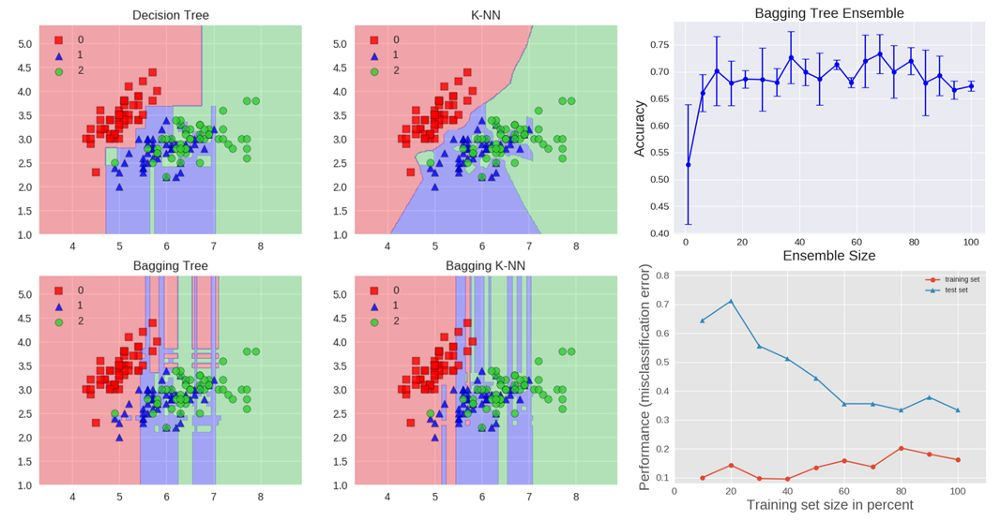
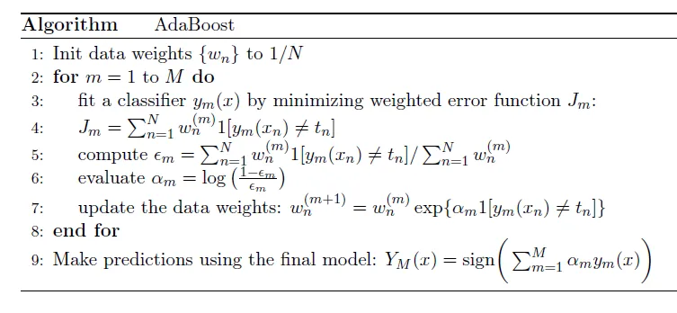
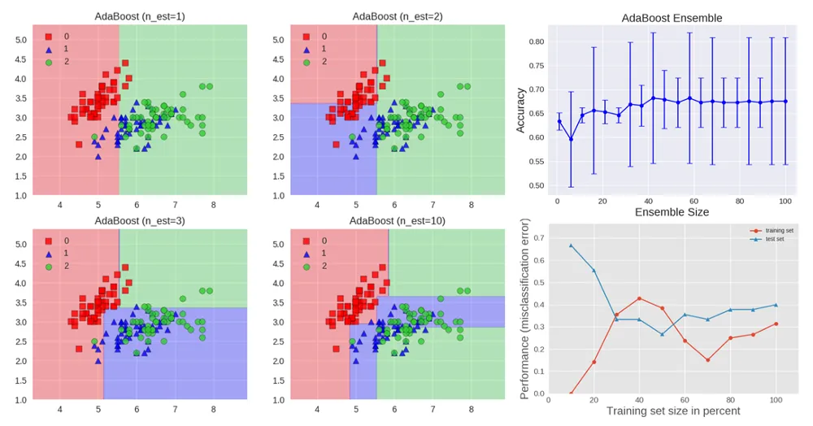
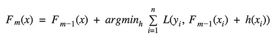
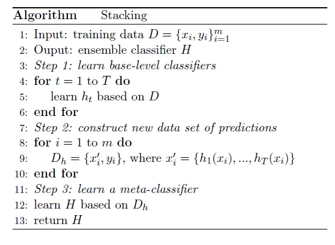
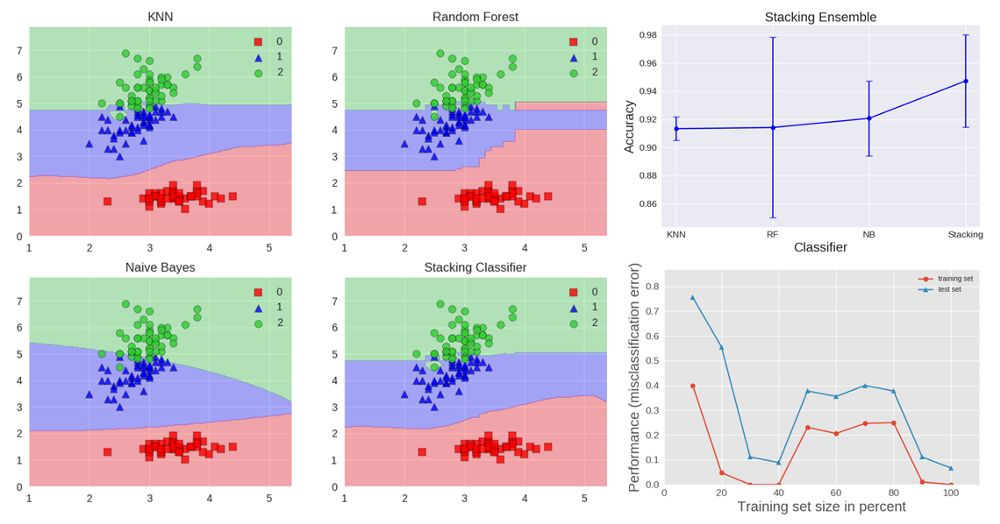
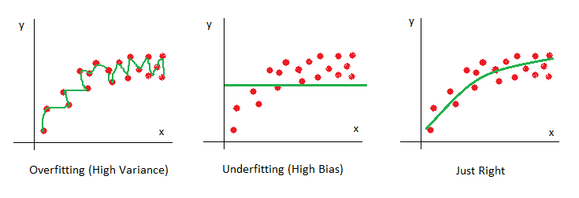
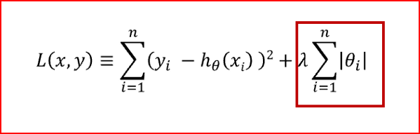
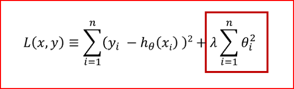

# 机器学习

### 1. 为什么PCA不被推荐用来避免过拟合？

>  PCA降维抛弃了一部分信息,并且它抛弃信息时根本不会看label.

>   主成分分析（PCA）是一种常用的降维方法，它通过线性变换将数据映射到低维空间中，以发现数据中的主要结构。虽然PCA可以在一定程度上降低过拟合的风险，但并不是一个被推荐的处理过拟合的方法。 
>   首先，PCA是一种无监督学习方法，它不依赖于样本标签信息，无法考虑标签对模型拟合过程的影响。在实际问题中，往往需要通过考虑样本标签信息来找到一个更好的特征子集，以提高模型性能和泛化能力。
>   其次，PCA在降维的过程中，只考虑数据中的主要结构，而忽略了噪声和不重要的特征。这意味着，PCA得到的主要特征并不一定是最有意义的特征，可能会损失一些有用的信息或忽略重要的特征。如果误差项或不重要的特征恰好对于泛化性能起到关键作用，则使用PCA容易导致过拟合。
>   最后，PCA在处理非线性结构的数据时表现不佳，因为它只能找到最能表示原始数据的线性子空间，而无法处理数据中的非线性关系。对于具有复杂结构的数据，使用PCA可能会捕捉到错误的特征，导致过拟合。
>   综上所述，虽然PCA可以用于降低维度和提取主成分等任务，但不被推荐用作减轻过拟合的方法。如果需要处理过拟合问题，可以考虑其他更正确和有效的方法，例如正则化、交叉验证和数据增强等。

## 基础

### 1. 样本不均衡如何处理？

* 选择合适的评价标准

  * 不要使用accuracy
  * 主流评估方法包括：ROC，Precision-Recall curve，F1;

* 若样本极不均衡，可作为异常问题处理

* 欠采样/过采样

  > 对于样本比较多的类别进行欠采样，对样本比较少的类别进行过采样

  * 常用的过采样方法

    >- 随机打乱数据；
    >- 加入噪声，或随机剔除部分词；
    >- 裁剪掉某一句；
    >- 复制；
    >- 翻译成另一种语言，再翻译回来，eg.中文->英文->中文；

  * 欠采样方法

    > 即对样本比较多的类别进行采样。

  * 缺点

    - 过采样：过拟合风险；
    - 欠采样：样本缺失，偏差较大；

  * 下采样缺失样本的解决方法

    > 1.EasyEnsemble:多次下采样（放回采样），训练多个不同的分类器
    >
    > 2.BalanceCascade：首先一次下采样产生训练集，对于分类正确的多样本类别不放回，只放回分类错误的样本；
    >
    > 3.利用KNN试图挑选那些最具代表性的大众样本，叫做NearMiss；

### 2. 什么是生成模型，什么是判别模型？

> 监督学习方法又分生成方法（Generative approach）和判别方法（Discriminative approach），所学到的模型分别称为生成模型（Generative Model）和判别模型（Discriminative Model)。

* 生成模型

  > 由数据学习联合概率密度分布P(X,Y)，然后求出条件概率分布P(Y|X)作为预测的模型，即生成模型：P(Y|X)= P(X,Y)/ P(X)。基本思想是首先建立样本的联合概率概率密度模型P(X,Y)，然后再得到后验概率P(Y|X)，再利用它进行分类。常见的有NB HMM模型。
  >
  > 而生成式模型求得P(Y,X)，对于未见示例X，你要求出X与不同标记之间的[联合概率分布](https://www.zhihu.com/search?q=联合概率分布&search_source=Entity&hybrid_search_source=Entity&hybrid_search_extra={"sourceType"%3A"answer"%2C"sourceId"%3A256466823})，然后大的获胜，如上图右边所示，并没有什么边界存在，对于未见示例（红三角），求两个联合概率分布（有两个类），比较一下，取那个大的。机器学习中[朴素贝叶斯模型](https://www.zhihu.com/search?q=朴素贝叶斯模型&search_source=Entity&hybrid_search_source=Entity&hybrid_search_extra={"sourceType"%3A"answer"%2C"sourceId"%3A256466823})、[隐马尔可夫模型](https://www.zhihu.com/search?q=隐马尔可夫模型&search_source=Entity&hybrid_search_source=Entity&hybrid_search_extra={"sourceType"%3A"answer"%2C"sourceId"%3A256466823})HMM等都是生成式模型，熟悉Naive Bayes的都知道，对于输入X，需要求出好几个联合概率，然后较大的那个就是预测结果~（根本原因个人认为是对于某示例X_1，对正例和反例的标记的联合概率不等于1，即P(Y_1,X_1)+P(Y_2,X_1)<1，要遍历所有的X和Y的联合概率求和，即sum(P(X,Y))=1，具体可参见楼上woodyhui提到的[维基百科](https://www.zhihu.com/search?q=维基百科&search_source=Entity&hybrid_search_source=Entity&hybrid_search_extra={"sourceType"%3A"answer"%2C"sourceId"%3A256466823})[Generative model](https://link.zhihu.com/?target=https%3A//en.wikipedia.org/wiki/Generative_model)里的例子）

* 判别模型

  > 由数据直接学习决策函数Y=f(X)或者条件概率分布P(Y|X)作为预测的模型，即判别模型。基本思想是有限样本条件下建立判别函数，不考虑样本的产生模型，直接研究预测模型。典型的判别模型包括k近邻，感知级，决策树，支持向量机等。
  >
  > 对于判别式模型来说求得P(Y|X)，对未见示例X，根据P(Y|X)可以求得标记Y，即可以直接判别出来，如上图的左边所示，实际是就是直接得到了判别边界，所以传统的、耳熟能详的机器学习算法如[线性回归模型](https://www.zhihu.com/search?q=线性回归模型&search_source=Entity&hybrid_search_source=Entity&hybrid_search_extra={"sourceType"%3A"answer"%2C"sourceId"%3A256466823})、[支持向量机](https://www.zhihu.com/search?q=支持向量机&search_source=Entity&hybrid_search_source=Entity&hybrid_search_extra={"sourceType"%3A"answer"%2C"sourceId"%3A256466823})SVM等都是判别式模型，这些模型的特点都是输入属性X可以直接得到Y（对于二分类任务来说，实际得到一个score，当score大于[threshold](https://www.zhihu.com/search?q=threshold&search_source=Entity&hybrid_search_source=Entity&hybrid_search_extra={"sourceType"%3A"answer"%2C"sourceId"%3A256466823})时则为正类，否则为反类）~（根本原因个人认为是对于某示例X_1，对正例和反例的标记的条件概率之和等于1，即P(Y_1|X_1)+P(Y_2|X_1)=1）

### 3. 回归问题可以设置SVM吗？

>   支持向量机（Support Vector Machine，SVM）最初用于解决二元分类问题，但它也可以被扩展用于解决回归问题，这就是支持向量回归（Support Vector Regression，SVR）。
>   与SVM一样，SVR基于支持向量的方法，通过寻找最大边距的方式来拟合回归数据。与常规的回归问题中使用的损失函数不同，SVR使用$\epsilon$-Insensitive Loss函数来构建损失函数。这个损失函数允许一些误差，但尽可能保持它们在$\epsilon$的范围之内，从而更好地适应噪声和异常数据。
>   在实际应用中，SVR广泛应用于各种领域，例如金融预测、生物信息学和气象学预测等。与传统的线性回归模型相比，SVR可以拟合更复杂的数据模式和非线性关系，并且具有较好的泛化能力和鲁棒性。
>   总之，回归问题可以用支持向量机（SVM）进行回归分析即使用支持向量回归（SVR）技术，SVR具有适应噪声和异常数据的能力，并且可以拟合复杂的非线性关系。

### 4. 介绍一下SVM，遇到线性不可分怎么办，核函数有什么特点？

>   支持向量机（Support Vector Machine，SVM）是一种广泛应用于分类问题中的监督学习算法，其基本思想是寻找一个超平面，可以在输入空间中将不同类别的样本分开。SVM具有较好的泛化能力和鲁棒性，并且可以有效地解决高维空间中的分类问题。
>   当遇到线性不可分问题时，SVM可以采用核函数来构建非线性决策边界，并将数据映射到高维空间中，以使不同类别的样本在新的空间中更容易分开。核函数是一种在输入空间中计算内积的函数，可以将低维数据映射到高维空间中，从而使它们更容易被线性分类器分割。
>   常用的核函数包括：
>
>   线性核函数：$K(x,y)=x^Ty$，将数据点映射到同一个空间。
>   多项式核函数：$K(x,y)=(ax^Ty+c)^d$，可以通过增加阶数$d$来获得更高阶的特征组合。
>   高斯核函数（径向基函数），常用于解决非线性问题：$K(x,y)=e^{-\frac{||x-y||^2}{2\sigma^2}}$，可以将数据映射到无限维空间中。
>   Sigmoid核函数：$K(x,y)=tanh(\alpha x^Ty+c)$，可以用于处理二元分类问题。
>
>   核函数的特点包括：
>
>   非线性映射：可以将低维数据映射到高维空间中，从而使它们更容易被线性分类器分割。
>   计算高效：在高维空间进行计算的复杂度可以通过核函数的设计得到优化及缩减，从而避免高维空间的计算高成本。
>   参数选择：需要根据具体问题来选择合适的核函数以及调节核函数的参数，以实现最佳性能和有效性的平衡。
>
>   总之，SVM是一种常见的机器学习算法，具有强大的分类能力和鲁棒性。当出现线性不可分问题时，可以通过核函数技术将数据映射到高维空间来解决，核函数具有非线性映射、计算高效和参数选择等特点。

### 5. 说一说xgboost和lightgbm有什么区别

>   XGBoost和LightGBM都是广泛应用于机器学习中的高效决策树算法库。它们都基于决策树精细优化和集成思想进行了多方面的改良，以提高模型的准确度、泛化能力和执行效率。下面是它们之间的一些主要区别：
>
>   决策树分裂方式：XGBoost基于预排序的方法计算特征值的梯度直方图，以确定决策树的节点分值，而LightGBM基于直方图算法和基于梯度的one-side采样方式进行高效的决策树节点分裂。LightGBM利用基于直方图的算法快速构建直方图，并通过one-side采样来过滤低频次特征从而提高运行效率。
>   贪心算法：XGBoost使用贪心算法的技巧，通过学习树的一部分形态来缩减决策树范围，进一步提高执行效率，而LightGBM使用最大增益作为距离来选择最佳分裂点。
>   多线程支持：XGBoost在实现过程中使用多线程来加速计算，因此在速度上具有相对的优势。LightGBM也可以实现多线程计算，但其计算速度相对较慢。
>   嵌入学习支持：LightGBM提供两个特殊的功能，“类别特征”和“查询特征”，前者用于嵌入学习和对类别特征的处理，后者允许交互式排序，该技术被广泛用于广告道具位置和推荐系统。
>   内存使用和可拓展性：XGBoost需要高度优化的预排序算法，需要预先在内存中为数据集保留对应的内存，所以它不适用于对大量数据集进行处理。相比之下，LightGBM使用了基于直方图的算法来处理大量数据，其高效的内存使用和可扩展性也使其更加适用于处理大数据集。
>
>   总之，XGBoost和LightGBM都是非常实用的机器学习算法库，并在特定应用场景下具有各自的优势特点。在实际应用中，应根据具体问题的需求来选择合适的算法库，以获得更好的性能和效果。

### 6. 决策树的实现逻辑，信息增益、信息增益率的公式

>   决策树是一种基于树形结构的分类和回归算法。其实现逻辑包括以下步骤：
>
>   选择最优特征：在当前节点中选择最优划分特征，使得划分后各子节点中样本纯度最高。
>   判断是否需要继续划分：如果当前节点的纯度已经足够高，或者已经没有特征可用来划分样本，则停止划分，并将当前节点标记为叶节点。
>   分裂子节点：根据选择的最优特征进行划分，生成子节点，并递归执行步骤1-2，直到所有叶节点的纯度达到期望值或者无法再进行划分。
>
>   决策树的划分依据包括信息熵和信息增益、信息增益率，其中信息熵是衡量样本集合纯度的度量，而信息增益和信息增益率则是在划分过程中选择最优特征的方式。
>   信息增益（Gain）是指在当前节点的基础上，选择某个特征进行分裂，导致样本集合纯度发生的变化。其计算公式为：
>   $$Gain(D, a) = Ent(D) - \sum_{v=1}^{V}\frac{|D^v|}{|D|}Ent(D^v)$$
>   其中，$D$为当前节点的样本集合，$a$为候选分裂特征，$V$为特征$a$可能的取值，$D^v$表示$a=v$时的样本子集。$Ent(D)$表示样本集合$D$的信息熵，由以下公式计算：
>   $$Ent(D) = -\sum{k=1}^{|y|}pk\log2{pk}$$
>   其中，$|y|$表示样本集合中类别的个数，$p_k$为第$k$个类别所占比例。
>   信息增益率（Gain Ratio）是在信息增益的基础上，考虑特征本身可能带来的信息量。其计算公式为：
>   $$GainRatio(D, a) = \frac{Gain(D, a)}{IV(a)}$$
>   其中，$IV(a)$表示特征$a$的固有值，用于惩罚具有较多候选分裂节点的特征。计算公式为：
>   $$IV(a) = - \sum{v=1}^{V}\frac{|D^v|}{|D|}\log2{\frac{|D^v|}{|D|}}$$
>   总之，决策树是一种基于树形结构的分类和回归算法，通过选择最优划分特征来构造树形结构，并递归地执行划分，逐步提高样本纯度。信息增益和信息增益率是选择最优特征的度量，前者只考虑特征的纯度提高程度，后者则考虑特征本身的信息量和信息增益。

### 7. RF和SVM的特点，评价

>   随机森林（Random Forest，RF）和支持向量机（Support Vector Machine，SVM）是两种应用广泛的机器学习算法，它们各具特点，可以应用于不同类型的问题。
>   随机森林：
>
>   > 随机森林是一种基于决策树的集成学习算法，可以应用于分类和回归问题，具有较高的准确性和鲁棒性。
>   > 随机森林可以处理大量输入特征，并在训练过程中随机选定特征，以提高泛化能力和减轻过拟合。它还可以处理高维数据，并通过决策树在空间中进行数据分割，用于发现变量之间的非线性关系。
>   > 随机森林算法的训练速度通常较快，并且容易进行并行计算。
>
>   支持向量机：
>
>   > SVM是一种非线性分类和回归算法，利用核函数实现高维空间中的特征映射，可以处理非线性关系，并具有较高的准确性和泛化能力。
>   > SVM可以应用于处理小样本数据，适用于二元和多元分类以及回归问题，因为它通过寻找间隔最大的分类超平面进行分割。
>   > SVM对于噪声敏感，分类结果会因为噪声变化而变化，所以在优化模型时，需要进行参数的调整。
>
>   评价：
>
>   随机森林模型较为容易建立和操作，具有良好的可读性，但难以优化参数。
>   SVM模型具有强大的学习能力，但容易陷入过拟合状态，需要合理设置超参数，并具有高计算复杂度。
>   随机森林和SVM在实际应用中具体选择要根据解决的问题和数据的情况而定。
>
>   总之，随机森林和SVM是两种强大的机器学习算法，可以应用于分类和回归问题。 随机森林适用于大样本、高维数据；SVM适用于小样本、高维识别问题。在实际问题中，需要根据具体情况选择合适的算法，以获得最优的性能。

### 8. 介绍一下逻辑回归

### 9. SVM的loss是什么， 优缺点是什么

### 10. RF和GBDT谁更容易过拟合，偏差和方差？

### 11. xgb的分类树也是用残差吗？不是的话是什么？

### 12. 对聚类算法的理解

### 13. 数据倾斜怎么处理？

### 14. LR和SVM的联系与区别

### 15. xgb的boosting如何体现，有什么特殊含义？

### 16. LR不使用MSE使用交叉熵损失函数的原因？

>   逻辑回归（Logistic Regression，LR）是一种分类算法，并且经常使用交叉熵损失函数作为目标函数。相比于MSE（Mean Squared Error，均方误差）损失函数，交叉熵具有以下几个优点：
>
>   更好的数学性质：相比于MSE，交叉熵损失函数的梯度更简单，更容易优化。而在带有sigmoid激活函数的逻辑回归中，使用交叉熵作为损失函数时，其导数可以使用更简单和可计算方法计算，同时在优化过程中也更加稳健。
>   更适用于处理分类问题：交叉熵损失函数在处理概率分布时非常有效而且通用，因此适用于分类问题。它可以比MSE更好地度量模型中的差异，并且更容易通过模型训练进行优化。
>   能够处理类别不平衡的问题：当训练数据集存在类别不平衡问题时，MSE损失函数通常难以处理。因为MSE只考虑回归模型的平均误差，可能忽略了小比例样本的预测误差。而交叉熵能够对分类模型进行更好的训练，可以有效地应对类别不平衡问题。
>
>   综上所述，交叉熵作为逻辑回归中常用的损失函数，比MSE更适合处理分类问题，且具有更好的数学性质和通用性，能够更好地应对类别不平衡问题。因此，在使用逻辑回归时，通常使用交叉熵作为目标函数。

### 17. 为什么LR使用sigmoid函数

>   1.   广义模型推导所得
>   2.   满足统计的最大熵模型
>   3.   性质优秀，方便使用（Sigmoid函数是平滑的，而且任意阶可导，一阶二阶导数可以直接由函数值得到不用进行求导，这在实现中很实用）

## 集成学习

### 1. 集成学习的分类？有什么代表性的模型和方法？

>   集成学习的思路是通过合并多个模型来提升机器学习性能，这种方法相较于当个单个模型通常能够获得更好的预测结果。这也是集成学习在众多高水平的比赛如奈飞比赛，KDD和Kaggle，被首先推荐使用的原因。
>
>   一般分为三类：
>
>   -   用于减少方差的bagging
>   -   用于减少偏差的boosting
>   -   用于提升预测结果的stacking
>
>   集成学习方法也可以归为如下两大类：
>
>   -   串行集成方法，这种方法串行地生成基础模型（如AdaBoost）。串行集成的基本动机是利用基础模型之间的依赖。通过给错分样本一个较大的权重来提升性能。
>   -   并行集成方法，这种方法并行地生成基础模型（如Random Forest）。并行集成的基本动机是利用基础模型的独立性，因为通过平均能够较大地降低误差。

*   Bagging

>   Bagging是引导聚合的意思。减少一个估计方差的一种方式就是对多个估计进行平均。
>
>   
>
>   Bagging使用装袋采样来获取数据子集训练基础学习器。通常分类任务使用投票的方式集成，而回归任务通过平均的方式集成。
>
>   下面通过应用Iris数据集的分类问题来距离说明bagging。我们可以使用两种基础模型：决策树和KNN。图像1展示了基础模型与集成模型学习得到的决策边界。
>
>   Accuracy: 0.63 (+/- 0.02) [Decision Tree]
>
>   Accuracy: 0.70 (+/- 0.02) [K-NN]
>
>   Accuracy: 0.64 (+/- 0.01) [Bagging Tree]
>
>   Accuracy: 0.59 (+/- 0.07) [Bagging K-NN]
>
>   
>
>   决策树学到的是轴平行边界，然而k=1最近邻对数据拟合的最好。bagging通过训练10个基础模型以及）。**随机选择80%的数据作为训练集，同样随机选择80%的特征进行训练。**
>
>   决策树bagging集成相比K-NN bagging集成获得了更高的准确率。K-NN对于训练样本的扰动并不敏感，这也是为什么K-NN成为稳定学习器的原因。
>
>   **整合稳定学习器对于提升泛化性能没有帮助。**
>
>   图像结果同样展示了通过增加集成模型的个数带来的测试准确率变化。基于交叉验证的结果，我们可以看到整合基础模型个数大于10个之后性能就基本不再提升了，只是带来了计算复杂度的增加。
>
>   最后一张图绘制的是集成学习模型的学习曲线，注意训练集数据的平均误差为0.3，在对训练集做80%采样的时候训练集和验证集误差最小。

*   **Boosting(提高)**

>   Boosting指的是通过算法集合将弱学习器转换为强学习器。boosting的主要原则是训练一系列的弱学习器，所谓弱学习器是指仅比随机猜测好一点点的模型，例如较小的决策树，训练的方式是**利用加权的数据**。在训练的早期对于错分数据给予较大的权重。
>
>   对于训练好的弱分类器，如果是分类任务按照权重进行投票，而对于回归任务进行加权，然后再进行预测。boosting和bagging的区别在于是对加权后的数据利用弱分类器依次进行训练。
>
>   下面描述的算法是最常用的一种boosting算法，叫做AdaBoost，表示自适应boosting。
>
>   
>
>   我们可以看到第一个分类器y1(x)是用相等的权重系数进行训练的。在随后的boosting中，错分的数据权重系数将会增加，正确分类的数据权重系数将会减小。
>
>   epsilon表示单个分类器的加权错误率。alpha是分类器的权重，正确的分类器alpha较大。
>
>   
>
>   AdaBoost算法的表现如上图所示。每个基础模型包含一个深度为1的决策树，这种决策树依靠线性划分进行分类，决策平面跟其中一个轴平行。上图还展示了集成规模的增加带来的测试准确率变化以及训练和测试集的学习曲线。
>
>   梯度树提升（Gradient Tree Boosting）是一个boosting算法在损失函数上的泛化。能够用于分类和回归问题。Gradient Boosting采用串行方式构建模型.
>   $$
>   F_{m}(x) = F_{m - 1}(x) + \gamma_{m}h_{m}(x)
>   $$
>   每新增一个决策树hm(x)都尽可能的选择是的当前模型Fm-1(x)损失最小的那个：
>
>   
>
>   注意：分类和回归使用的损失函数有所差别。

*   Stacking(堆叠)

>   Stacking是通过一个元分类器或者元回归器来整合多个分类模型或回归模型的集成学习技术。基础模型利用整个训练集做训练，元模型将基础模型的特征作为特征进行训练。
>
>   基础模型通常包含不同的学习算法，因此stacking通常是异质集成。算法伪代码如下：
>
>   
>
>   
>
>   各基础模型的预测结果如下：
>
>   Accuracy: 0.91 (+/- 0.01) [KNN]
>
>   Accuracy: 0.91 (+/- 0.06) [Random Forest]
>
>   Accuracy: 0.92 (+/- 0.03) [Naive Bayes]
>
>   Accuracy: 0.95 (+/- 0.03) [Stacking Classifier]
>
>   Stacking集成效果如上图所示。分别在K-NN，Random Forest,Naive Bayes做训练和预测，然后将其输出结果作为特征，利用逻辑回归作为元模型进一步训练。如图所示，stacking集成的结果由于每个基础模型，并且没有过拟合。
>
>   Stacking被Kaggle竞赛获奖者广泛使用。例如，Otto Group Product分类挑战赛的第一名通过对30个模型做stacking赢得了冠军。他将30个模型的输出作为特征，继续在三个模型中训练，这三个模型XGBoost，Neural Network和Adaboost，最后再加权平均。详见文章([https://www.kaggle.com/c/otto-group-product-classification-challenge/discussion/14335](https://link.zhihu.com/?target=https%3A//www.kaggle.com/c/otto-group-product-classification-challenge/discussion/14335))。

>   代码参考
>
>   https://github.com/vsmolyakov/experiments_with_python/blob/master/chp01/ensemble_methods.ipynb

### 2. 如何从偏差和方差的角度解释bagging和boosting的原理？

>   从偏差和方差的角度解释bagging和boosting的原理可以帮助我们更好地理解这两种集成学习方法的原理和优缺点。
>
>   Bagging
>
>   Bagging（Bootstrap Aggregating）是一种集成学习算法，通过并行训练多个基学习器，并使用简单投票或平均等方式进行集成，从而降低模型的方差。
>   从偏差和方差的角度来看，Bagging主要解决的是方差问题。由于模型拟合的不确定性导致的方差较大，Bagging通过并行训练多个基学习器，每个基学习器都训练在随机采样得到的不同子集上，从而降低模型的方差。在投票或平均等方式进行集成时，多个基学习器之间的方差也可以互相抵消，从而得到更稳定的预测结果。
>
>   Boosting
>
>   Boosting是一种集成学习算法，通过串行训练多个基学习器，并使用加权投票或加权平均等方式进行集成，从而降低模型的偏差和方差，并提高模型的性能。
>   从偏差和方差的角度来看，Boosting主要解决的是偏差问题。由于模型学习能力不足导致的偏差较大，Boosting通过不断调整样本权重，使基学习器能够更加关注错误分类的样本。在串行训练多个基学习器时，每个基学习器都会在前一轮学习错误分类的样本，从而逐步降低模型的偏差。在加权投票或加权平均等方式进行集成时，加入更多的错误分类的样本，能够提高模型的学习能力，从而获得更好的性能表现。
>   总之，Bagging和Boosting都是基于集成学习的方法，通过并行和串行地训练多个基学习器进行集成，从而降低模型的方差和偏差，并提高模型的性能。Bagging主要解决方差问题，而Boosting主要解决偏差问题。需要结合实际问题和数据特点来选择合适的集成学习方法。

* 什么是集成学习？

  >   集成学习通过构建并结合多个学习器来完成学习任务，有时也被称为多分类器系统、基于委员会的学习。只包含同种类型的个体学习器，这样的集成是“同质”的；包含不同类型的个体学习器，这样的集成是“异质”的。集成学习通过将多个学习器进行结合，常可获得比单一学习器显著优越的泛化性能。这对“弱学习器”（弱学习器常指泛化性能略优于随机猜测的学习器）尤为明显。要获得好的集成，学习器之间要具有差异性。根据个体学习器的生成方式，目前的集成学习方法大致可分为两大类，即个体学习器间存在强依赖关系、必须串行生成的序列化方法，以及个体学习器间不存在强依赖关系、可同时生成的并行化方法；前者的代表是Boosting，后者的代表是Bagging和“随机森林”。

* 什么是boosting？

  >   Boosting是一族可将弱学习器提升为强学习器的算法。
  >   关于Boosting的工作机制：
  >   1）提高那些在前一轮被弱分类器分错样例的权值，减小前一轮分对样本的权值，使误分的样本在后续受到更多的关注。
  >   2）加法模型将弱分类器进行线性组合，比如AdaBoost通过加权多数表决的方式，即增大错误率小的分类器的权值，同时减小错误率较大的分类器的权值。
  >   如此反复（1）、（2），直到满足训练停止条件。
  >   需要注意的是：Boosting算法在训练的每一轮要检查当前生成的基学习器是否满足基本条件（比如：检查当前分类器是否比随机猜测好）

* 什么是Bagging

  >   Bagging即套袋法，其算法过程如下：
  >   1）从原始样本集中抽取训练集。每轮从原始样本集中使用Bootstraping法（即自助法，是一种有放回的抽样方法，可能抽到重复的样本）抽取n个训练样本（在训练集中，有些样本可能被多次抽取到，而有些样本可能一次都没有被抽中）.共进行k轮抽取，得到k个训练集.（k个训练集相互独立）
  >   2）每次使用一个训练集得到一个模型，k个训练集共得到k个模型.（注：根据具体问题采用不同的分类或回归方法，如决策树、神经网络等）
  >   3）对分类问题：将上步得到的k个模型采用投票的方式得到分类结果；对回归问题，计算上述模型的均值作为最后的结果。
  >   Bagging的典型代表是随机森林：
  >   随机森林改变了决策树容易过拟合的问题，这主要是由两个操作所优化的：
  >   1、Boostrap从袋内有放回的抽取样本值
  >   2、每次随机抽取一定数量的特征（通常为sqr(n)）
  >   分类问题：采用Bagging投票的方式选择类别频次最高的
  >   回归问题：直接取每颗树结果的平均值

* 区别

  >   1）偏差—方差
  >   Boosting：从偏差—方差分解角度看，降低偏差。
  >   Bagging：从偏差—方差分解角度看，降低方差。
  >   2）样本选择：
  >   Boosting：每一轮的训练集不变，只是训练集中每个样例在分类器中的权重发生变化.而权值是根据上一轮的分类结果进行调整。
  >   Bagging：训练集是在原始集中有放回选取的，从原始集中选出的各轮训练集之间是独立的。
  >   3）样例权重：
  >   Boosting：根据错误率不断调整样例的权值，错误率越大则权重越大。
  >   Bagging：使用均匀取样，每个样例的权重相等
  >   4）基学习器权重：
  >   Boosting：每个弱分类器都有相应的权重，对于分类误差小的分类器会有更大的权重.
  >   Bagging：所有弱分类器的权重相等.
  >   5）串、并行计算：
  >   Boosting：串行，各个及学习器只能顺序生成，因为后一个模型参数需要前一轮模型的结果。
  >   Bagging：各个预测函数可以并行生成。

### 3. GBDT的原理？和Xgboost的区别联系？

>   参考链接
>
>   https://blog.csdn.net/u011094454/article/details/78948989

### 4. adaboost和gbdt的区别联系？

>   参考链接
>
>   https://zhuanlan.zhihu.com/p/31639299

## 模型

### 1. 手推LR、Kmeans、SVM

>   手推三种常见的机器学习算法，包括逻辑回归（Logistic Regression，LR）、K均值聚类（K-means Clustering）和支持向量机（Support Vector Machine，SVM）：
>
>   LR
>
>   > 假设训练集为${(x^{(i)}, y^{(i)})}$，其中$x^{(i)}$为第$i$个样本的特征向量，$y^{(i)}$为它的类别标签（二元分类）。逻辑回归的模型假设为：
>   > $$
>   > h_{\theta}(x) = \frac{1}{1+e^{-\theta_T x}}
>   > $$
>   >
>   > 其中，$\theta$为模型的参数向量，$h_{\theta}(x)$为预测值。模型中使用的是Sigmoid函数，可以将实数映射到0和1之间，表示样本为正例的概率。
>   > 为了学习模型的参数，需要最大化似然函数的值。对于二元分类，似然函数定义为：
>   > $$
>   > L(\theta) = \prod_{i=1}^m h_{\theta}(x^{(i)})^{y^{(i)}}(1-h_{\theta}(x^{(i)}))^{1-y^{(i)}}
>   > $$
>   > 其中，$m$为样本数。通过对似然函数取对数，将连乘变成求和，得到对数似然函数：
>   > $$
>   > l(\theta) = \sum_{i=1}^m [y^{(i)}\log(h_{\theta}(x^{(i)}))+(1-y^{(i)})\log(1-h_{\theta}(x^{(i)}))]
>   > $$
>   > 可以使用梯度下降算法或牛顿法求解参数值$\theta$，从而得到分类器。
>
>   K均值聚类
>
>   > 假设有$n$个样本，每个样本有$d$个维度的特征向量。K均值聚类的目标是将这$n$个样本分为$K$个簇，使得同簇内的样本相似度较高，不同簇之间的样本相似度较低。算法步骤如下：
>   > 1）随机选择$K$个初始簇中心；
>   > 2）计算每个样本距离所有簇中心的距离，并将其分配到最近的簇；
>   > 3）重新计算每个簇的中心坐标；
>   > 4）重复步骤2 和步骤3，直到簇中心不再发生变化或达到最大迭代次数。
>
>   SVM
>
>   > SVM是一种二元分类算法，通过寻找超平面将不同类别的样本分开。SVM基于支持向量，将样本空间映射到高维特征空间来寻找最优的超平面，从而具有较好的泛化能力和鲁棒性。
>   > 对于二元分类，给定训练集${x^{(i)}, y^{(i)}}$，其中$x^{(i)}\in R^n$，$y^{(i)}\in{-1,1}$为类别标签。SVM的决策函数为：
>   > $$
>   > \begin{align}
>   > f(x) = sign(\omega^Tx+b)
>   > \end{align}
>   > $$
>   >
>   > 其中，$\omega$为超平面的法向量，$b$为截距。分类的目标是最大化分离超平面与支持向量之间的间隔距离，因此问题可以转化为以下凸二次规划问题：
>   > $$
>   > \begin{align}
>   > \min\limits_{\omega,b} \frac{1}{2}||\omega||^2 \quad \quad \quad
>   > s.t. \quad y^{(i)}(\omega^Tx^{(i)}+b) \geq 1, i=1,\ldots,m
>   > \end{align}
>   > $$
>   >
>   > 通过拉格朗日乘子法和KKT条件，可以求出最优解。最终得到分类器的参数$\omega$和$b$，从而完成对样本的分类。
>
>   总之，逻辑回归、K均值聚类和支持向量机是三种常见的机器学习算法。逻辑回归用于二元分类，采用Sigmoid函数进行建模；K均值聚类用于无监督学习的聚类，通过迭代调整簇中心进行聚类；SVM用于二元分类，利用支持向量寻找最优的分离超平面。

### 2. 简述ridge和lasson的区别和联系

> 回归分析是机器学习中的经典算法之一，用途广泛，在用实际数据进行分析时，可能会遇到以下两种问题
>
> 1. 过拟合, overfitting
> 2. 欠拟合, underfitting
>
> 在机器学习中，首先根据一批数据集来构建一个回归模型，然后在用另外一批数据来检验回归模型的效果。构建回归模型所用的数据集称之为训练数据集，而验证模型的数据集称之为测试数据集。模型来训练集上的误差称之为训练误差，或者经验误差；在测试集上的误差称之为泛化误差。
>
> 过拟合指的是模型在训练集中表现良好，而测试集中表现很差，即泛化误差大于了经验误差，说明拟合过度，模型泛化能力降低，只能够适用于训练集，通用性不强 ；欠拟合指的是模型在训练集中的表现就很差，即经验误差很大，图示如下
>
> 
>
> 第一张图代表过拟合，可以看到为了完美匹配每个点，模型非常复杂，这种情况下，经验误差非常小，但是预测值的方差会很大，第二张图代表欠拟合，此时模型过于简单，在训练集上的误差就很大，第三张图则表示一个理想的拟合模型。
>
> 欠拟合出现的原因是模型复杂度太低，可能是回归模型自变量较少，模型不合适。针对欠拟合，要做的是增大模型复杂度，可以增加自变量，或者改变模型，比如将自变量由1次方改为2次方。
>
> 过拟合出现的原因则是模型复杂度太高或者训练集太少，比如自变量过多等情况。针对过拟合，除了增加训练集数据外，还有多种算法可以处理，正则化就是常用的一种处理方式。
>
> 所谓正则化`Regularization`, 指的是在回归模型代价函数后面添加一个约束项， 在线性回归模型中，有两种不同的正则化项
>
> 1. 所有参数绝对值之和，即L1范数，对应的回归方法叫做Lasso回归
> 2. 所有参数的平方和，即L2范数，对应的回归方法叫做Ridge回归，岭回归
>
> 岭回归对应的代价函数如下
>
> 
>
> lasso回归对应的代价函数如下
>
> 
>
> 红框标记的就是正则项，需要注意的是，正则项中的回归系数为每个自变量对应的回归系数，不包含回归常数项。
>
> L1和L2各有优劣，L1是基于特征选择的方式，有多种求解方法，更加具有鲁棒性；L2则鲁棒性稍差，只有一种求解方式，而且不是基于特征选择的方式。
>
> 在GWAS分析中，当用多个SNP位点作为自变量时，采用基于特征选择的L1范式，不仅可以解决过拟合的问题，还可以筛选重要的SNP位点，所以lasso回归在GWAS中应用的更多一点。

### 3. 树模型如何调参

> * 当样本少数量但是样本特征非常多的时候，决策树很容易过拟合，一般来说，样本数比特征数多一些会比较容易建立健壮的模型
> * 如果样本数量少但是样本特征非常多，在拟合决策树模型前，推荐先做维度规约，比如主成分分析（PCA），特征选择（Losso）或者独立成分分析（ICA）。这样特征的维度会大大减小。再来拟合决策树模型效果会好。
> * 推荐多用决策树的可视化，同时先限制决策树的深度（比如最多3层），这样可以先观察下生成的决策树里数据的初步拟合情况，然后再决定是否要增加深度。
> * 在训练模型先，注意观察样本的类别情况（主要指分类树），如果类别分布非常不均匀，就要考虑用class_weight来限制模型过于偏向样本多的类别。
> * 决策树的数组使用的是numpy的float32类型，如果训练数据不是这样的格式，算法会先做copy再运行。
> * 如果输入的样本矩阵是稀疏的，推荐在拟合前调用csc_matrix稀疏化，在预测前调用csr_matrix稀疏化。

### 4. 树模型如何剪枝？

> 参考：https://blog.csdn.net/u012328159/article/details/79285214
>
> https://blog.csdn.net/yujianmin1990/article/details/49864813

### 5. 是否存一定存在参数，使得SVM的训练误差能到0

>  参考 https://zhuanlan.zhihu.com/p/32870566

### 6. 逻辑回归如何处理多分类？

> * one vs all 模型
>
> > 把一个多分类的问题变成多个二分类的问题。转变的思路就如同方法名称描述的那样，选择其中一个类别为正类（Positive），使其他所有类别为负类（Negative）。
> >
> > 优点：普适性还比较广，可以应用于能输出值或者概率的分类器，同时效率相对较好，有多少个类别就训练多少个分类器。
> >
> > 缺点：很容易造成训练集样本数量的不平衡（Unbalance），尤其在类别较多的情况下，经常容易出现正类样本的数量远远不及负类样本的数量，这样就会造成分类器的偏向性。
>
> * one VS one 模型
>
> > 思想是将特征两两组合训练模型，然后预测结果是根据各个模型的预测结果投票所得。
> >
> > 优点：在一定程度上规避了data unbalance 的情况，性能相对稳定，并且需要训练的模型数虽然增多，但是每次训练时训练集的数量都降低很多，其训练效率会提高。
> >
> > 缺点：相比one_vs_all, 训练出更多的 Classifier，会影响预测时间
>
> * softmax模型
>
> > 将特征值映射到(0, 1)区间内，可以表示为各个类别的概率。
>
> 参考：https://zhuanlan.zhihu.com/p/46599015

### 7. 决策树有哪些划分指标？区别与联系？

> 参考： https://easyai.tech/ai-definition/decision-tree/

* 什么是决策树？

> 是一种逻辑简单的机器学习算法，是一种树形结构

* 结构：

> - 根节点：包含样本的全集
> - 内部节点：对应特征属性测试
> - 叶节点：代表决策的结果
>
> 预测时，在树的内部节点处用某一属性值进行判断，根据判断结果决定进入哪个分支节点，直到到达叶节点处，得到分类结果。
>
> 这是一种基于 if-then-else 规则的有监督学习算法，决策树的这些规则通过训练得到，而不是人工制定的。

* 学习过程

> **特征选择**
>
> 特征选择决定了使用哪些特征来做判断。在训练数据集中，每个样本的属性可能有很多个，不同属性的作用有大有小。因而特征选择的作用就是筛选出跟分类结果相关性较高的特征，也就是分类能力较强的特征。
>
> 在特征选择中通常使用的准则是：信息增益。
>
> **决策树生成**
>
> 选择好特征后，就从根节点触发，对节点计算所有特征的信息增益，选择信息增益最大的特征作为节点特征，根据该特征的不同取值建立子节点；对每个子节点使用相同的方式生成新的子节点，直到信息增益很小或者没有特征可以选择为止。
>
> **决策树剪枝**
>
> 剪枝的主要目的是对抗“过拟合”，通过主动去掉部分分支来降低过拟合的风险。

* 3种典型的决策树算法

> **ID3 算法**
>
> ID3 是最早提出的决策树算法，他就是利用信息增益来选择特征的。
>
> **C4.5 算法**
>
> 他是 ID3 的改进版，他不是直接使用信息增益，而是引入“信息增益比”指标作为特征的选择依据。
>
> **CART（Classification and Regression Tree）**
>
> 这种算法即可以用于分类，也可以用于回归问题。CART 算法使用了基尼系数取代了信息熵模型。

* 优缺点

> **优点**
>
> - 决策树易于理解和解释，可以可视化分析，容易提取出规则；
> - 可以同时处理标称型和数值型数据；
> - 比较适合处理有缺失属性的样本；
> - 能够处理不相关的特征；
> - 测试数据集时，运行速度比较快；
> - 在相对短的时间内能够对大型数据源做出可行且效果良好的结果。
>
> **缺点**
>
> - 容易发生过拟合（随机森林可以很大程度上减少过拟合）；
> - 容易忽略数据集中属性的相互关联；
> - 对于那些各类别样本数量不一致的数据，在决策树中，进行属性划分时，不同的判定准则会带来不同的属性选择倾向；信息增益准则对可取数目较多的属性有所偏好（典型代表ID3算法），而增益率准则（CART）则对可取数目较少的属性有所偏好，但CART进行属性划分时候不再简单地直接利用增益率尽心划分，而是采用一种启发式规则）（只要是使用了信息增益，都有这个缺点，如RF）。
> - ID3算法计算信息增益时结果偏向数值比较多的特征。

### 8. 简述SVD和PCA的区别和联系？

> 参考：https://zhuanlan.zhihu.com/p/78193297

1. 两者都是矩阵分解的技术，一个直接分解SVD，一个是对协方差矩阵操作后分解PCA
2. 奇异值和特征向量存在关系，即有 ��=�2�/(�−1)
3. SVD可以获取另一个方向上的主成分，而PCA只能获得单个方向上的主成分，PCA只与SVD的右奇异向量的压缩效果相同
4. 通过SVD可以得到PCA相同的结果，但是SVD通常比直接使用PCA更稳定。因为在PCA求协方差时很可能会丢失一些精度。例如Lauchli矩阵

### 9. 如何使用梯度下降方法进行矩阵分解？

> 参考：https://www.cnblogs.com/hxsyl/p/4881727.html

### 10. LDA与PCA的区别与联系？

> 参考：https://blog.csdn.net/sinat_30353259/article/details/81569550

LDA用于降维，和PCA有很多相同，也有很多不同的地方，因此值得好好的比较一下两者的降维异同点。
首先我们看看相同点：
　　1）两者均可以对数据进行降维。
　　2）两者在降维时均使用了矩阵特征分解的思想。
　　3）两者都假设数据符合高斯分布。
我们接着看看不同点：
　　1）LDA是有监督的降维方法，而PCA是无监督的降维方法
　　2）LDA降维最多降到类别数k-1的维数，而PCA没有这个限制。
　　3）LDA除了可以用于降维，还可以用于分类。
　　4）LDA选择分类性能最好的投影方向，而PCA选择样本点投影具有最大方差的方向。

## 特征工程

### 1. 常用的特征筛选方法有哪些？

> 参考：https://blog.csdn.net/LY_ysys629/article/details/53641569

* 特征选择的作用

> 1. 减少特征数量、降维，使模型泛化能力更强，减少过拟合
> 2. 增强对特征和特征值之间的理解

* 常用的特征选择方法

> 1. 去掉取值变化小的特征 Removing features with low variance
>
> 2. 单变量特征选择Univariate feature selection
>
>    > 单变量特征选择能够对每一个特征进行测试，衡量该特征和响应变量之间的关系，根据得分扔掉不好的特征。对于回归和分类问题可以采用卡方检验等方式对特征进行测试.
>
> 3. 线性模型和正则化
>
> 4. 随机森林
>
>    > 随机森林提供了两种特征选择的方法：mean decrease impurity(平均不纯度减少)和mean decrease accuracy(平均精确率减少)。
>
> 5. 2种顶层特征选择算法
>
>    > 之所以叫做顶层，是因为他们都是建立在基于模型的特征选择方法基础之上的，例如回归和SVM，在不同的子集上建立模型，然后汇总最终确定特征得分。
>
>    * 稳定性选择 Stability selection
>
>      > 主要思想是在不同的数据子集和特征子集上运行特征选择算法，不断的重复，最终汇总特征选择结果，比如可以统计某个特征被认为是重要特征的频率
>
>    * 递归特征消除 Recursive feature elimination (RFE)
>
>      > 主要思想是反复的构建模型（如SVM或者回归模型）然后选出最好的（或者最差的）的特征（可以根据系数来选），把选出来的特征放到一遍，然后在剩余的特征上重复这个过程，直到所有特征都遍历了。这个过程中特征被消除的次序就是特征的排序。因此，这是一种寻找最优特征子集的贪心算法。

### 2. 文本如何构造特征？

* 文本特征项的特点

  > * 能够确实标识文本内容
  > * 具有将目标文本与其他文本区分的能力
  > * 特征个数不能太多
  > * 特征分离要比较容易实现

* 基于统计的特征提取方法

  > * TF-IDF：
  >
  >   > TFIDF算法是建立在这样一个假设之上的：对区别文档最有意义的词语应该是那些在文档中出现频率高，而在整个文档集合的其他文档中出现频率少的词语，所以如果特征空间坐标系取TF词频作为测度，就可以体现同类文本的特点。
  >
  > * 词频（word frequency）
  >
  > * 文档频次（Document Frequency）
  >
  > * 互信息（Mutual Information）
  >
  > * 期望交叉熵（Expected Cross Entropy）

### 3. 类别变量如何构造特征？

> 构造类别变量的特征（Categorical Feature）是在机器学习中非常常见的。通常，数据集可以包含两种类型的变量：数值型变量和类别型变量。数值型变量是具有数量意义，可以进行算术运算的变量；而类别型变量则表示某个主题中特定类别的数据，而不是具有一定数量级的数据。
> 在机器学习算法中，数量型变量可以直接输入算法中；但是，当数据集包含类别型变量时，需要将这些变量转换为数字型特征，并将其纳入算法中。在构造类别变量的特征方面，主要有以下三种方法：
>
> 将类别标签编码为有序数字
>
> 这是最简单和最常见的方法，也称为标签编码（Label Encoding），即将不同的类别标签映射为数字，对于有序分类变量适用。例如，对于{red, green, blue}三种颜色标签，将其分别编码为{1, 2, 3}。
> 这种方法的优点是简单、直观。可以将多个离散变量转换为单个数字特征，便于许多机器学习算法的运用。但是，它假设不同数字之间的间距是均等的，这在一些机器学习算法中可能会引入误差。
>
> 将类别标签映射为二进制特征
>
> 这种方法称为one-hot编码（One-Hot Encoding），也称为哑变量编码（Dummy Variable Encoding）。将每一个类别标签都映射为一个唯一的二进制向量，其中有一维为1，其余全部为0。例如，对于{red, green, blue}三种颜色标签，将其分别进行one-hot编码为{1, 0, 0}, {0, 1, 0}, {0, 0, 1}。
> 这种方法的优点是可以解决将类别变量中的相对大小，转换为更加显式的特征，避免了标签编码中引入的误差。缺点是可能会为每个类别引入大量的特征，特别是在分类变量具有高维度时，这可能会使算法的训练时间变得很长。
>
> 将类别标签映射为数值特征并分段
>
> 这种方法称为分段（binning）。将连续分布的类别变量映射到固定数量的数字特征，尽量保持原始的分布信息。例如，对于年龄这个变量，可以将其映射到5个数字特征，对应于5个不同的年龄区间。
> 这种方法的优点是可以对连续的密度函数进行数字化表示，从而保留了原始数据的分布信息。缺点是对于具有高度离散的类别变量，不同类别之间的边界变得模糊不清，导致了特征的失真。
> 在实际应用中，以上三种方法可以根据具体数据集的特征进行选择使用。除此之外，也可以考虑利用自然语言处理（NLP）的方式，将文本数据集中的类别变量转换为数字特征，例如使用词袋模型（Bag-of-Words）将文本映射为向量。

* 什么是类别变量？

  > 用来表达一种类别或标签.

* 编码：

  > One-hot 编码
  >
  > dummy编码

### 4. 连续值变量如何构造特征？

>   z-score标准化：这是最常见的特征预处理方式，基本所有的线性模型在拟合的时候都会做 z-score标准化。具体的方法是求出样本特征x的均值mean和标准差std，然后用（x-mean)/std来代替原特征。这样特征就变成了均值为0，方差为1了。在sklearn中，我们可以用StandardScaler来做z-score标准化。当然，如果我们是用pandas做数据预处理，可以自己在数据框里面减去均值，再除以方差，自己做z-score标准化。
>
>    max-min标准化：也称为离差标准化，预处理后使特征值映射到[0,1]之间。具体的方法是求出样本特征x的最大值max和最小值min，然后用(x-min)/(max-min)来代替原特征。如果我们希望将数据映射到任意一个区间[a,b]，而不是[0,1]，那么也很简单。用(x-min)(b-a)/(max-min)+a来代替原特征即可。在sklearn中，我们可以用MinMaxScaler来做max-min标准化。这种方法的问题就是如果测试集或者预测数据里的特征有小于min，或者大于max的数据，会导致max和min发生变化，需要重新计算。所以实际算法中， 除非你对特征的取值区间有需求，否则max-min标准化没有 z-score标准化好用。
>
>    L1/L2范数标准化：如果我们只是为了统一量纲，那么通过L2范数整体标准化也是可以的，具体方法是求出每个样本特征向量x的L2范数||x||2,然后用x/||x||2代替原样本特征即可。当然L1范数标准化也是可以的，即用x/||x||1代替原样本特征。通常情况下，范数标准化首选L2范数标准化。在sklearn中，我们可以用Normalizer来做L1/L2范数标准化。

### 5. 哪些模型需要对特征进行归一化？

> 参考：https://blog.csdn.net/zenghaitao0128/article/details/78361038

> 归一化的目的就是使得预处理的数据被限定在一定的范围内（比如[0,1]或者[-1,1]），从而消除**奇异样本数据**导致的不良影响

1）概率模型不需要归一化，因为这种模型不关心变量的取值，而是关心变量的分布和变量之间的条件概率；

2）SVM、线性回归之类的最优化问题需要归一化，是否归一化主要在于是否关心变量取值；

3）神经网络需要标准化处理，一般变量的取值在-1到1之间，这样做是为了弱化某些变量的值较大而对模型产生影响。一般神经网络中的隐藏层采用tanh激活函数比sigmod激活函数要好些，因为tanh双曲正切函数的取值[-1,1]之间，均值为0.

4）在K近邻算法中，如果不对解释变量进行标准化，那么具有小数量级的解释变量的影响就会微乎其微。

### 6. 什么是组合特征？如何处理高维组合特征？

> 参考：https://cloud.tencent.com/developer/article/1428680

* 什么是组合特征？

  > 将一阶离散特征两两组合，就可以构成二阶组合特征
  >
  > 例如，特征a有m个取值，特别b 有n个取值，将二者组合就有m*n个组成情况。这时需要学习的参数个数就是 m×n 个

* 如何处理高维组合特征？

  > 问题：当每个特征都有千万级别，就无法学习 m×n 规模的参数了
  >
  > 解决方案：可以将每个特征分别用 k 维的低维向量表示，需要学习的参数变为 m×k+n×k 个，等价于矩阵分解

* 应该对哪些特征进行组合？

  > 可以用基于决策树的方法
  >
  > * 首先根据样本的数据和特征构造出一颗决策树.
  > * 然后从根节点都叶节点的每一条路径，都可以当作一种组合方式。