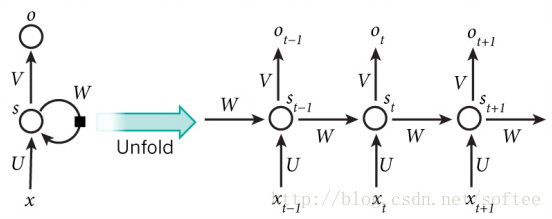
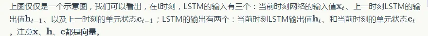
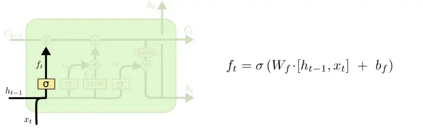
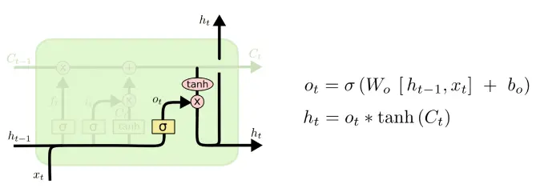

# 深度学习

### 1. 以一层隐层的神经网络，relu激活，MSE作为损失函数推导反向传播


### 2. NN的权重参数能否初始化为0？

不能，可能导致模型无法收敛。

### 3. 什么是梯度消失和梯度爆炸？

> 参考：https://cloud.tencent.com/developer/article/1374163

* 梯度消失

  > 根据链式法则，如果每一层神经元对上一层神经元的输出的偏导乘上权重结果都小于1的话，即使这个结果是0.99，在经过多层传播后，误差对输入层的偏导会趋于0
  >
  > 这种情况会导致靠近输入层的隐藏层神经元调整极小

* 梯度爆炸

  > 根据链式法则，如果每一层神经元对上一层神经元的输出的偏导乘上权重结果都大于1的话，在经过多层传播后，误差对输入层的偏导会趋于无穷大
  >
  > 这种情况会导致靠近输入层的隐藏层神经元调整极大

* 解决方案

  * 预训练加微调

  > 此方法来自Hinton在2006年发表的一篇论文，Hinton为了解决梯度的问题，提出采取无监督逐层训练方法，其基本思想是每次训练一层隐节点，训练时将上一层隐节点的输出作为输入，而本层隐节点的输出作为下一层隐节点的输入，此过程就是逐层“预训练”（pre-training）；在预训练完成后，再对整个网络进行“微调”（fine-tunning）。
  >
  > Hinton在训练深度信念网络（Deep Belief Networks）中，使用了这个方法，在各层预训练完成后，再利用BP算法对整个网络进行训练。此思想相当于是先寻找局部最优，然后整合起来寻找全局最优，此方法有一定的好处，但是目前应用的不是很多了。

  * 梯度剪切、正则(梯度爆炸)

  > 其思想是设置一个梯度剪切阈值，然后更新梯度的时候，如果梯度超过这个阈值，那么就将其强制限制在这个范围之内，通过这种直接的方法就可以防止梯度爆炸。

  > 权重正则化（weithts regularization）比较常见的是l1正则，和l2正则
  >
  > 正则化是通过对网络权重做正则限制过拟合，仔细看正则项在损失函数的形式：
  >
  > 
  >
  > 其中，α 是指正则项系数，因此，如果发生梯度爆炸，权值的范数就会变的非常大，通过正则化项，可以部分限制梯度爆炸的发生。

  * ##### **relu、leakrelu、elu等激活函数**

  > 思想也很简单，如果激活函数的导数为1，那么就不存在梯度消失爆炸的问题了，每层的网络都可以得到相同的更新速度，relu就这样应运而生。
  >
  > Relu的主要贡献在于：
  >
  > * 解决了梯度消失、爆炸问题
  > * 计算方便、计算速度快
  > * 加速了网络的训练
  >
  > 缺点：
  >
  > * 由于负数部分恒为0，会导致一些神经元无法激活（可通过设置小学习率部分解决）
  > * 输出不是以0为中心的

  * ##### **Batchnorm**

  > Batchnorm是深度学习发展以来提出的最重要的成果之一了，目前已经被广泛的应用到了各大网络中，具有加速网络收敛速度，提升训练稳定性的效果，Batchnorm本质上是解决反向传播过程中的梯度问题。
  >
  > 通过规范化操作将输出x规范化以此来保证网络的稳定性。
  >
  > batchnorm就是通过对每一层的输出规范为均值和方差一致的方法，消除了w带来的放大缩小的影响，进而解决梯度消失和爆炸的问题。
  >
  > 
  >
  > 参考：https://blog.csdn.net/qq_25737169/article/details/79048516

  * **残差结构**
  * **LSTM**

### 4. sigmoid和tanh为什么会导致梯度消失？

* sigmoid函数出现梯度消失的原因

> 当神经元的激活在接近0或者1处时，梯度几乎为0
>
> 在反向传播时，这个（局部）梯度将会与整个损失函数关于改门单元输出的梯度相乘。因此，如果局部梯度非常小，那么相乘的结果也会非常小，这会有效地“杀死”梯度，几乎就没有信号通过神经元传到权重再到数据了。
>
> 为了防止饱和，在权重初始化时也需特别留意。如果过大，将会导致神经元饱和，不再学习了

* tanh函数出现梯度消失的原因

> 函数tanh和函数sigmoid一样，在其饱和区的接近于0，都容易产生后续梯度消失、计算量大的问题


### 5. dropout为何能防止过拟合？

> https://zhuanlan.zhihu.com/p/23178423

> 防止参数过分依赖训练数据，增加参数对数据集的泛化能力
>
> > 假设要训练这样一个网络：
> >
> > 
> >
> > 正常的流程是：首先把x通过网络前向传播；然后把误差反向传播以决定 如何更新参数 让网络进行学习。
> >
> > 使用dropout之后过程变成：
> >
> > 
> >
> > 1. 首先随机（临时）删掉网络中一半的隐藏神经元，输入输出神经元保持不变（下图中虚线为部分临时被删除的神经元）
> > 2. 然后把输入x通过修改后的网络前向传播，然后把得到的损失结果通过修改的网络反向传播。一小批训练样本执行完这个过程后就按照随机梯度下降法更新（没有被删除的神经元）对应的参数（w，b）。
> > 3. 然后继续重复这一过程：
> >    - 恢复被删掉的神经元（此时 被删除的神经元 保持原样，而没有被删除的神经元已经有所更新）
> >    - 从隐藏神经元中随机选择一个一半大小的子集 临时删除掉（备份被删除神经元的参数）。
> >    - 对一小批训练样本，先前向传播然后反向传播损失并根据随机梯度下降法更新参数（w，b） （没有被删除的那一部分参数得到更新，删除的神经元参数保持被删除前的结果）
> > 4. 重复这一过程
>
> 为什么能防止过拟合呢？
>
> * **取平均的作用**： 先回到正常的模型（没有dropout），我们用相同的训练数据去训练5个不同的神经网络，一般会得到5个不同的结果，此时我们可以采用 “5个结果取均值”或者“多数取胜的投票策略”去决定最终结果。（例如 3个网络判断结果为数字9,那么很有可能真正的结果就是数字9，其它两个网络给出了错误结果）。这种“综合起来取平均”的策略通常可以有效防止过拟合问题。**因为不同的网络可能产生不同的过拟合，取平均则有可能让一些“相反的”拟合互相抵消**。dropout掉不同的隐藏神经元就类似在训练不同的网络（随机删掉一半隐藏神经元导致网络结构已经不同)，**整个dropout过程就相当于 对很多个不同的神经网络取平均**。而不同的网络产生不同的过拟合，一些互为“反向”的拟合相互抵消就可以达到整体上减少过拟合。
> * **减少神经元之间复杂的共适应关系**： 因为dropout程序导致两个神经元不一定每次都在一个dropout网络中出现。（这样权值的更新不再依赖于有固定关系的隐含节点的共同作用，阻止了某些特征仅仅在其它特定特征下才有效果的情况）。 迫使网络去学习更加鲁棒的特征 （这些特征在其它的神经元的随机子集中也存在）。换句话说假如我们的神经网络是在做出某种预测，它不应该对一些特定的线索片段太过敏感，即使丢失特定的线索，它也应该可以从众多其它线索中学习一些共同的模式（鲁棒性）。（这个角度看 dropout就有点像L1，L2正则，减少权重使得网络对丢失特定神经元连接的鲁棒性提高）

### 6. dropout和BN 在前向传播和方向传播阶段的区别？

### 7. 一个隐层需要多少节点能实现包含n元输入的任意布尔函数？

### 8. 多个隐层实现包含n元输入的任意布尔函数，需要多少节点和网络层？

> 问题7 和 8 参考：https://zhuanlan.zhihu.com/p/32579088

### 9. 感受野

>   是指输出特征图上某个像素对应到输入空间中的区域范围，可以理解为特征图像素到输入区域的映射。

## CNN

### 1. 空洞卷积是什么？有什么应用场景？

>   -   空洞卷积就是在卷积的时候不是对连续的值进行计算，而是会中间隔开几个值，其他与普通的卷积并无差异。可以理解为一个稀疏的大卷积核，只有个别值有效，其余值为零。

* 应用

> 01.在卷积图上注入空洞，增加感受野。注入空洞的数量由dilation rate确定。常规卷积的dilation rate为1。
>
> 02.多尺度检测，利于检测出小物体
>
> 03.语义分割中常用dilation rate。但是人像分割中无用，应该就是我们的应用场景没有特别小的物体。

### 2. resnet提出的背景和核心理论是？

* 背景

> 当模型深度增加到某个程度后，在增加深度，模型效果可能不升反降，出现退化现象。（不是过拟合也不是梯度爆炸或消失）

* 核心理论

> 恒等映射

### 3. CNN如何用于文本分类？


### 4. 常用的池化操作有哪些？有什么特点？

> https://zhuanlan.zhihu.com/p/112216409

* 优点

  > 1. 抑制噪声，降低信息冗余
  > 2. 提升模型的尺度不变性、旋转不变性
  > 3. 降低模型计算量
  > 4. 防止过拟合

* 最大/平均池化

  * 最大池化

  > 最大池化就是选择图像区域中最大值作为该区域池化以后的值，反向传播的时候，梯度通过前向传播过程的最大值反向传播，其他位置梯度为0。
  >
  > ```python
  > import torch
  > import torch.nn.functional as F
  > input_ = torch.Tensor(4,3,16,16)
  > output = F.max_pool2d(input_, kernel_size=2, stride=2)
  > print(output.shape)
  > ```
  >
  > 

  * 平均池化

  > 将选择的图像区域中的平均值作为该区域池化以后的值。
  >
  > ```python
  > import torch
  > import torch.nn.functional as F
  > input_ = torch.Tensor(4,3,16,16)
  > output = F.avg_pool2d(input_, kernel_size=2, stride=2)
  > print(output.shape)
  > ```

* 随机池化

  > 特征区域的大小越大，代表其被选择的概率越高

* 中值池化

* 组合池化

  > 组合池化则是同时利用最大值池化与均值池化两种的优势而引申的一种池化策略。
  >
  > 常见组合策略有两种：Cat与Add。
  >
  > 常常被当做分类任务的一个trick，其作用就是丰富特征层，maxpool更关注重要的局部特征，而average pooling更关注全局特征。
  >
  > ```python
  > import torch.nn.functional as F
  > 
  > def add_avgmax_pool2d(x, output_size=1):
  >      x_avg = F.adaptive_avg_pool2d(x, output_size)
  >      x_max = F.adaptive_max_pool2d(x, output_size)
  >      return 0.5 * (x_avg + x_max)
  > 
  > def cat_avgmax_pool2d(x, output_size=1):
  >      x_avg = F.adaptive_avg_pool2d(x, output_size)
  >      x_max = F.adaptive_max_pool2d(x, output_size)
  >      return torch.cat([x_avg, x_max], 1)
  > ```

* Spatial Pyramid Pooling

  > SPP是在SPPNet中提出的，SPPNet提出比较早，在RCNN之后提出的，用于解决重复卷积计算和固定输出的两个问题，具体方法如下图所示：
  >
  > 
  >
  > 在feature map上通过selective search获得窗口，然后将这些区域输入到CNN中，然后进行分类。
  >
  > 实际上SPP就是多个空间池化的组合，对不同输出尺度采用不同的划窗大小和步长以确保输出尺度相同，同时能够融合金字塔提取出的多种尺度特征，能够提取更丰富的语义信息。常用于多尺度训练和目标检测中的RPN网络。
  >
  > * SPP有效地原因
  >
  >   > 1. 从感受野角度来讲，之前计算感受野的时候可以明显发现，maxpool的操作对感受野的影响非常大，其中主要取决于kernel size大小。在SPP中，使用了kernel size非常大的maxpool会极大提高模型的感受野，笔者没有详细计算过darknet53这个backbone的感受野，在COCO上有效很可能是因为backbone的感受野还不够大。
  >   >
  >   > 2. 第二个角度是从Attention的角度考虑，这一点启发自CSDN@小楞（链接在参考文献中），他在文章中这样讲：
  >   >
  >   >    > 出现检测效果提升的原因：通过spp模块实现局部特征和全局特征（所以空间金字塔池化结构的最大的池化核要尽可能的接近等于需要池化的featherMap的大小）的featherMap级别的融合，丰富最终特征图的表达能力，从而提高MAP。
  >   >    >
  >   >    > https://blog.csdn.net/qq_33270279/article/details/103898245
  >
  > 

* Global Average/Max Pooling

  >Gloabel Average Pooling 是NIN里边的做法，一般使用torchvision提供的预训练模型进行finetune的时候，通常使用Global Average Pooling，原因就是可以不考虑图片的输入尺寸，只与filter有关。
  >
  >```python
  >import torch
  >from torch.nn import AdaptiveAvgPool2d
  >input = torch.zeros((4,12,18,18)) # batch size, fileter, h, w
  >gap = AdaptiveAvgPool2d(1)
  >output = gap(input)
  >print(output.shape)
  >print(output.view(input.shape[0],-1).shape)
  >```

* NetVLAD池化

* 双线性池化

  > Bilinear Pooling是在《Bilinear CNN Models for Fine-grained Visual Recognition》被提出的，主要用在细粒度分类网络中。双线性池化主要用于特征融合，对于同一个样本提取得到的特征x和特征y, 通过双线性池化来融合两个特征(外积)，进而提高模型分类的能力。
  >
  > > 主要思想是对于两个不同图像特征的处理方式上的不同。传统的，对于图像的不同特征，我们常用的方法是进行串联（连接），或者进行sum,或者max-pooling。论文的主要思想是，研究发现人类的大脑发现，人类的视觉处理主要有两个pathway, the ventral stream是进行物体识别的，the dorsal stream 是为了发现物体的位置。
  > > 论文基于这样的思想，希望能够将两个不同特征进行结合来共同发挥作用，提高细粒度图像的分类效果。论文希望两个特征能分别表示图像的位置和对图形进行识别。论文提出了一种Bilinear Model。
  >
  > 如果特征 x 和特征y来自两个特征提取器，则被称为**多模双线性池化**（MBP，Multimodal Bilinear Pooling）
  >
  > 如果特征 x = 特征 y，则被称为**同源双线性池化**（HBP，Homogeneous Bilinear Pooling）或者二阶池化（Second-order Pooling）。
  >
  > 
  >
  > ```python
  > import torch
  > X = torch.reshape(N, D, H * W)                        # Assume X has shape N*D*H*W
  > X = torch.bmm(X, torch.transpose(X, 1, 2)) / (H * W)  # Bilinear pooling
  > assert X.size() == (N, D, D)
  > X = torch.reshape(X, (N, D * D))
  > X = torch.sign(X) * torch.sqrt(torch.abs(X) + 1e-5)   # Signed-sqrt normalization
  > X = torch.nn.functional.normalize(X)                  # L2 normalization
  > ```
  >
  > 参考： https://zhuanlan.zhihu.com/p/62532887

* UnPooling

  > 是一种上采样操作
  >
  > 
  >
  > 流程描述：
  >
  > > 1. 在Pooling（一般是Max Pooling）时，保存最大值的位置。
  > > 2. 中间经历若干网络层的运算。
  > > 3. 上采样阶段，利用第1步保存的Max Location，重建下一层的feature map。
  >
  > **UnPooling不完全是Pooling的逆运算**，Pooling之后的feature map，要经过若干运算，才会进行UnPooling操作；对于非Max Location的地方以零填充。然而这样并不能完全还原信息。

### 5. 共享参数有什么优点

* 削减参数量，压缩模型复杂度
* 实现平移不变性

### 6. 网络容量计算方法

参考经典网络结构文档

### 7. 给定卷积核的尺寸，特征图大小计算方法？


## RNN

### 1. 简述RNN，LSTM，GRU的区别和联系

> 参考： https://blog.csdn.net/softee/article/details/54292102

> RNN(Recurrent Neural Networks,循环神经网络)不仅学习当前输入的信息，还要依赖之前的信息，如处理由重多词组成的序列。但它并不能很好地处理长的序列。是因为会出现梯度消失和梯度爆炸现象，由此出现了LSTM。LSTM和RNN相同都是利用BPTT传播和随机梯度或者其他优化算法来拟合参数。但是RNN在利用梯度下降算法链式求导时是连乘的形式,而LSTM是相加的形式，这也是最主要的区别。GRU与LSTM相比，少了一个gate,由此就少了一些矩阵乘法，GRU虽与LSTM的效果较近，但却因此在训练中节省了很多时间，在文本类处理中，相比用LSTM，导师更建议用GRU来训练。最小GRU可看最近南大教授的篇论文是用最小GRU来进行计算的，比GRU又少了一个门，这就使计算时间更短了，计算维度降低，占用内存减少。

* RNN 

  > 在传统的神经网络中，输入是相互独立的，但是在RNN中则不是这样。一条语句可以被视为RNN的一个输入样本，句子中的字或者词之间是有关系的，后面字词的出现要依赖于前面的字词。RNN被称为并发的（recurrent），是因为它以同样的方式处理句子中的每个字词，并且对后面字词的计算依赖于前面的字词。
  >
  > 典型的RNN如下图所示：
  >
  > 
  >
  > 图中左边是RNN的一个基本模型，右边是模型展开之后的样子。展开是为了与输入样本匹配。
  >
  > > * $ x_{t} $代表输入序列中的第t步元素，例如语句中的一个汉字。一般使用一个one-hot向量来表示，向量的长度是训练所用的汉字的总数（或称之为字典大小），而唯一为1的向量元素代表当前的汉字。
  > > * $ s_{t} $代表第t步的隐藏状态，其计算公式为$s_{t}=tanh(U_{X_{t}} + W_{S_{t-1}})$。也就是说，当前的隐藏状态由前一个状态和当前输入计算得到。考虑每一步隐藏状态的定义，可以把$s_{t}$视为一块内存，它保存了之前所有步骤的输入和隐藏状态信息。$s_{-1}$是初始状态，被设置为全0。
  > > * $o_{t}$是第t步的输出。可以把它看作是对第 t+1 步的输入的预测，计算公式为：$o_{t} = softmax(V_{s_{t}})$。可以通过比较$o_{t}$ 和$x_{t+1}$之间的误差来训练模型
  > > * U, V, W 是RNN的参数，并且在展开之后的每一步中依然保持不变。这就大大减少了RNN中参数的数量
  >
  > * 举例
  >
  >   > 假设我们要训练的中文样本中一共使用了3000个汉字，每个句子中最多包含50个字符，则RNN中每个参数的类型可以定义如下。
  >
  >   > * $x_{t} \in R^{3000}$ , 第t步的输入，是一个one-hot向量，代表3000个汉字中的某一个。
  >   > * $o_{t} \in R^{3000}$,第t步的输出，类型同$x_{t}$
  >   > * $s_{t} \in R^{50}$，第t步的隐藏状态，是一个包含50个元素的向量。RNN展开后每一步的隐藏状态是不同的。
  >   > * $U \in R^{50 * 3000}$，在展开后的每一步都是相同的。
  >   > * $V \in R^{3000 * 50}$，在展开后的每一步都是相同的。
  >   > * $W \in R^{50 * 50}$，在展开后的每一步都是相同的。
  >   >
  >   > 其中，$x_{t}$是输入，$U, V, W$是参数，$s_{t}$是有输入和参数计算所得到的隐藏状态，而$o_{t}$是输出。
  >
  > * 

* LSTM

  > LSTM是为了解决RNN中的反馈消失问题而被提出的模型，它也可以被视为RNN的一个变种。与RNN相比，增加了3个门（gate）：input门，forget门和output门，门的作用就是为了控制之前的隐藏状态、当前的输入等各种信息，确定哪些该丢弃，哪些该保留，如下图表示：
  >
  > 
  >
  > LSTM的隐藏状态g的计算公式：$g = tanh(U^{g}_{X_{t}} + W^{g}_{s_{t-1}})$ 。但是这个隐藏状态的输出受各种门的限制。
  >
  > 内部存储用$c$来表示，它由前一步的内部存储和当前的隐藏状态计算得出，并且受到input门和forget门的控制。前者确定当前隐藏状态中需要保留的信息，后者确定前一步的内部存储中需要保留的信息:$c_{t}= c_{t-1}·f + g · i$。 LSTM的输出则使用$s_{t}$ 表示，并且受输出们的限制：$s_{t} = tanh(c_{t}) · o$。综上所述，第t步的LSTM种输出信息的计算公式如下：
  >
  > * $i = \sigma(U^{i}_{X_{t}} + W^{i}_{S_{t - 1}})$
  > * $f = \sigma(U^{f}_{X_{t}} + W^{f}_{S_{t - 1}})$
  > * $o = \sigma(U^{o}_{X_{t}} + W^{o}_{S_{t - 1}})$
  > * $g = tanh(U^{g}_{X_{t}} + W^{g}_{S_{t - 1}})$
  > * $c_{t}= c_{t-1}·f + g · i$
  > * $s_{t}= tanh(c_{t})·o$
  >
  > 公式中的变量$i,f,o,g,c_{t}$的数据类型与$s_{t}$一样，是一个向量。圆点表示向量之间逐个元素相乘而得到一个新向量。这些式子具有以下特点。
  >
  > * 三个门input、forget、output具有相同的形式，只是参数不同。它们各自的参数$U,W$都需要在对样本的训练过程中学习。
  > * 隐藏状态$g$的计算与RNN中的隐藏状态相同，但是不能直接使用，必须通过input门的约束，才能够作用到内部存储$c_{t}$之中。
  > * 当前的内部存储的计算，不仅依赖于当前的隐藏状态，也依赖于前一步的内部存储$c_{t-1}$，并且$c_{t-1}$受forget门的约束。
  > * 输出信息在$c_{t}$的基础上又施加了一层tanh函数，并且受到输出门的约束。
  > * 如果input门全为1，forget门全为0，output门全为1的话，则LSTM与RNN相似，只是多了一层tanh函数的作用。

  总之，门机制的存在，就使得LSTM能够显示地为序列中长距离的依赖建模，通过对门参数的学习，网络能够找到合适的内部存储行为。

* GRU

  > GRU具有与LSTM类似的结构，但是更为简化，如下图所示。
  >
  > 
  >
  > GRU中状态与输出的计算包含以下步骤。
  >
  > * $z = \sigma(U^{z}_{x_{t}} + W^{z}_{s_{t - 1}})$
  > * $r = \sigma(U^{r}_{x_{t}} + W^{r}_{s_{t - 1}})$
  > * $h = tanh(U^{h}_{x_{t}} + W^{h}_{s_{t - 1} · r})$
  > * $ s_{t} = (1 - z) · h + z · s_{t - 1}$

  * 与LSTM相比，GRU存在着下述特点。
    * 门数不同。GRU只有两个门reset门r和update门z。
    * 在GRU中，r和z共同控制了如何从之前的隐藏状态（$s_{t-1}$）计算获得新的隐藏状态（$s_{t}$），而取消了LSTM中的output门。
    * 如果reset门为1，而update门为0的话，则GRU完全退化为一个RNN。

### 2. 画出lstm的结构图，写出公式

> 参考问题 1

### 3. RNN的梯度消失问题？如何解决？

* 梯度消失与梯度爆炸的原因

  > RNN的梯度是多个激活函数偏导乘积的形式来计算，如果这些激活函数的偏导比较小（小于1）或者为0，那么随时间很容易发生梯度消失；相反，如果这些激活函数的偏导比较大（大于1），那么很有可能就会梯度爆炸。
  >
  > 
  >
  > 例如：小明是中国人，小明国家的首都是：_____。这时，RNN只需要参考横线前面的词，
  >
  > 最易懂的RNN的结构图：
  >
  > 
  >
  > 简单的RNN内部结构为：
  >
  > 
  >
  > 
  >
  > 
  >
  > 但，当我们推测如下的：小明很喜欢吃蛋挞，所以小明下班后决定去商店__两个蛋挞。这时，不仅需要参考前面的词，还需要参考后面的词，才能推测出中间横线上的词，最大的概率是买。这就需要双向循环神经网络。如下图：
  >
  > 
  >
  > 以及深层神经网络
  >
  > 
  >
  > 具体公式实现可参考：https://zybuluo.com/hanbingtao/note/541458
  >
  > 
  >
  > * LSTM
  >
  >   * 前向计算：有三个门：遗忘门、输入门、输出门
  >
  >   >**遗忘门（forget gate）**，它决定了上一时刻的单元状态有多少保留到当前时刻；
  >   >
  >   >**输入门（input gate）**，它决定了当前时刻网络的输入有多少保存到单元状态。
  >   >
  >   >**输出门（output gate）**来控制单元状态有多少输出到LSTM的当前输出值。
  >   >
  >   >
  >   >
  >   >
  >   >
  >   >
  >
  >   * 遗忘门
  >
  >   > sigmod函数，0代表舍弃，1代表保留。
  >   >
  >   > 
  >   >
  >   > 
  >
  >   * 输入门
  >
  >   >决定什么样的新信息被存放在细胞状态中。当前输入的单元状态通过 tanh 进行处理（得到一个在 -1 到 1 之间的值）。
  >   >
  >   >
  >   >
  >   >计算当前时刻的单元状态：它是由上一次的单元状态按元素乘以遗忘门，再用当前输入的单元状态按元素乘以输入门，再将两个积加和产生的，
  >   >
  >   >
  >
  >   * 输出门
  >
  >   >LSTM最终的输出，是由输出门和单元状态共同确定的：把细胞状态通过 tanh 进行处理（得到一个在 -1 到 1 之间的值）并将它和 sigmoid 门的输出相乘，最终我们仅仅会输出我们确定输出的那部分。
  >   >
  >   >
  >   >
  >   >
  >
  > * GRU
  >
  > > 省略了一个门，而且余下的两个门是z,1-z的关系。
  > >
  > > 
  > >
  > > 

* LSTM为什么可以解决梯度消失问题：

  > 

### 4. lstm中是否可以用relu作为激活函数？

> 在默认的情况下，LSTM使用tanh函数作为其激活函数。看到当LSTM组成的神经网络层数比较少的时候，才用其默认饿tanh函数作为激活函数比Relu要好很多。随着LSTM组成的网络加深，再继续使用tanh函数，就存在了梯度消失的的风险，导致一直徘徊在一个点无法搜索最优解，这种情况下，可以采用Relu函数进行调整，注意学习率需要变地更小一点防止进入死神经元。

### 5. lstm各个门分别使用什么激活函数？

* sigmoid 用在了各种gate上，产生0~1之间的值，这个一般只有sigmoid最直接了。
* tanh 用在了状态和输出上，是对数据的处理，这个用其他激活函数或许也可以

### 6. 简述seq2seq模型？

* 前言

  > RNN Encoder-Decoder结构，简单的来说就是算法包含两部分，一个负责对输入的信息进行Encoding，将输入转换为向量形式。
  >
  > 然后由Decoder对这个向量进行解码，还原为输出序列。
  >
  > 而RNN Encoder-Decoder结构就是编码器与解码器都是使用RNN算法，一般为LSTM

* LSTM

  > 优势在于处理序列，它可以将上文包含的信息保存在隐藏状态中，这样就提高了算法对于上下文的理解能力。
  >
  > 很好的抑制了原始RNN算法中的梯度消失弥散（Vanishing Gradient）问题。
  >
  > 一个LSTM神经元（Cell）可以接收两个信息，其中一个是序列的某一位输入，另一个是上一轮的隐藏状态。
  >
  > 而一个LSTM神经元也会产生两个信息，一个是当前轮的输出，另一个是当前轮的隐藏状态。
  >
  > 假设我们输入序列长度为`2`，输出序列长度也为`2`，流程如下：
  >
  > 

* seq to seq

  > 举例
  >
  > > 以机器翻译为例，假设我们要将`How are you`翻译为`你好吗`，模型要做的事情如下图：
  > >
  > > 
  > >
  > > 流程说明：
  > >
  > > > 上图中，LSTM Encoder是一个LSTM神经元，Decoder是另一个，Encoder自身运行了`3`次，Decoder运行了`4`次。
  > > >
  > > > 可以看出，Encoder的输出会被抛弃，我们只需要保留隐藏状态（即图中EN状态）作为下一次ENCODER的状态输入。
  > > >
  > > > Encoder的最后一轮输出状态会与Decoder的输入组合在一起，共同作为Decoder的输入。
  > > >
  > > > 而Decoder的输出会被保留，当做下一次的的输入。注意，这是在说预测时时的情况，一般在训练时一般会用真正正确的输出序列内容，而预测时会用上一轮Decoder的输出。
  > > >
  > > > 给Decoder的第一个输入是`<S>`，这是我们指定的一个特殊字符，它用来告诉Decoder，你该开始输出信息了。
  > > >
  > > > 而最末尾的`<E>`也是我们指定的特殊字符，它告诉我们，句子已经要结束了，不用再运行了

### 7. seq2seq在解码时候有哪些方法？

> 参考：https://blog.csdn.net/jlqCloud/article/details/104516802

### 8. Attention机制是什么？

* 导言

  > attention机制是模仿人类注意力而提出的一种解决问题的办法，简单地说就是从大量信息中快速筛选出高价值信息。主要用于解决LSTM/RNN模型输入序列较长的时候很难获得最终合理的向量表示问题，做法是保留LSTM的中间结果，用新的模型对其进行学习，并将其与输出进行关联，从而达到信息筛选的目的。

* 知识点前述

  > encoder+decoder，中文名字是编码器和解码器，应用于seq2seq问题，其实就是固定长度的输入转化为固定长度输出。其中encoder和decoder可以采用的模型包括CNN/RNN/BiRNN/GRU/LSTM等，可以根据需要自己的喜好自由组合。
  >
  > 
  >
  > encoder过程将输入的句子转换为语义中间件，decoder过程根据语义中间件和之前的单词输出，依次输出最有可能的单词组成句子。
  >
  > 
  >
  > 问题就是当输入长度非常长的时候，这个时候产生的语义中间件效果非常的不好，需要调整。

* attention 模型

  > attention模型用于解码过程中，它改变了传统decoder对每一个输入都赋予相同向量的缺点，而是根据单词的不同赋予不同的权重。在encoder过程中，输出不再是一个固定长度的中间语义，而是一个由不同长度向量构成的序列，decoder过程根据这个序列子集进行进一步处理。
  >
  > 
  >
  > 举例说明：
  >
  > > 假设输入为一句英文的话：Tom chase Jerry
  > > 那么最终的结果应该是逐步输出 “汤姆”，“追逐”，“杰瑞”。
  > > 那么问题来了，如果用传统encoder-decoder模型，那么在翻译Jerry时，所有输入单词对翻译的影响都是相同的，但显然Jerry的贡献度应该更高。
  > > 引入attention后，每个单词都会有一个权重：（Tom,0.3）(Chase,0.2) (Jerry,0.5)，现在的关键是权重怎么算的呢。
  > >
  > > 
  > >
  > > 从图上可以看出来，加了attention机制以后，encoder层的每一步输出都会和当前的输出进行联立计算（wx+b形式），最后用softmx函数生成概率值。
  > > 概率值出来了，最后的结果就是一个加权和的形式。
  > >
  > > 
  > >
  > > 基本上所有的attention都采用了这个原理，只不过算权重的函数形式可能会有所不同，但想法相同。

* 应用

  > 文本：应用于seq2seq模型，最常见的应用是翻译。
  > 图片：应用于卷积神经网络的图片提取

* attention的简单实现

  1. 思路一：直接对原文本进行权重计算

     > 这个思路非常暴力，我们说过要对输入进行权重计算，此种方法的计算很简单，就是将输入来一个全连接，随后采用softmax函数激活算概率。先看代码：
     >
     > ```python
     > from keras.layers import Permute
     > from keras.layers import Dense
     > from keras.layers import Lambda
     > from keras.layers import RepeatVector
     > from keras.layers import Multiply
     > 
     > def attention_3d_block(inputs, single_attention_blick=False):
     >  time_steps = K.int_shape()[1]#返回输入的元组，以列表的形式储存
     >  input_dim = K.int_shape()[2]#记住输入是[训练批量，时间长度，输入维度]
     >  #下面是函数建模方式
     >  a = Permute((2, 1))(inputs)
     >  a = Dense(time_steps, activation='softmax')(a)
     >  if single_attention_blick:
     >      a = Lambda(lambda x: K.mean(x, axis=1))(a)
     >      a = RepeatVector(input_dim)(a)
     >  a_probs = Permute((2, 1))(a)
     >  output_attention_mul = Multiply()([inputs, a.prob])
     >  return output_attention_mul
     > ```

  2. 思路2：加入激活函数并求和

     > 这个的思路是权重计算之后加了一个tanh激活函数，然后求完权重进行了加和，更加符合attention机制的习惯，其实方法是一样的只不过返回是乘完加和而已。代码来自网上，原作者自己定义了一个attention层。
     >
     > 
     >
     > * 代码实现
     >
     >   ```python
     >   class attention_layers(Layer):
     >       def __init__(self, **kwargs):
     >           super(attention_layers, self).__init__(**kwargs)
     >           
     >       def build(self,inputshape):
     >           assert len(inputshape) == 3
     >           #以下是keras的自己开发工作
     >           self.W = self.add_weight(name='attr_weight',
     >                                    shape=(inputshape[1], inputshape[2]),
     >                                    initializer='uniform',
     >                                    trainable=True)
     >           self.b = self.add_weight(name='attr_bias',
     >                                    shape=(inputshape[1],),
     >                                    initializer='uniform',
     >                                    trainable=True)
     >           super(attention_layers, self).bulid(inputshape)
     >           
     >       def call(self,inputs):
     >           x = K.permute_dimensions(inputs, (0, 2, 1))
     >           a = K.softmax(K.tanh(K.dot(x, self.W) + self.b))
     >           outputs = K.permute_dimensions(a*x, (0, 2, 1))
     >           outputs = K.sum(outputs, axis=1)
     >           return  outputs
     >           
     >       def compute_output_shape(self, input_shape):
     >           return input_shape[0], input_shape[2]
     >   ```
     >
     > 

