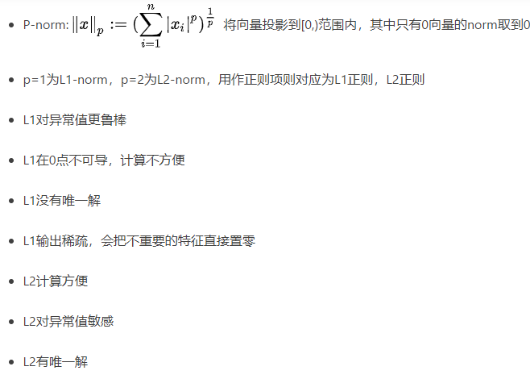
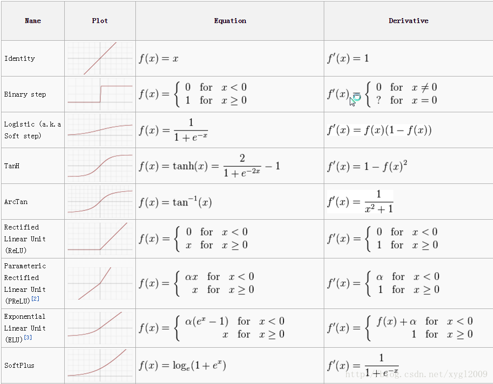
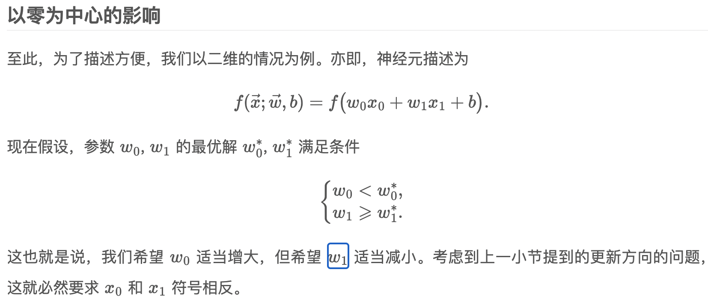
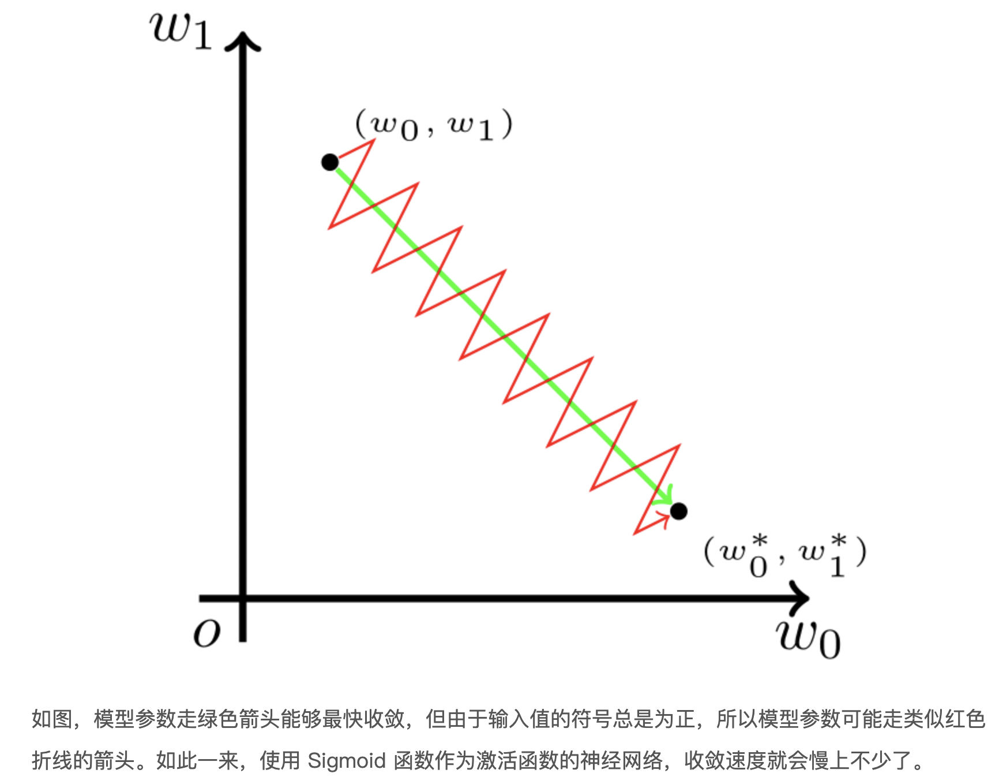
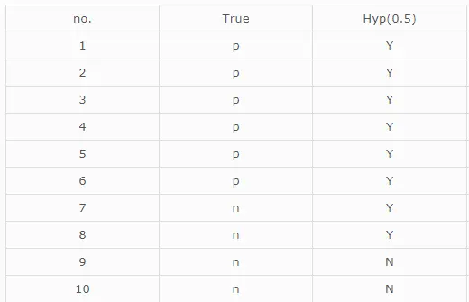
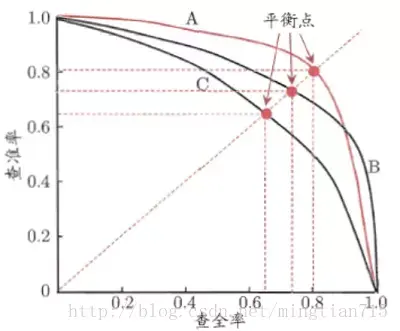
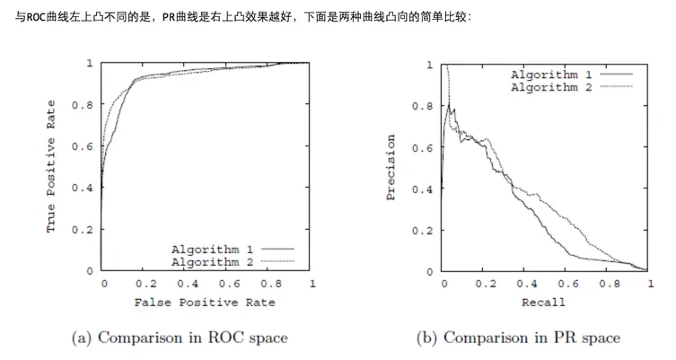

# 算法通用问题

## 1. 范数（Norm）

> 具体定义
>
> * a function that assigns a strictly positive length or size to each vector in a vector space， except for the zero vector. ——Wikipedia
>
> 一个向量的范数就是**将向量投影到[0,1)范围的值**，其中0只有零向量的范数可以取到

### L1 和 L2 范数

> 可以用距离的概念来看

> 具体应用：
>
> 1. 作为损失函数使用
>
> 	> 主要用L2原因是：L2求导计算方便，一定存在一条最优的线;L1则可能存在多个最优解
> 	>
> 	> L1优点：鲁棒性更强，对异常值不敏感
>
> 2. 作为正则项来使用
>
> 	> L2 计算起来非常方便，L1则在非稀疏向量的计算上效率非常低
> 	>
> 	> L1输出稀疏，会把不重要的特征置为0，L2不会
> 	>
> 	> L2存在唯一解，L1则存在多个解

- L1和L2正则分别有什么特点？为何L1稀疏？



> > 为何L1稀疏？
> >
> > 
> >
> > 在梯度更新时，不管 L1 的大小是多少（只要不是0）梯度都是1或者-1，所以每次更新时，它都是稳步向0前进。从而导致L1输出稀疏。

>参考： https://www.zhihu.com/question/26485586/answer/616029832

## 2. 激活函数

```
损失函数和激活函数决定的是模型会不会收敛，也影响训练速度；优化器决定的是模型能不能跳出局部极小值、跳出鞍点、能不能快速下降这些问题的。

https://www.cnblogs.com/eilearn/p/9028394.html
```



### **a. 为什么使用激活函数**

> 如果不用激励函数，每一层输出都是上层输入的线性函数，无论神经网络有多少层，输出都是输入的线性组合。
> 如果使用的话，激活函数给神经元引入了非线性因素，使得神经网络可以任意逼近任何非线性函数，这样神经网络就可以应用到众多的非线性模型中。

### **b. 为什么分类问题不能使用mse损失函数？**

> 1. 在线性回归中用到的最多的是MSE(最小二乘损失函数)，这个比较好理解，就是预测值和目标值的欧式距离。而交叉熵是一个信息论的概念，交叉熵能够衡量同一个随机变量中的两个不同概率分布的差异程度，在机器学习中就表示为真实概率分布与预测概率分布之间的差异。交叉熵的值越小，模型预测效果就越好。
> 	所以交叉熵本质上是概率问题，表征真实概率分布与预测概率分布差异，和几何上的欧氏距离无关，在线性回归中才有欧氏距离的说法，在分类问题中label的值大小在欧氏空间中是没有意义的。所以分类问题不能用mse作为损失函数。
> 2. 分类问题是逻辑回归，必须有激活函数这个非线性单元在，比如sigmoid（也可以是其他非线性激活函数），mse已经是非凸函数了，有多个极值点，所以不适用做损失函数了。
> 3. mse作为损失函数，求导的时候都会有对激活函数的求导连乘运算，对于sigmoid、tanh，有很大区域导数为0的。该激活函数的输入很可能直接就在平坦区域，那么导数就几乎是0，梯度就几乎不会被反向传递，梯度直接消失了。所以mse做损失函数的时候最后一层不能用sigmoid做激活函数，其他层可以用sigmoid做激活函数。当然，用其他损失函数只能保证在第一步不会直接死掉，反向传播如果激活函数和归一化做得不好，同样会梯度消失。所以从梯度这个原因说mse不好不是很正确。

* 梯度消失问题存在两个地方
	1. 损失函数对权值w求导，这是误差反向传播的第一步，mse的损失函数会在损失函数求导这一个层面上就导致梯度消失；所以使用交叉熵损失函数
	2. 误差反向传播时，链式求导也会使得梯度消失。
* 使用交叉熵损失函数也不能避免反向传播带来的梯度消失，此时规避梯度消失的方法：
	* ReLU等激活函数；
	* 输入归一化、每层归一化；
	* 网络结构上调整，比如LSTM、GRU等。

### c. 常用激活函数

#### 1. softmax函数

> 具体定义
>
> * 是一种概率函数，将原始的输出映射到(0, 1)中，并且最最终结果的总和为1.
>
> 公式：
>
> 用处：可用于多分类问题

##### softmax激活函数

> 特点：保证较小的值有较小的概率，而不是直接丢弃
>
> ​			获得所有概率彼此相关，因为分母结合了原始输出值的所有因子
>
> ​			在0处不可微
>
> ​			负输入的梯度为零，这意味着对于该区域的激活，权重不会在反向传播期间更新，因此会产生永不激活的死亡神经元

> 转换成概率的步骤
>
> * 分子：利用指数函数转为非负数的值
> * 分母：将所有结果相加，进行归一化

#### 2. tanh函数

双曲正切函数

* 优点

	> 1. 在特征相差明显时的效果会很好，在循环过程中会不断扩大特征效果
	> 1. 是 0-mean的，实际应用中比sigmoids函数要好


#### 3. Relu函数的定义、优缺点

* 优点

	> 1. 反向求导时，计算量较少；
	> 1. 反向传播时，不会出现较小的梯度，不会出现饱和现象
	> 1. 会使一部分网络激活输出值为0，这样就造成了网络的稀疏性，并且减少了参数的相互依存关系，缓解了过拟合问题的发生

* 缺点

	> 1. 不是0-centered
	> 2. 很容易导致神经元坏死
	> 3. 不会对数据进行幅度压制
	
* **ReLu是如何表现出高阶的非线性组合的？**

	> ReLU在正负半轴都是线性的，确实没错。但是，**它实现网络非线性映射的魔法在于对不同样本的不同状态**。
	>
	> 考虑对于一个激活函数只包含ReLU和线性单元的简单网络：首先，我们考虑有一个输入样本 ![[公式]](https://www.zhihu.com/equation?tex=x_%7B1%7D) ，网络中所有的ReLU对它都有一个确定的状态，整个网络最终对![[公式]](https://www.zhihu.com/equation?tex=x_%7B1%7D)的映射等效于一个线性映射:![[公式]](https://www.zhihu.com/equation?tex=y_%7B1%7D%3Dw_%7B1%7Dx_%7B1%7D%2Bb_%7B1%7D)考虑另一个输入样本 ![[公式]](https://www.zhihu.com/equation?tex=x_%7B2%7D) ，它的特征与![[公式]](https://www.zhihu.com/equation?tex=x_%7B1%7D)不同。因此，网络中某些ReLU的激活状态因为输入变化可能发生变化，比如一些以前在右侧接通区域的变到左侧切断区域（或反之）；这样整个网络对于样本![[公式]](https://www.zhihu.com/equation?tex=x_%7B2%7D)有一个新的等效线性映射：![[公式]](https://www.zhihu.com/equation?tex=y_%7B2%7D%3Dw_%7B2%7Dx_%7B2%7D%2Bb_%7B2%7D) 这两个函数都是线性的，但是他们的参数是不同的。进一步，可以这样设想，在 ![[公式]](https://www.zhihu.com/equation?tex=x_%7B1%7D) 的周围，有一小块区域 ![[公式]](https://www.zhihu.com/equation?tex=%5B%7Bx_%7B1%7D%5E%7B1%7D%7D%5Cpm%5Cvarepsilon_%7B1%7D%2C%7Bx_%7B1%7D%5E%7B2%7D%7D%5Cpm%5Cvarepsilon_%7B2%7D%2C...%2C%7Bx_%7B1%7D%5E%7Bn%7D%7D%5Cpm%5Cvarepsilon_%7Bn%7D%5D)（为了表达简单，假定了两侧 ![[公式]](https://www.zhihu.com/equation?tex=%5Cpm%5Cvarepsilon_%7Bi%7D) 都是对称的，实际通常不是）。所有特征位于这一小块区域内的样本，在网络中激活的ReLU状态都和 ![[公式]](https://www.zhihu.com/equation?tex=x_%7B1%7D) 激活的完全一样。（因为这些点离![[公式]](https://www.zhihu.com/equation?tex=x_%7B1%7D)非常接近，在这个变化范围，网络中所有的ReLU都没有翻转）。那么这一小块区域内，网络拟合的出的线性映射都是一样的，去掉x,y的角标，表示为![[公式]](https://www.zhihu.com/equation?tex=y%3Dw_%7B1%7Dx%2Bb_%7B1%7D)您一定发现了，这就是由 ![[公式]](https://www.zhihu.com/equation?tex=%5Bw_%7B1%7D%EF%BC%8Cb_%7B1%7D%5D) 定义的一个超平面，但是这个超平面可能只在![[公式]](https://www.zhihu.com/equation?tex=x_%7B1%7D)的附近才成立。一旦稍微远离，导致至少一个ReLU翻转，那么网络将有可能拟合出另一个不同参数的超平面。
	>
	> 　　所以，这具有不同参数的超平面拼接在一起，不就拟合出了各种各样的非线性特性了吗？所以，虽然ReLU的每个部分都是线性的，但是通过对ReLU各种状态的组合进行改变，导致了网络等效映射的变化，也就构造了各种非线性映射。表现在多维空间，就是很多不同的小块超平面拼接成的奇形怪状的近似超曲面。

#### 4. sigmoid函数定义、优缺点

* 优点

	> 1. 用于二分类问题

* 缺点

	> 1. 激活函数计算量大，反向传播求误差梯度时，求导涉及除法
	> 1. 反向传播时，很容易就会出现梯度消失的情况，从而无法完成深层网络的训练
	> 1. Sigmoids函数饱和且kill掉梯度
	> 1. Sigmoids函数收敛缓慢。
	> 1. 输出不是以0为中心的
	
* **导致梯度消失的原因**

	> 1. 当神经元的激活在接近0或1处时会饱和，在这些区域，梯度几乎为0。
	> 2. 可以作为概率，但导数值小于1，最大为0.25，如果损失函数 mse，则梯度计算与 sigmoid 导数相关，导致梯度消失。
	
* **输出不是以0为中心问题**

	
	
	> 在 Sigmoid 函数中，输出值恒为正。这也就是说，如果上一级神经元采用 Sigmoid 函数作为激活函数，那么我们无法做到 x0 和 x1 符号相反。此时，模型为了收敛，不得不向逆风前行的风助力帆船一样，走 Z 字形逼近最优解。
	>
	> 

### d. 激活函数的比较

#### **1) Sigmoid 和 ReLU 比较：**

> 1. 对于深层网络，sigmoid函数反向传播时，很容易就会出现梯度消失的情况（在sigmoid接近饱和区时，变换太缓慢，导数趋于0，这种情况会造成信息丢失）。而relu函数在大于0的部分梯度为常数，所以不会产生梯度弥散现象。
> 2. relu函数在负半区的导数为0 ，所以一旦神经元激活值进入负半区，那么梯度就会为0，造成了网络的稀疏性，缓解过拟合。
> 3. relu计算简单，采用sigmoid等函数，反向传播求误差梯度时，计算量大，而采用Relu激活函数，整个过程的计算量节省很多。

#### 2) **Sigmoid 和 Softmax 区别：**

> 1. sigmoid将一个real value映射到（0,1）的区间（当然也可以是（-1,1）），这样可以用来做二分类。 
> 2. 而softmax把一个k维的real value向量（a1,a2,a3,a4….）映射成一个（b1,b2,b3,b4….）其中 bi 是一个 0～1 的常数，输出神经元之和为 1.0，所以相当于概率值，然后可以根据 bi 的概率大小来进行多分类的任务。
> 3. 二分类问题时 sigmoid 和 softmax 是一样的，求的都是 cross entropy loss，而 softmax 可以用于多分类问题。
> 4. 多个logistic回归通过叠加也同样可以实现多分类的效果，但是 softmax回归进行的多分类，类与类之间是**互斥**的，即一个输入只能被归为一类；多个logistic回归进行多分类，输出的类别并不是互斥的，即"苹果"这个词语既属于"水果"类也属于"3C"类别。

## 3. 模型评估方法

### 1. Accuracy作为指标有哪些局限性？

> 准确率是指分类正确的样本占总样本的比例
>
> 准确率是样本分类问题中最简单也是最直观的评价指标。但存在明显的缺陷。
>
> 比如负样本占99%时，分类器把所有样本都预测为负样本也可以获得99%的准确率。所以，当不同类别的样本比例非常不均衡时。占比大的类别往往成为影响准确率的最主要因素。
>
> 此时准确率指标并不足以说明分类器的好坏。

### 2. ROC曲线和PR曲线各是什么？

* PR曲线

> **PR曲线实则是以precision（精准率）和recall（召回率）这两个为变量而做出的曲线，其中recall为横坐标，precision为纵坐标。**
>
> 什么是精准率？什么是召回率？
>
> 在二分类问题中，分类器将一个实例的分类标记为是或否，可以用一个**混淆矩阵**来表示，如下图所示。
>
> 
>
> 把正例正确地分类为正例，表示为TP（true positive），把正例错误地分类为负例，表示为FN（false negative）。
> 把负例正确地分类为负例，表示为TN（true negative）， 把负例错误地分类为正例，表示为FP（false positive）。
>
> 从混淆矩阵可以得出精准率与召回率：**precision = TP/(TP + FP), recall = TP/(TP +FＮ)**
>
> 
>
> **一个阈值对应PR曲线上的一个点。通过选择合适的阈值，比如50%，对样本进行划分，概率大于50%的就认为是正例，小于50%的就是负例,从而计算相应的精准率和召回率。（选取不同的阈值，就得到很多点，连起来就是PR曲线）**
>
> > 举个例子如下：(true这列表示正例或者负例，hyp这列表示阈值0.5的情况下，概率是否大于0.5)
> >
> > 
> >
> > 那么根据这个表格我们可以计算：TP=6，FN=0，FP=2，TN=2。故recall=6/(6+0)=1,precison=6/(6+2)=0.75，那么得出坐标（1，0.75）。同理得到不同阈下的坐标，即可绘制出曲线。
> >
> > 
>
> 
>
> **如果一个学习器的P-R曲线被另一个学习器的P-R曲线完全包住，则可断言后者的性能优于前者，例如上面的A和B优于学习器C。**但是A和B的性能无法直接判断，我们可以根据曲线下方的面积大小来进行比较，但更常用的是平衡点或者是F1值。**平衡点（BEP）是P=R时的取值，如果这个值较大，则说明学习器的性能较好。而F1  =  2 \* P \* R ／( P + R )，同样，F1值越大，我们可以认为该学习器的性能较好。**

* ROC 曲线

> 有了前面的PR的铺垫，ROC曲线就会更好理解了。
>  **在ROC曲线中，横轴是假正例率（FPR），纵轴是真正例率（TPR）。**
>  **(1)真正类率(True Postive Rate)TPR: TP/(TP+FN),代表分类器预测的正类中实际正实例占所有正实例的比例。
>  (2)负正类率(False Postive Rate)FPR: FP/(FP+TN)，代表分类器预测的正类中实际负实例占所有负实例的比例。**
>  我们可以发现：**TPR=Recall。**
>  ROC曲线也需要相应的阈值才可以进行绘制，原理同上的PR曲线。
>
> 下图为ROC曲线示意图，因现实任务中通常利用有限个测试样例来绘制ROC图，因此应为无法产生光滑曲线，如右图所示。
>
> 
>
> > 绘图过程：给定m个正例子，n个反例子，根据学习器预测结果进行排序，先把分类阈值设为最大，使得所有例子均预测为反例，此时TPR和FPR均为0，在（0，0）处标记一个点，再将分类阈值依次设为每个样例的预测值，即依次将每个例子划分为正例。设前一个坐标为(x,y)，若当前为真正例，对应标记点为(x,y+1/m)，若当前为假正例，则标记点为（x+1/n,y），然后依次连接各点。
>
> >**ROC曲线图中的四个点**
> > 第一个点：(0,1)，即FPR=0, TPR=1，这意味着FN=0，并且FP=0。这是完美的分类器，它将所有的样本都正确分类。
> > 第二个点：(1,0)，即FPR=1，TPR=0，类似地分析可以发现这是一个最糟糕的分类器，因为它成功避开了所有的正确答案。
> > 第三个点：(0,0)，即FPR=TPR=0，即FP=TP=0，可以发现该分类器预测所有的样本都为负样本（negative）。
> > 第四个点：（1,1），分类器实际上预测所有的样本都为正样本。
> >
> >经过以上的分析，ROC曲线越接近左上角，该分类器的性能越好。
>
> **PR曲线与ROC曲线的对比**
>
> 

>##### AUC
>
>这里补充一下AUC的简单介绍。
> **AUC (Area under Curve)：ROC曲线下的面积，介于0.1和1之间，作为数值可以直观的评价分类器的好坏，值越大越好。**
> AUC = 1，是完美分类器，采用这个预测模型时，存在至少一个阈值能得出完美预测。绝大多数预测的场合，不存在完美分类器。
> 0.5 < AUC < 1，优于随机猜测。这个分类器（模型）妥善设定阈值的话，能有预测价值。
> AUC = 0.5，跟随机猜测一样（例：丢铜板），模型没有预测价值

```
https://www.jianshu.com/p/ac46cb7e6f87
http://www.fullstackdevel.com/computer-tec/data-mining-machine-learning/501.html
```

### 3. 编程实现AUC的计算，并指出复杂度？

> 有两种计算AUC的方法:
>
> 1.绘制ROC曲线，ROC曲线下面的面积就是AUC的值
>
> 2.假设总共有（m+n）个样本，其中正样本m个，负样本n个，总共有mn个样本对，计数，正样本预测为正样本的概率值大于负样本预测为正样本的概率值记为1，累加计数，然后除以（mn）就是AUC的值

```
def get_roc(pos_prob,y_true):
    pos = y_true[y_true==1]
    neg = y_true[y_true==0]
    threshold = np.sort(pos_prob)[::-1]        # 按概率大小逆序排列
    y = y_true[pos_prob.argsort()[::-1]]
    tpr_all = [0] ; fpr_all = [0]
    tpr = 0 ; fpr = 0
    x_step = 1/float(len(neg))
    y_step = 1/float(len(pos))
    y_sum = 0     # 用于计算AUC
    for i in range(len(threshold)):
        if y[i] == 1:
            tpr += y_step
            tpr_all.append(tpr)
            fpr_all.append(fpr)
        else:
            fpr += x_step
            fpr_all.append(fpr)
            tpr_all.append(tpr)
            y_sum += tpr
   return tpr_all,fpr_all,y_sum*x_step   # 获得总体TPR，FPR和相应的AUC
   
排序复杂度：O(log2(P+N))

计算AUC的复杂度：O(P+N)
```


### 4. AUC指标有什么特点？放缩结果对AUC是否有影响？

* AUC反映的是分类器对样本的排序能力。

	> 根据这个解释，如果我们完全随机的对样本分类，那么AUC应该接近0.5。另外值得注意的是，AUC对样本类别是否均衡并不敏感，这也是不均衡样本通常用AUC评价分类器性能的一个原因
	>
	> AUC（Area under Curve）指的是ROC曲线下的面积，介于0和1之间。AUC作为数值可以直观地评价分类器的好坏，值越大越好。
	>
	> 它的统计意义是从所有正样本随机抽取一个正样本，从所有负样本随机抽取一个负样本，当前score使得正样本排在负样本前面的概率。

* 放缩结果对AUC没有影响

### 5. 余弦距离与欧式距离有什么特点？

* 余弦距离

	> 余弦距离也称为余弦相似度，是用向量空间中的两个向量之间夹角的余弦值作为衡量两个向量间差异大小的度量；值越小，表示两个向量越相近

* 欧式距离

	

## 4. 基本方法

### 1. 如何划分训练集？如何选取验证集？

>1. 根据经验
>
>（1.）通常80%为训练集，20%为测试集
>
>（2.）当数据量较小时（万级别及以下）的时候将训练集、验证集以及测试集划分为6：2：2；若是数据很大，可以将训练集、验证集、测试集比例调整为98：1：1
>
>（3.）当数据量很小时，可以采用K折交叉验证
>
>（4.）划分数据集时可采用随机划分法（当样本比较均衡时），分层采样法（当样本分布极度不均衡时）
>
>2. 随机采样
>
>```python
>import numpy as np
>def split_train_test(data,test_ratio):
>        #设置随机数种子，保证每次生成的结果都是一样的
>        np.random.seed(42)
>        #permutation随机生成0-len(data)随机序列
>        shuffled_indices = np.random.permutation(len(data))
>        #test_ratio为测试集所占的半分比
>        test_set_size = int(len(data)) * test_ratio
>        test_indices = shuffled_indices[:test_ratio]
>        train_indices = shuffled_indices[test_set_size:]
>        #iloc选择参数序列中所对应的行
>        return data.iloc[train_indices],data.iloc[test_indices]
>#测试
>train_set,test_set = split_train_test(data,0.2)print(len(train_set), "train +", len(test_set), "test")
>```
>
>

### 2. 什么是偏差和方差？

* 偏差是描述预测值与真实值之间的差异，差异越大模型的预测能力越差
* 方差是描述预测值的变化范围。方差越大说明模型越不稳定
* 过拟合高方差，欠拟合高偏差

### 3. 什么是过拟合？深度学习解决过拟合的方法有哪些

* 过拟合

	> 是指模型泛化能力低，过度学习了数据中的噪声

* 解决方法

	> * 增加数据，丰富数据多样性
	> * 缩减模型表达能力，L1，L2正则化
	> * Dropout
	> * 训练提前终止
	> * 集成多种模型

### 4. 解决欠拟合的方法

> * 增加模型复杂度
> * 调整模型初始化方式
> * 调整学习率
> * 集成多种模型

### 5. 深度模型参数调整的一般方法论？

**重要性：学习率 > 正则值 > dropout**

> 1. 学习率：遵循小->大->小原则
> 1. 初始化：选择合适的初始化方式，有预训练模型更好
> 1. 优化器选择：adam比较快，sgd较慢
> 1. loss：回归问题选L2 loss，分类问题选交叉熵
> 1. 从小数据大模型入手，先过拟合，再增加数据并根据需要调整模型复杂度
> 1. 可视化

## 5. 优化方法

### 1. 简述了解的优化器，发展综述？

**深度学习优化算法经历了 SGD -> SGDM -> NAG ->AdaGrad -> AdaDelta -> Adam -> Nadam 这样的发展历程。**


### 2. 常用的损失函数

**损失函数的应用场景**


### 3. 梯度下降与拟牛顿法的异同？

* 参数更新模式相同
* 梯度下降法利用误差的梯度来更新参数，拟牛顿法利用海塞矩阵的近似来更新参数
* 梯度下降是泰勒级数的一阶展开，而拟牛顿法是泰勒级数的二阶展开
* SGD能保证收敛，但是L-BFGS在非凸时不收敛

## 其他

### 1. cbow和skipgram如何选择？

> 参考：https://zhuanlan.zhihu.com/p/37477611

> - CBOW ：根据上下文词语来预测当前词的生成概率
> - Skip-gram ：根据当前词来预测上下文中各词的生成概率

### 2. word2vec的原理，glove的原理，fasttext的原理？

> 参考： https://zhuanlan.zhihu.com/p/56382372

### 3. 了解elmo和bert吗？简述与word embedding的联系和区别

> 参考：https://zhuanlan.zhihu.com/p/264989685

### 4. 图像和文本和语音数据各有哪些数据增强方法？

> 视频数据增强参考：https://zhuanlan.zhihu.com/p/385311896
>
> 音频数据增强参考：https://blog.csdn.net/qq_36999834/article/details/109851965
>
> 图像和文本数据增强参考：https://juejin.cn/post/7027307485061251102

### 5. rcnn、fatse rcnn、fatser rcnn、mask rcnn的原理？

> 参考： https://blog.csdn.net/qq_43799400/article/details/123127851

### 6. 介绍resnet和GoogLeNet中的inception module的结构？

> 参考： https://zhuanlan.zhihu.com/p/41691301

### 7. 介绍yolo和ssd ？

> https://www.jianshu.com/p/aab93e615a62

### 8. 介绍FM，FFM，deepFM，deepWide.

> 参考： https://zhuanlan.zhihu.com/p/268776484

### 9. 机器翻译如何解决oov？

> 参考：https://www.zhihu.com/question/55172758

> OOV` 问题是NLP中常见的一个问题，其全称是`Out-Of-Vocabulary`，下面简要的说了一下`OOV
>
> 


